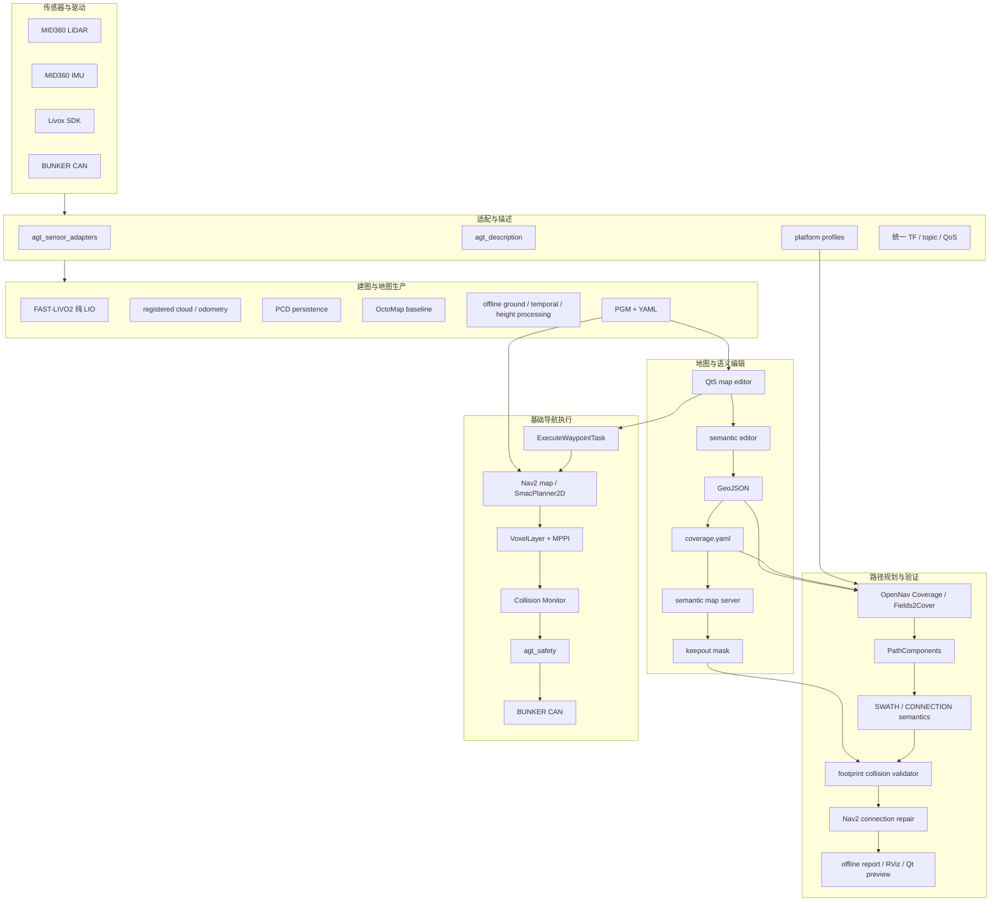
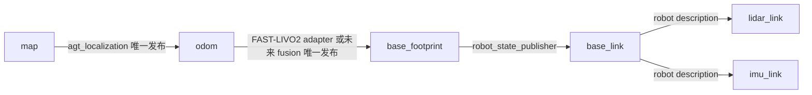
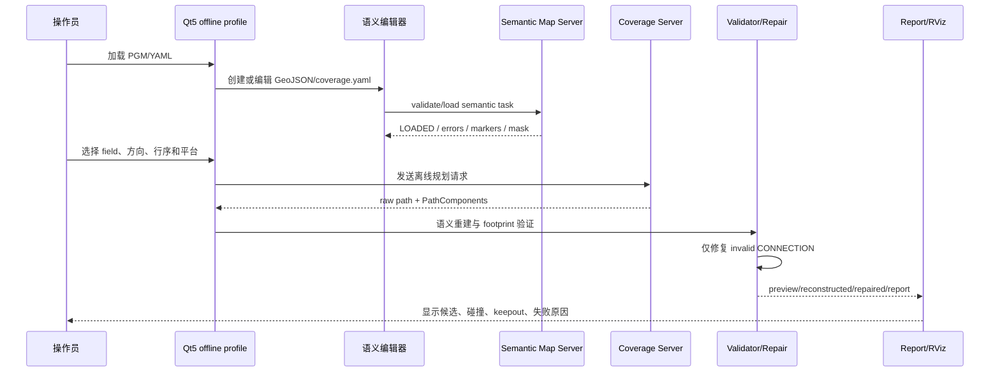

# agt_navigation_v2

## 基于 MID360、FAST-LIVO2、Nav2 与 Qt5 的模块化农业机器人导航平台

**文档类型：** 项目总体方案与下一阶段开发汇报稿

**当前基准：** MID360 + FAST-LIVO2 纯 LIO + Nav2 + BUNKER 履带底盘

**当前闭环：** 建图、二维地图生产、Qt5 地图编辑、waypoint 规划与任务下发、安全仲裁、CAN 底盘输出

**下一阶段重点：** 语义地图数据链、Fields2Cover 离线覆盖路径、路径语义重建、完整碰撞验证、路径修复与可执行性审计

**未来扩展：** 语义感知、RTK/UWB 融合、实时可通行性、机械臂任务编排和多底盘执行

项目负责人：yangxuan  
版本：V2.0
日期：2026年7月

> 本文以当前仓库实际代码、配置、测试和文档为准。代码中已经存在的离线预览或验证能力，不等同于经过实车验收的执行能力；覆盖路径在通过全部语义、碰撞、运动学和安全检查前，不得进入底盘控制链。

# 文档说明

| 项目 | 内容 |
| --- | --- |
| 文档名称 | `agt_navigation_v2` 项目总体方案与下一阶段语义覆盖汇报稿 |
| 文档目的 | 汇报当前系统能力，统一下一阶段语义地图和离线路径开发目标 |
| 适用范围 | 仓库架构、建图地图链、Qt5 交互、Nav2 导航、覆盖规划、验证与验收 |
| 当前状态 | 基础导航工程闭环已建立；语义地图和覆盖规划已完成较多离线模块，但覆盖路径仍存在上游语义缺陷，尚不可执行 |
| 当前车辆 | AgileX BUNKER 履带底盘，CAN 通讯；导航控制模型为差速/履带近似模型 |
| 当前传感器 | Livox MID360，点云和 IMU 通过 Livox SDK 接入，基准频率 10 Hz |
| 当前建图前端 | FAST-LIVO2 ROS 2 纯 LIO 模式，输出连续里程计、注册点云和可持久化定位 PCD |
| 当前导航前端 | Qt5 维护版 GUI、Nav2、项目 waypoint Action、安全层和 BUNKER 驱动 |
| 非目标 | 本阶段不把语义感知、实时动态地图和机械臂执行伪装成已完成能力 |

## 汇报主线

1. 项目已经从单纯的算法工作区发展为一条可运行的基础导航集成链。

2. 当前可以稳定讨论的是“地图生产和 waypoint 导航闭环”，不是覆盖作业已经可执行。

3. 下一阶段不再从空白设计语义功能，而是把现有 GeoJSON、coverage.yaml、Qt5 编辑、Fields2Cover、路径语义、碰撞检测和离线预览串成一条可审计的数据链。

4. 覆盖规划必须先在离线地图上形成可解释、可复现、可验证的候选路径，再考虑与 Nav2 和底盘执行连接。

5. 所有运动输出仍必须经过 Nav2、`agt_safety`、底盘 watchdog 和 CAN 驱动，Qt5 和覆盖算法不能直接发布速度。

> **一句话定位**
> `agt_navigation_v2` 是一套以 MID360 + FAST-LIVO2 为当前建图和定位基准、以 Nav2 为基础导航执行框架、以 Qt5 为操作前端、以 GeoJSON/coverage.yaml 为农业语义任务数据源的 ROS 2 模块化机器人导航平台。当前基础 waypoint 导航链已经闭环，下一阶段的核心是把语义地图和离线覆盖路径做成可复现、可审计、可验证的独立规划产品。

# 1. 项目背景与当前判断

## 1.1 系统已经具备的基础

- MID360 驱动、点云和 IMU 接入统一到项目 topic。
- FAST-LIVO2 纯 LIO 建图适配，隔离原生 topic，并输出项目命名的里程计和注册点云。
- 增量稀疏体素 PCD 持久化，支持保存定位地图和处理记录。
- OctoMap 高度范围投影以及 PGM/YAML 地图保存入口。
- 离线静态障碍证据、时间一致性、地面拟合、高度层和车体扫掠地图处理工具。
- NDT/ICP 重定位节点，唯一发布 `map -> odom`。
- Nav2 静态全局 costmap、局部 VoxelLayer、MPPI 控制器、Collision Monitor 和 lifecycle 管理。
- Qt5 地图显示、地图编辑、目标点两次点击、任务点表格和项目 waypoint Action 调用。
- `agt_safety` 速度仲裁、超时归零、急停锁存、速度/加速度限制和手动优先。
- BUNKER CAN 驱动、状态桥接、连接诊断和双层速度 watchdog。
- GeoJSON/`coverage.yaml` 语义地图模型、Shapely/GEOS 几何校验、语义地图服务器和 keepout mask。
- Fields2Cover/OpenNav Coverage 适配、PathComponents 语义重建、全 footprint 路径验证、连接段修复和离线路线预览。

## 1.2 当前闭环的准确表述

当前仓库已经形成以下闭环：

```text
MID360 点云/IMU
    -> Livox SDK 与项目传感器适配
    -> FAST-LIVO2 纯 LIO
    -> odom、注册点云、定位 PCD
    -> OctoMap/离线地图处理
    -> PGM + YAML OccupancyGrid
    -> Qt5 地图查看与编辑
    -> Nav2 静态地图与全局路径
    -> 局部障碍 costmap 与控制器
    -> Collision Monitor
    -> agt_safety
    -> BUNKER CAN 速度和状态链
```

这是一条**基础导航工程闭环**，主要对应单点目标和有限 waypoint 任务。它证明了数据接口、地图、规划、速度安全和底盘通讯能够被组合起来，但还不代表以下指标已经达标：

- 大量不同初值下的定位成功率和恢复时间；
- 长时间运行时的 CPU、内存、磁盘和消息延迟；
- 障碍漏检、误检和动态拖影的实车统计；
- 急停距离、CAN 断连归零和低速制动距离；
- 农业覆盖路径的面积覆盖率、重复率和最终可执行性。

## 1.3 需要纠正的技术路线表述

| 原有表述 | 当前仓库实际情况 | 建议汇报表述 |
| --- | --- | --- |
| Nav2 使用 RPP 局部规划 | 当前 `nav2_bunker.yaml` 使用 `nav2_mppi_controller::MPPIController`，运动模型为 `DiffDrive` | Nav2 使用 SmacPlanner2D 生成全局路径，MPPI 进行局部轨迹控制 |
| 局部避障算法未知 | 已有点云过滤、VoxelLayer、InflationLayer、Collision Monitor 和 MPPI 多层链 | 局部避障由几何障碍点云、Nav2 局部代价地图、Collision Monitor 和 MPPI 共同完成 |
| 地面分割实时生成导航图 | 实时入口主要是 OctoMap 高度范围投影；地面拟合、时间证据和扫掠清除主要在离线工具链 | 基础地图采用高度范围投影，离线增强链加入地面、时序、高度和车体自返回处理 |
| 已经完成拖影消除 | 已有静态证据过滤、车体扫掠清除和局部 costmap clearing，但没有独立在线动态目标跟踪 | 已建立拖影抑制机制，尚未完成完整在线动态地图去鬼影算法 |
| BUNKER 状态已经进入融合定位 | CAN 状态已桥接和诊断；`agt_localization_fusion` 仍是骨架 | BUNKER 通讯和状态监控已接通，轮速/LIO/IMU 融合尚未实现 |
| Fields2Cover 路径已经可执行 | 已完成适配、可视化、语义重建、碰撞验证和连接修复实验；存在 `zero_length_swath`，执行资格为 false | 覆盖路径离线生成与验证链已建立，但当前输出仍是不可执行候选 |
| Qt5 直接完成任务规划 | Qt5 负责交互和 Action 请求，项目 waypoint server 负责校验并调用 Nav2 `FollowWaypoints` | Qt5 是前端，导航任务由项目 Action 和 Nav2 负责，速度不得由 GUI 直接下发 |

# 2. 总体目标与阶段边界

## 2.1 总体目标

建立一套面向温室和农业移动机器人的模块化导航平台，使系统能够：

1. 使用 MID360 + FAST-LIVO2 完成三维建图和定位地图生产。
2. 从三维点云生成可解释的二维导航地图，并保留原始地图和处理记录。
3. 使用 Qt5 完成地图浏览、地图修改、目标点选择和 waypoint 任务编辑。
4. 使用 Nav2 完成全局规划、局部控制、局部障碍处理和路径执行。
5. 通过 `agt_safety` 和 BUNKER CAN 链提供独立于 GUI 的安全速度下发。
6. 使用 GeoJSON 与 `coverage.yaml` 表达田块、障碍、作业行、入口、方向和覆盖参数。
7. 在不修改基础 PGM 的前提下，离线生成、审计和验证 Fields2Cover 覆盖候选路径。
8. 为未来语义感知、实时可通行性和机械臂任务编排提供明确接口，但不提前把它们接入运动闭环。

## 2.2 下一阶段的核心目标

下一阶段不是继续扩大算法范围，而是完成“语义地图到可验证离线路径”的闭环：

```text
基础 PGM/YAML
    + GeoJSON 语义几何
    + coverage.yaml 任务参数
    + 平台 profile
    + 障碍/keepout mask
    -> 语义校验
    -> OpenNav/Fields2Cover 路径生成
    -> PathComponents 语义重建
    -> 全 footprint 碰撞与曲率验证
    -> 仅修复 CONNECTION
    -> 再次验证
    -> 离线报告、可视化和执行资格判定
```

下一阶段的“完成”定义是：

- 给定一份版本化基础地图和一份合法语义任务，能够稳定生成离线路径候选；
- 每个路径区间都有明确的 `SWATH` 或 `CONNECTION` 语义；
- 路径与地图、语义任务、平台 profile 具有关联指纹；
- 全车体 polygon、未知区域、越界、最小转弯半径和 keepout 均得到检查；
- 任何不满足条件的路径输出为空或明确标记为不可执行；
- 生成结果可在 Qt5/RViz 中查看，可输出 JSON/YAML/Markdown 报告；
- 不启动控制器、不使能安全层、不发布速度、不调用底盘。

## 2.3 明确不纳入下一阶段的目标

- 不在本阶段实现完整在线语义感知。
- 不把实时静态可通行性候选配置直接改造成运行节点。
- 不把临时生成的 GML 写回用户语义 GeoJSON。
- 不允许覆盖路径绕过 Nav2、`agt_safety` 或底盘 watchdog。
- 不因几何路径看起来连贯而放宽 `PathComponents` 语义缺陷。
- 不在尚未解决 BUNKER 与 Ackermann profile 差异前共用一套执行参数。
- 不把离线时间估算、路径排序或可视化报告解释为实车作业性能。

# 3. 系统总体架构



## 3.1 运行时基础导航链

基础 waypoint 导航链的实际职责如下：

| 层 | 当前组件 | 输入 | 输出 | 当前状态 |
| --- | --- | --- | --- | --- |
| 传感器 | `livox_ros_driver2` + `agt_sensor_adapters` | MID360 点云/IMU | `/agt/sensors/lidar/custom`、`/agt/sensors/imu/data` | 已接入，需继续做网络、QoS、长时间验证 |
| 建图 | FAST-LIVO2 + `agt_mapping` | CustomMsg、IMU | `/agt/mapping/odometry`、`/agt/mapping/registered_points_lidar` | 纯 LIO baseline 已接入 |
| 连续 TF | FAST-LIVO2 adapter | LIO odometry、机器人外参 | `odom -> base_footprint` | 已集中适配，需实车外参和 TF 稳定性验证 |
| 定位 | `agt_localization` NDT/ICP | 全局 PCD、局部注册点云、`/initialpose` | `map -> odom`、定位状态 | 初验通过，批量收敛统计未完成 |
| 地图 | Nav2 map server | PGM/YAML | `/agt/map/global_occupancy` | 已接入 |
| 全局规划 | Nav2 SmacPlanner2D | 全局 OccupancyGrid、目标 | 全局路径 | 已接入 |
| 局部障碍 | `local_obstacle_filter` + VoxelLayer | 注册点云、时间戳 TF | `/agt/perception/obstacle_cloud`、局部 costmap | 已接入，算法参数需实测 |
| 局部控制 | MPPI controller | 全局路径、局部 costmap、里程计 | `/agt/navigation/cmd_vel_raw` | 当前实际控制器，不是 RPP |
| 速度保护 | Collision Monitor + `agt_safety` | 控制速度、障碍、人工速度 | `/agt/navigation/cmd_vel`、`/agt/safety/cmd_vel` | 已接入，实车急停和制动未验收 |
| 底盘 | command guard + BUNKER driver | 安全速度 | CAN 速度、状态、里程计 | 已接入，需 CAN 实车和长时间验证 |
| 任务 | Qt5 + `ExecuteWaypointTask` | map frame waypoint 数组或 Qt 任务文件 | Nav2 `FollowWaypoints` | 已接入，需实车成功/取消/失败测试 |

## 3.2 TF 责任



| TF | 当前责任 | 约束 |
| --- | --- | --- |
| `map -> odom` | `agt_localization` | 不允许第二个定位节点同时发布 |
| `odom -> base_footprint` | FAST-LIVO2 adapter | 未来融合层接入时必须明确切换责任 |
| `base_footprint -> base_link` | 机器人描述 | 保持二维导航基准语义 |
| `base_link -> lidar_link` | URDF/Xacro 与平台外参 | 不在 Livox 网络 JSON 中重复维护 |
| `base_link -> imu_link` | URDF/Xacro | FAST-LIVO2 内部 LiDAR/IMU 外参与车体外参分开管理 |

# 4. 当前仓库能力盘点

## 4.1 基础导航模块状态

| 模块 | 当前实际状态 | 已有证据 | 主要缺口 |
| --- | --- | --- | --- |
| `agt_sensor_adapters` | baseline 已接入 | MID360 CustomMsg 转换、topic/QoS 测试 | 硬件同步、丢包、频率和长时间稳定性报告 |
| `agt_mapping` | 大包 PCD 持久化已实现 | 稀疏 int64 voxel、异常点过滤、处理记录 | 新旧轨迹对比、独立 bag、实机外参和内存长期测试 |
| `agt_map_processing` | 基础投影和离线增强工具已实现 | OctoMap、静态障碍证据、扫掠清除、三种可通行性图 | 实时节点尚不存在，最终地图阈值仍需独立数据验证 |
| `agt_localization` | NDT/ICP 节点已实现 | 线程参数边界、同源 PCD 初验 | 多初值批量统计、错误初值拒绝、恢复时间和 TF 稳定性 |
| `agt_localization_fusion` | 仅 package 骨架 | 目录和职责文档 | LIO、轮速、IMU、RTK/UWB 融合全部未实现 |
| `agt_perception` | 几何局部障碍过滤已实现 | base frame 高度/距离/车体裁切 | 地面分割、动态目标语义、漏检/误检和实时性能评估 |
| `agt_navigation` | waypoint Action 与 Nav2 offline preview 已实现 | FollowWaypoints、取消、安全状态和地图校验测试 | 真实地图多点执行、RPP 迁移没有实施，当前为 MPPI |
| `agt_safety` | BUNKER baseline 已实现 | 手动优先、超时、急停锁存、限速和合成回归 | 硬件急停、制动距离、CAN 断连和进程退出验收 |
| `agt_chassis` | BUNKER CAN 链已实现 | 官方驱动、状态桥接、command guard | 协议版本、方向、里程计和长时间通讯验证 |
| `agt_ui_bridge` | Qt5 三种 profile 与语义编辑器已实现 | navigation/mapping/offline 隔离、GeoJSON、undo/redo、语言设置 | 大地图交互性能、真实任务操作和用户验收 |
| `agt_coverage_planning` | 离线规划与验证链已实现 | F2C/OpenNav、PathComponents、Validator、Repair、preview | `zero_length_swath`、真实场景质量和执行资格 |
| `agt_experiment_manager` | 仅骨架 | package、runtime 边界 | 配置合并、版本快照、实验恢复和一键复现 |
| `agt_evaluation` | 仅骨架 | package、职责文档 | 轨迹、定位、导航、地图质量和资源指标工具 |

## 4.2 当前验证等级

```text
L0  静态契约：文件、topic、frame、参数、schema 和 launch 检查
L1  单元/合成：几何、JSON/YAML、Action 序列化、路径和安全函数
L2  离线回放：bag、PCD、OccupancyGrid、Coverage Server 和 Nav2 planner
L3  无 CAN 系统：完整节点树、安全状态和速度链，不连接底盘
L4  架空/台架：CAN、轮速、方向、急停和 watchdog
L5  低速实车：地图、定位、局部避障、waypoint 和人工接管
L6  长时/产品：资源边界、故障注入、重复实验、数据与许可证审计
```

当前语义和覆盖功能主要达到 L0-L2；基础 waypoint 导航达到部分 L2-L4，具体实车功能仍需 L5；尚未达到 L6。

# 5. MID360 与 FAST-LIVO2 建图基线

## 5.1 数据链

```text
MID360
  -> Livox SDK
  -> /agt/sensors/lidar/custom       CustomMsg，保留逐点时间信息
  -> /agt/sensors/imu/data           IMU
  -> FAST-LIVO2 pure LIO
  -> /agt/mapping/odometry
  -> /agt/mapping/registered_points_lidar
  -> incremental localization PCD
```

当前方案以 MID360 本体完成时间同步、SDK 以约 10 Hz 更新点云为系统前提。仓库负责 topic、消息转换、时间戳传递和 bag 回放检查，但硬件时间同步的精度、网络抖动和实车长时稳定性仍应通过独立测试报告固化，不能只由 launch 配置推断。

## 5.2 纯 LIO 的作用边界

FAST-LIVO2 在当前阶段只启用 LiDAR-IMU 里程计和建图路径。视觉参数仍需要上游初始化，因此仓库保留 camera placeholder，但这不代表相机参与当前建图。

FAST-LIVO2 负责：

- 连续局部位姿估计；
- 注册点云输出；
- 建图过程中的局部地图维护；
- 增量稀疏 PCD 持久化。

FAST-LIVO2 不负责：

- 发布 `map -> odom`；
- 生成最终 Nav2 PGM/YAML；
- 语义地图编辑；
- 覆盖路径规划；
- 底盘安全和速度下发。

## 5.3 地图持久化与异常点

定位 PCD 通过稀疏有符号 64 位 voxel key 增量维护，不在关机时保留完整原始累积点云再一次性降采样。输入点在插入前检查：

- 非有限坐标；
- 超出绝对坐标上限的点；
- voxel key 溢出风险；
- PCL/Eigen 对齐 ABI。

只有 `localization_map.processing.yaml` 标记 `state: ready` 的 PCD 才是可用定位地图。原始点云、旧版 downsample 文件和没有处理记录的 PCD 不能直接作为导航定位输入。

# 6. 三维点云到二维导航地图

## 6.1 当前地图生产的两级链路

当前仓库存在两种不同用途的地图处理链，不应混写：

### A. 在线/基线投影链

基础建图入口通过 OctoMap 对注册点云进行射线和高度范围投影，输出 OccupancyGrid，再使用 Nav2 `map_saver_cli` 保存 PGM/YAML。它的优点是结构简单、容易随建图过程查看，适合作为 baseline 和快速地图生产入口。

当前基线的关键特征：

- 以 `odom` 作为建图连续坐标；
- 使用明确的点云和 occupancy 高度范围；
- 保留 unknown/free/occupied 三值语义；
- 不把 Nav2 inflation 或 footprint 烘焙进源 PGM；
- 输出地图后再交给 Qt5、Nav2 和语义地图流程。

### B. 离线增强链

离线处理工具消费注册点云、时间匹配位姿和基础 OccupancyGrid，生成用于质量比较的增强地图：

- 时间戳匹配或插值的 base pose；
- 非有限点和车体自返回过滤；
- 相对高度阈值；
- RANSAC 地面拟合和残差统计；
- 多帧观测次数和最小时间跨度；
- 完整 canonical polygon 车体扫掠清除；
- 地面、时间一致性和 provisional 高度层变体；
- PGM/YAML 与 processing record。

这条链适合地图生产、对比、审计和候选固化。它不应在每一帧实时回调中同步执行完整轨迹扫掠和全图写盘。

## 6.2 地图质量与拖影抑制

当前“拖影隔绝”不是单一算法，而是多个边界共同作用：

| 机制 | 作用 | 当前性质 |
| --- | --- | --- |
| FAST-LIVO2 注册 | 把点云变换到连续地图坐标 | 依赖 LIO 稳定性 |
| 时间匹配 pose | 避免使用回调时刻的错误最新位姿 | 离线静态证据 |
| 多帧观测阈值 | 抑制一次性动态点 | 离线静态证据 |
| 地面/高度过滤 | 去除地面和不参与车辆碰撞的高层点 | 离线候选或局部过滤 |
| 车体 self-return 清除 | 去除雷达看到的自身结构 | 依赖完整 footprint 扫掠 |
| 射线 free/unknown 基线 | 防止原始投影把未知误写成自由 | 地图生产约束 |
| local costmap clearing | 处理局部动态障碍消失 | Nav2 运行时 |
| Collision Monitor | 对进入保护区的障碍做停/减速 | 运行时安全层 |

已经建立了拖影抑制和局部动态障碍处理的工程机制

## 6.3 下一阶段地图输入要求

下一阶段语义地图不直接修改源 PGM。每个语义任务必须绑定：

- 地图 YAML 路径；
- 地图图像路径；
- 地图图像 SHA256；
- `resolution`、width、height 和 origin；
- `frame_id: map`；
- 平台 profile 快照；
- 创建工具版本和时间；
- 语义 GeoJSON 与 coverage.yaml 的版本。

基础地图一旦被语义任务引用，语义编辑器只能写 GeoJSON 和 coverage.yaml；任何底图改变都必须重新计算 hash，并使旧语义任务进入不匹配状态。

# 7. 语义地图模型与 Qt5 编辑功能

## 7.1 数据分层

语义地图分成三层：

```text
Nav2 base map
  PGM + YAML
  只读，提供 OccupancyGrid 和坐标基准

Semantic document
  semantic_map.geojson
  手工创建的 field、keepout、crop rows、entry 等对象

Coverage task
  coverage.yaml
  作业宽度、方向、地头、路径策略、入口和平台约束
```

三者之间通过地图 hash、frame、schema version 和 profile snapshot 关联，不能把语义区直接写入源 PGM。

## 7.2 当前语义对象

当前 schema 支持的主要语义对象包括：

| 对象 | 几何 | 规划作用 |
| --- | --- | --- |
| field boundary | Polygon/MultiPolygon | 限制作业区域和默认外部禁行区 |
| exclusion/keepout | Polygon | 不允许车辆和作业路径进入 |
| crop row | LineString | 提供作业行中心线或行方向语义 |
| access lane | LineString | 独立的开放、可行驶通道 |
| entry pose | Point + heading | 预览入口和作业起点 |
| work direction | LineString/方向属性 | 约束行向和作业朝向 |
| headland | Polygon | 提供转弯和掉头空间 |
| disabled feature | 任意合法几何 | 可保存和显示，但不进入规划输入 |

`speed_zone` 等未来对象可以在文档中保留，但当前不参与执行路径生成。所有对象仍必须经过 schema、坐标、拓扑、包含关系和 footprint 可行性检查。

## 7.3 Qt5 角色与交互边界

Qt5 分为三个 profile：

| profile | 作用 | 运动权限 |
| --- | --- | --- |
| mapping | 建图观察和地图查看 | 禁止导航任务执行 |
| navigation | 真实导航操作和 waypoint 任务 | 只能调用项目 Action，不能发速度 |
| offline | 地图/语义编辑和路径预览 | 禁止控制器、安全使能、定位和底盘 |

当前编辑器已支持：

- PGM/YAML 读取和非零 origin/yaw；
- 地图平移、缩放和机器人跟随解除；
- 语义对象绘制、顶点编辑、图层和未保存提示；
- 多边形自交检查和可修复草稿保留；
- GeoJSON/coverage.yaml 原子写入；
- undo/redo；
- 语义地图加载、校验和状态显示；
- waypoint 两次点击，第二次点击确定 heading；
- Task 行选择、拓扑刷新和项目 Action 预览/执行入口。

Qt5 不负责：

- 计算真实路径可执行性；
- 直接修改 Nav2 costmap；
- 直接调用 BUNKER CAN；
- 用机器人距离轮询判断任务成功；
- 把路径预览结果转成速度。

## 7.4 语义地图服务

语义地图服务器负责事务式加载：

1. 读取 GeoJSON 与相邻 coverage.yaml。
2. 校验 schema、地图 hash、frame、平台 profile 和几何拓扑。
3. 生成 markers、keepout mask 和语义状态。
4. 只有所有必要产品有效时才替换当前有效状态。
5. 加载失败时保留上一份有效产品，不清空为半成品。

Nav2 global costmap 只通过 `/agt/map/keepout_mask` 和 type-0 FilterInfo 接收禁行过滤，保持 `StaticLayer -> KeepoutFilter -> InflationLayer` 的顺序。keepout mask 不是新的基础地图，也不能写回 PGM。

# 8. 下一阶段核心：离线覆盖路径生成

## 8.1 为什么先做离线

覆盖路径不同于普通 waypoint：它同时涉及区域语义、作业行、机具宽度、转弯半径、车辆 footprint、禁行区和作业顺序。先在离线环境完成有输入版本、有输出指纹和有失败报告的链路，可以把算法问题与定位、控制、CAN 和现场安全问题分离。

离线模式的价值：

- 可重复使用同一份 PGM、GeoJSON、coverage.yaml 和 profile；
- 可比较多种行序、方向、转弯模板和平台参数；
- 可在没有底盘和定位的情况下暴露几何错误；
- 可对每个失败阶段给出原因，而不是只显示一条红线；
- 可确保不因为预览而误启动运动链。

## 8.2 覆盖路径输入

一次规划请求必须包含完整快照：

```yaml
request:
  map_yaml: <canonical map yaml>
  semantic_map: <semantic_map.geojson>
  coverage: <coverage.yaml beside semantic_map>
  platform_profile: <canonical platform yaml>
  field_id: <selected field>
  planning_mode: <direct_swaths|crop_centerlines>
  start_pose: <optional explicit map pose>
  route_variant: <variant name>
  execution_enabled: false
```

规划前必须检查：

- 文件存在且可读；
- GeoJSON 和 coverage.yaml 的 identity 一致；
- 基础地图 hash 一致；
- `frame_id` 为 `map`；
- field、障碍和入口几何合法；
- platform profile 是当前允许的版本；
- `navigation_footprint`、最小转弯半径和运动学能力来自 profile；
- 请求没有引用旧的 validation、repair 或 keepout 产品。

## 8.3 OpenNav/Fields2Cover 适配

`agt_coverage_planning` 负责把项目语义模型适配到固定版本的 Open Navigation Coverage 和 Fields2Cover。核心原则是：

- 外部 coverage 依赖使用 `nav_dependencies.repos` 固定 commit；
- `humble-v2` 与 Fields2Cover `v2.0.0` 版本线不混用；
- 语义源文件保持不变；
- Row Coverage Server 所需临时 GML 由进程私有目录生成；
- 临时 GML 至少使用三个点，绕开锁定版本的行宽缺陷；
- 只有来自当前已验证 annotated-row 请求的端点补正才允许恢复 SWATH 端点；
- 不从 heading 猜测 SWATH 几何，不把适配结果反写 GeoJSON。

当前支持两种 row interpretation：

| 模式 | 处理逻辑 |
| --- | --- |
| `direct_swaths` 或缺省兼容模式 | 保持版本 1 的直接 swath 行为 |
| `crop_centerlines` | 根据相邻 crop row centerline 事务式派生 aisle，不修改源语义文件 |

## 8.4 路径语义重建

Coverage Server 的扁平 Path 不能只通过 heading 推断作业区间。当前方案将锁定版 `PathComponents.swaths` 和 `PathComponents.turns` 作为权威来源。

路径语义的基本合同：

- 只支持 `SWATH` 和 `CONNECTION` 两类；
- 每个原始路径区间必须有且只有一个 component type 和 component ID；
- `swath_NNNN` ID 由端点几何稳定生成，与路线顺序和行驶方向无关；
- `order_index` 独立表达本次执行顺序；
- 重建路径长度必须在绝对/相对容差内匹配原始 Path；
- 语义文档必须携带原始 Path 精确 fingerprint；
- raw path、reconstructed path 和 semantics 不匹配时必须事务失败。

当前真实问题是：部分真实大棚请求返回了零长度 SWATH。几何路线可以有输出，但语义重建无法形成可信的作业段，因此 coverage rate、overlap rate 和 `eligible_for_execution` 必须保持 null/false。这不是可以通过 UI 隐藏的显示问题，而是上游 PathComponents 质量问题。

## 8.5 完整 footprint 碰撞与运动学验证

Validator 对每个路径 pose 使用 canonical `navigation_footprint` polygon，而不是只检查中心点或四个角点。验证内容包括：

- 地图坐标 frame 和 costmap metadata；
- unknown-space 策略，默认 unknown 视为碰撞；
- costmap 外部默认视为碰撞；
- 平移插值；
- 航向角插值和旋转扫描；
- 障碍 cost threshold；
- 最小 clearance；
- 最大曲率；
- in-place rotation；
- 最小转弯半径；
- Nav2 published footprint 与 canonical profile 的形状一致性；
- keepout mask 的直接检查。

验证输出必须包含：

```text
valid
sample_count
collision_pose_count
unknown_collision_pose_count
out_of_bounds_pose_count
maximum_cost
minimum_clearance
maximum_curvature
required_min_turning_radius
invalid_component_ids
invalid_swath_ids
path_fingerprint
```

只要输入不完整、路径过期、语义指纹不匹配或验证失败，就发布空的 validated path，防止旧的有效结果继续具有行动性。

## 8.6 连接段修复

路径修复只允许替换无效 `CONNECTION`，禁止修改任何 `SWATH` 坐标和 ID。

连接段修复流程：

```text
读取 raw path、semantics、validation report、costmap、keepout mask、profile
    -> 检查 fingerprint 和 semantic status
    -> 找出被 TASK-10 标记无效且由 TASK-11 标记为 CONNECTION 的 component
    -> 调用 Nav2 ComputePathToPose
    -> 检查候选端点容差
    -> 恢复原始 connection 端点
    -> 用同一套 full-footprint validator 验证候选
    -> 拼接完整路径
    -> 再次验证最终路径
    -> 成功发布 repaired path，否则清空结果
```

Ackermann profile 只能选择具备正最小转弯半径的 Hybrid-A* 或 State Lattice 类修复 planner；差速/履带平台才允许根据 profile 选择原地旋转能力。临时 profile 与 BUNKER 参数不得互相回退。

## 8.7 入口 approach 与执行路径的区别

从 `entry_pose` 到第一条作业行的 approach 是独立的预览路径，必须单独规划和验证。它不能被悄悄插入权威 SWATH/CONNECTION 语义，也不能因为 approach 成功就自动获得执行资格。

离线预览可以发布：

- `path_preview`：算法可视化路径；
- `path_reconstructed`：语义重建路径；
- `path_repaired`：连接段修复候选；
- collision markers、diagnostics、JSON report。

只有未来的执行 Action 在所有门槛通过后，才允许发布非空 `path_validated` 并调用 Nav2 `FollowPath`。当前下一阶段仍以离线报告为主。

# 9. Qt5 与离线路径可视化

## 9.1 离线工作流



## 9.2 Qt5 显示层必须区分的结果

| 显示结果 | 含义 | 是否可执行 |
| --- | --- | --- |
| Coverage `path_preview` | Server 有几何输出 | 否 |
| reconstructed path | 通过 PathComponents 语义重建 | 否，仍需验证 |
| repaired path | 仅连接段经 planner 修复 | 否，仍需最终验证 |
| validated path | 全部当前验证通过 | 仍需执行 Action 和安全就绪 |
| simulation report | 时间/距离等 metrics-only 估算 | 否 |
| auditor report | 预览审计和碰撞可视化 | 否 |

UI 不能只显示一条绿色线就称为“可执行”。必须同时显示语义状态、验证状态、修复状态、指纹、平台、地图 hash 和执行资格。

## 9.3 离线入口的安全边界

离线覆盖 preview 只允许启动：

- map server；
- planner server；
- Coverage Server；
- preview adapter；
- Validator/Repair/Auditor/Time Simulator；
- RViz 或 offline Qt5 profile。

禁止启动：

- localization；
- Nav2 controller；
- BT navigator；
- waypoint follower；
- safety motion enable；
- velocity publisher；
- BUNKER driver；
- 机械臂或其他执行器。

# 10. 下一阶段开发任务分解

## TASK-N1：语义任务版本化与输入快照

**目标：** 让一次离线规划能够被完整复现。

**工作内容：**

- 建立 semantic task manifest；
- 绑定 map image/YAML hash；
- 绑定 GeoJSON、coverage.yaml、platform profile hash；
- 记录 OpenNav/Fields2Cover 版本；
- 记录 route variant、planning mode 和 request start pose；
- 规划前拒绝陈旧 validation、repair、mask 产品。

**验收：** 修改基础地图、语义文件或平台 profile 任一内容后，旧报告必须被识别为 stale，不能继续作为有效输入。

## TASK-N2：语义编辑器闭环加固

**目标：** 从 Qt5 交互稳定产生合法语义任务。

**工作内容：**

- 完善 field/keepout/crop row/access lane/entry/headland 的编辑体验；
- 保留自交多边形可修复草稿；
- 保存前展示 code、对象 ID 和具体错误；
- 明确 direct swaths 与 crop centerlines 的 row interpretation；
- 保存 GeoJSON 与 coverage.yaml 时使用原子事务；
- map 切换时清除旧 topology、markers、mask 和路径预览。

**验收：** 合法样例可以保存、重载、生成 mask；schema、hash、身份和底图失败进入只读/失败闭环。

## TASK-N3：Fields2Cover/OpenNav 路径生成稳定化

**目标：** 解决真实大棚请求的空结果和零长度 SWATH。

**工作内容：**

- 构造最小复现语义任务；
- 对 direct swaths、crop centerlines、access lane 分别回放；
- 校验临时 GML 点数、端点、闭合性和行宽；
- 记录 Coverage Server 每一步返回和错误；
- 只使用精确验证请求做端点补偿；
- 对零长度 SWATH 做 fail-closed，不伪造作业行；
- 形成 upstream issue/patch 或 adapter workaround 记录。

**验收：** 合法场景不再出现无法解释的零长度 SWATH；若上游仍不能生成有效 component，系统给出稳定错误码和最小复现包。

## TASK-N4：PathComponents 语义重建与指纹闭环

**目标：** 使每段路径都有可审计语义。

**工作内容：**

- 固定 SWATH ID 算法和端点几何归一化；
- 固定 route order 与 stable ID 的分离；
- 对 raw/reconstructed path 进行长度和 fingerprint 校验；
- 生成语义 JSON、Marker 和报告；
- 禁止从 heading 猜测 swath/connection。

**验收：** 路径反向、排序变化或重复规划时，ID 稳定；任一区间缺语义、重叠或指纹过期都会失败。

## TASK-N5：全 footprint 离线验证

**目标：** 以平台 profile 为唯一几何真源判断路径是否安全。

**工作内容：**

- 对 PGM、global costmap 和 keepout mask 做一致性检查；
- 使用完整 polygon 做碰撞；
- 按 resolution 和 footprint radius 自适应插值；
- 检查 unknown、越界、曲率、旋转和最小转弯半径；
- 输出碰撞 pose、component ID、clearance 和 cost。

**验收：** 中心点安全但 footprint 碰撞的路径必须失败；未知区域默认失败；旧 validated path 在新输入下必须清空。

## TASK-N6：连接段修复与入口 approach

**目标：** 在不修改作业行的前提下修复可规划的连接段。

**工作内容：**

- 只消费匹配的 validation report 和 semantics；
- 只请求 invalid CONNECTION 的 Nav2 planner；
- 候选端点按原始端点容差检查并恢复；
- 对 connection candidate 和最终拼接路径再次验证；
- 入口 approach 单独输出、单独审计；
- 修复失败时保持 source path、semantic source 和 mask 不变。

**验收：** invalid SWATH 永远不可被自动修复；connection 修复不能改变任何 SWATH 坐标或 ID；最终失败时没有残留可执行输出。

## TASK-N7：Qt5/RViz 离线结果与报告

**目标：** 让算法结果可用于汇报、调试和复现。

**工作内容：**

- 显示 base map、keepout、field、row、entry、raw/reconstructed/repaired path；
- 显示碰撞 footprint 和无效 component；
- 显示语义/验证/修复状态；
- 输出 JSON、Markdown 和可选 CSV；
- 接入 metrics-only 时间估算和 variant comparison；
- 报告明确 `eligible_for_execution=false` 的原因。

**验收：** 一个报告目录可以让另一台电脑复现同一条候选路径和同一份失败结论。

## TASK-N8：离线质量评测和数据集

**目标：** 从“有一条路径”升级为“可比较的规划实验”。

**工作内容：**

- 建立至少一个合法、一个边界、一个自交、一个 keepout 阻断、一个零长度 SWATH 的样例；
- 比较行序、方向、倒车策略和 planner variant；
- 统计路径长度、连接数量、最大曲率、最小净距、碰撞段、覆盖面积和重复覆盖率；
- 对 coverage semantics 不完整时，将作业/非作业指标保持 null；
- 固定报告 schema 和版本。

**验收：** 几何时间最优不能自动成为执行最优；每个候选均有独立 eligibility 判定。

# 11. 路径可执行性的判定体系

## 11.1 分层状态

```text
GENERATED
  Coverage Server 产生几何路径

SEMANTICALLY_RECONSTRUCTED
  PathComponents 可重建，SWATH/CONNECTION 完整

VALIDATED
  全 footprint、costmap、unknown、曲率和平台约束通过

REPAIRED
  仅允许的 CONNECTION 已修复并重新验证

READY
  语义、地图、平台、mask、验证、修复和 Nav2 状态全部匹配

EXECUTING
  未来执行 Action 已发送标准 Nav2 FollowPath
```

当前仓库的离线覆盖结果可以达到 `GENERATED`，部分候选可达到 `SEMANTICALLY_RECONSTRUCTED` 和 `VALIDATED`；真实大棚当前因零长度 SWATH 和缺少完整语义而不能进入 `READY`。

## 11.2 执行资格门槛

未来允许执行前必须同时满足：

- `execution_enabled=true` 是显式配置，而不是 UI 默认行为；
- field_id、planning_mode、地图 hash、语义 fingerprint 和 platform snapshot 匹配；
- semantic status 为 `LOADED`；
- keepout mask 和 global costmap 是当前请求产品；
- PathComponents 语义完整；
- TASK-10 validation 有效；
- TASK-12 repair 若存在则已成功；
- Nav2 `FollowPath` server ready；
- `agt_safety` 状态新鲜、运动已显式使能且急停未锁存；
- 所有执行前检查通过；
- 取消和安全丢失可使 child Action 先取消，再结束 parent Action。

任何一项失败都必须拒绝、取消或失败，不得用路径时间、距离或机器人是否靠近目标推断成功。

# 12. 配置、数据和版本治理

## 12.1 配置层级

| 层级 | 内容 | 示例 |
| --- | --- | --- |
| 模块默认 | 节点安全默认值 | timeout、threshold、QoS |
| 传感器 profile | frame、topic、频率、设备参数 | MID360 |
| 平台 profile | footprint、运动学、速度、转弯半径 | BUNKER、greenhouse_ackermann |
| 环境 profile | 场景和地图约束 | greenhouse |
| 任务文件 | GeoJSON、coverage.yaml、field_id | annotated rows |
| 实验快照 | 真实生效参数和依赖版本 | future experiment manager |

## 12.2 数据目录建议

```text
runtime/maps/<map_id>/
├── <map_id>.yaml
├── <map_id>.pgm
├── map_manifest.yaml
├── semantic/
│   ├── semantic_map.geojson
│   ├── coverage.yaml
│   └── semantic_manifest.yaml
├── planning_runs/<run_id>/
│   ├── request.yaml
│   ├── effective_profile.yaml
│   ├── path_raw.yaml
│   ├── path_semantics.json
│   ├── path_reconstructed.yaml
│   ├── path_repaired.yaml
│   ├── validation_report.json
│   ├── repair_report.json
│   ├── simulation_report.json
│   ├── comparison_report.json
│   └── report.md
└── pcd/
    └── localization_map.pcd + processing.yaml
```

源码、schema、示例和小型离线测试地图进入 Git；真实 PCD、rosbag、GUI 状态、运行日志和大规模结果默认不进入 Git。大数据应通过独立数据包、对象存储或实验归档按 manifest 管理。

## 12.3 复现最小集合

一次离线规划要交接给另一台电脑，至少需要：

- 主仓库 commit；
- `nav_dependencies.repos` 和外部 coverage workspace commit；
- 基础 PGM/YAML 或其数据包 URI；
- semantic GeoJSON；
- 相邻 coverage.yaml；
- canonical platform profile；
- request.yaml；
- dependency/version snapshot；
- 输出报告和 fingerprint。

不需要上传：

- build/install/log；
- Qt 运行状态和用户偏好；
- 临时 `.pids`、`.time`、`.asan` 和大段 launch log；
- 与结论无关的所有历史 rosbag；
- 可由 PCD/地图生产脚本重新生成的重复中间文件。

# 13. 测试与验收计划

## 13.1 语义和路径单元测试

- schema 正常、缺字段、错误 frame、重复 ID、错误类型；
- Polygon 自交、越界、包含关系和 footprint 净距；
- GeoJSON/coverage.yaml 原子保存和重载；
- map hash 改变后的只读降级；
- row interpretation 两种模式；
- GML 至少三点和端点事务补偿；
- 零长度 SWATH fail-closed；
- path fingerprint、stable SWATH ID 和 component interval 覆盖；
- full polygon collision、unknown、越界、曲率和原地旋转；
- invalid SWATH 不可修复、invalid CONNECTION 可修复；
- 修复失败清空输出且不修改源产品。

## 13.2 离线系统测试

每个场景按以下顺序运行：

```text
准备 PGM/YAML + semantic + coverage + profile
  -> semantic server load
  -> mask 生成
  -> Coverage Server request
  -> path semantics reconstruction
  -> global costmap validation
  -> optional connection repair
  -> final validation
  -> Qt/RViz preview
  -> JSON/Markdown report
```

必须覆盖：

- 小型可控示例；
- 真实大棚地图；
- 障碍阻断连接；
- unknown 区域；
- 入口不可达；
- Ackermann 最小转弯半径；
- BUNKER 差速/履带原地旋转；
- stale semantic/mask/report；
- Coverage Server 返回无路径或零长度 component。

## 13.3 基础导航系统测试

- MID360 topic 频率、时间戳、QoS 和丢包；
- FAST-LIVO2 纯 LIO 连续输出和正常关机 PCD 保存；
- 多位置、多初值 NDT/ICP 重定位；
- TF 单父节点和时间连续性；
- Nav2 global/local costmap 与 footprint；
- 局部障碍 cloud 的清除和标记；
- MPPI 输出经过 Collision Monitor 和 safety；
- 手动优先、超时、急停锁存和 CAN 断连归零；
- Qt5 waypoint Action 成功、拒绝、取消、missed waypoint 和地图不匹配。

## 13.4 长时间和产品化测试

下一阶段如果继续走向可商用目标，必须增加：

| 类别 | 测试内容 | 关键记录 |
| --- | --- | --- |
| 实时性 | 10 Hz 点云、LIO、局部障碍和 Nav2 并发 | P50/P95/P99 延迟、丢帧、队列 |
| 资源 | 2 h、8 h 及更长运行 | CPU、RSS、线程、磁盘、温度 |
| 可靠性 | 传感器断流、TF 缺失、时间跳变、DDS 堵塞 | 故障检测时间、恢复行为 |
| 持久化 | 磁盘满、写盘失败、进程重启 | 是否保留有效数据、是否 fail-closed |
| 地图质量 | 独立 bag 对比离线金标准 | 漏检、误检、未知误转 free |
| 导航 | 障碍、窄通道、长距离、多目标 | 成功率、横向误差、人工接管 |
| 安全 | 急停、CAN 断连、定位跳变、节点退出 | 停止延迟、制动距离、零速确认 |
| 交付 | 全新工作区和全新电脑复现 | 依赖、配置、数据和许可证完整率 |

“可商用”不是单元测试通过的同义词。它至少要求：可复现、可观测、有边界、有故障降级、有实车安全证据、有长期稳定性数据，并完成第三方许可证、固件、地图和数据权利审查。

# 14. 分阶段开发路线


| 阶段 | 目标 | 主要工作 | 进入条件 |
| --- | --- | --- | --- |
| N0 | 固化当前基线 | 记录 MID360、FAST-LIVO2、Nav2、MPPI、BUNKER 和当前报告 | 当前仓库 commit 可复现 |
| N1 | 任务和版本可复现 | manifest、hash、profile snapshot、stale 检查 | 语义文件已具备 schema |
| N2 | 语义编辑可靠 | Qt5 editor、GeoJSON、coverage、server、mask | 合法/非法样例测试通过 |
| N3 | 路径生成稳定 | F2C/OpenNav、GML、row interpretation、零长度定位 | 最小复现用例建立 |
| N4 | 路径语义完整 | SWATH/CONNECTION、stable ID、fingerprint、reconstruction | 上游 component 可解释 |
| N5 | 几何安全验证 | footprint、costmap、unknown、曲率、keepout | canonical profile 已确认 |
| N6 | 连接和入口处理 | Nav2 planner repair、approach preview、事务清理 | N5 能稳定输出报告 |
| N7 | 汇报和对比 | Qt/RViz 分层显示、JSON/Markdown、variant comparison | 多候选可重复生成 |
| N8 | 离线阶段验收 | 真实地图、多种 profile、独立数据集和报告 | 所有失败有稳定错误码 |
| R1 | 未来执行闭环 | ExecuteCoverageTask、FollowPath、safety、BUNKER 实车 | N8 全部通过且实车审批 |
| R2 | 商用化验证 | 长时、故障注入、制动、安全、质量和许可证审计 | R1 实车数据完整 |

# 15. 风险与控制措施

| 风险 | 可能表现 | 控制措施 |
| --- | --- | --- |
| 上游 PathComponents 缺陷 | 零长度 SWATH、语义无法重建 | 最小复现、稳定错误码、只做精确 adapter 补偿，不伪造语义 |
| 几何路径误当可执行 | Qt 显示有路线但 footprint 碰撞 | raw/reconstructed/validated 分层显示，执行前强制门槛 |
| 基础地图和语义错位 | mask 或 rows 偏移 | map hash、origin、resolution、frame 和 manifest 绑定 |
| Ackermann/BUNKER 混用 | 曲率、原地旋转或控制器不匹配 | profile 选择 repair planner，禁止参数回退 |
| 动态物体写入静态图 | 地图越来越堵或产生拖影 | PGM 只读，动态点只进入局部链，静态证据异步固化 |
| 语义服务器失效 | KeepoutFilter fail-open | 运动前必须检查 `LOADED`、mask、FilterInfo 和 costmap |
| 长时间资源增长 | 内存、tile、bag 或日志无界增长 | 有界队列、活动 cell/tile 上限、持久化后淘汰和诊断 |
| 实车参数未标定 | footprint、速度、转弯和制动不可信 | 实测后才更新 canonical profile，并同步合同测试 |
| 文档状态失真 | 汇报把 preview 写成执行 | 每个能力标记 L0-L6 和 execution eligibility |
| 第三方许可证问题 | 无法合法发布整套产品 | 固定 provenance、许可证审计和发布前法律审查 |

# 16. 阶段性成果与评价指标

## 16.1 下一阶段工程成果

- 一份版本化的语义地图任务格式和 manifest。
- Qt5 语义编辑器到 GeoJSON/coverage.yaml 的可复现保存链。
- 基础地图、语义地图、keepout mask 和平台 profile 的一致性检查。
- Fields2Cover/OpenNav 生成结果的稳定适配和最小复现用例。
- PathComponents 到 SWATH/CONNECTION 的权威语义重建。
- 基于 canonical footprint 的完整离线碰撞与曲率验证。
- 仅连接段修复、入口 approach 预览和事务式失败清理。
- Qt5/RViz 分层可视化和 JSON/Markdown/CSV 报告。
- 多路线 variant comparison 和 metrics-only 时间估算。
- 可在另一台电脑重复运行的源代码、依赖、配置和小型样例包。

## 16.2 建议量化指标

| 类别 | 指标 |
| --- | --- |
| 语义数据 | 合法任务加载成功率、错误定位完整率、map hash mismatch 检出率 |
| 路径生成 | 规划成功率、空路径率、零长度 component 数、平均生成耗时 |
| 语义重建 | 区间覆盖率、component 重叠数、raw/reconstructed 长度误差 |
| 碰撞验证 | 碰撞 pose 数、unknown/越界数、最小 clearance、最大曲率 |
| 修复 | 可修复 connection 比例、修复成功率、SWATH 不变性 |
| 覆盖几何 | 覆盖面积、重复面积、漏作面积、连接长度、转弯次数 |
| 路径对比 | 总长度、估算时间、倒车次数、曲率峰值、候选 eligibility |
| UI | 大地图加载时间、预览响应时间、任务状态可解释性 |
| 复现 | 同输入 fingerprint 一致率、报告完整率、外部依赖版本一致率 |
| 基础导航 | waypoint 成功率、定位恢复时间、障碍漏检/误检、人工接管次数 |

覆盖率、重复率和漏作面积只有在 PathComponents 通过完整语义重建后才允许计算；否则必须为 `null`，不能用 heading 或几何 fallback 伪造作业统计。

# 17. 结论与汇报决策建议

当前仓库已经不是只有目录骨架的迁移项目，而是一个具备真实基础导航集成能力的工程 baseline：MID360 和 FAST-LIVO2 提供建图前端，离线地图处理生成 PGM/YAML，Qt5 提供地图和任务交互，Nav2 负责规划与控制，Collision Monitor 和 `agt_safety` 形成速度保护，BUNKER CAN 完成底盘接口。

当前最重要的技术判断是：

1. 基础 waypoint 导航链已经形成闭环，但当前控制器实际是 MPPI，不是 RPP。
2. 局部避障不是单个未知算法，而是点云过滤、VoxelLayer、InflationLayer、Collision Monitor 和 MPPI 的组合链。
3. 离线地图处理已经具备地面、时间、高度和车体扫掠逻辑，但不能原样同步搬进实时建图回调；后续实时化必须采用异步、有界、资源可诊断的设计。
4. 语义地图编辑、GeoJSON、coverage.yaml、keepout mask 和 Fields2Cover 适配已经建立，下一阶段要做的是稳定化、可复现和可审计，而不是重新发明数据格式。
5. 覆盖路径当前不能执行的根因不是“还缺一个显示按钮”，而是上游 PathComponents 存在零长度 SWATH，以及完整语义、碰撞、运动学和安全门槛尚未同时满足。
6. 未来执行覆盖任务必须继续走项目 Action、Nav2、`agt_safety` 和 BUNKER watchdog，Qt5 只能作为前端。
7. 商用目标还必须补充长时间资源测试、故障注入、独立数据集、实车定位/避障/制动验收和许可证审计。

> **本阶段建议汇报决策**
> 批准以当前 MID360 + FAST-LIVO2 + Nav2 + BUNKER waypoint 闭环作为工程基线；下一阶段集中完成语义地图和离线覆盖路径的版本化、规划、语义重建、完整 footprint 验证、连接段修复、可视化和报告；在 `zero_length_swath`、执行资格和独立离线数据集问题解决前，不开放覆盖路径实车执行。

# 附录 A：当前核心接口

| 类别 | 接口 | 作用 |
| --- | --- | --- |
| 传感器 | `/agt/sensors/lidar/custom` | MID360 Livox CustomMsg，供 FAST-LIVO2 使用 |
| 传感器 | `/agt/sensors/imu/data` | MID360 IMU |
| 建图 | `/agt/mapping/odometry` | 项目连续里程计 |
| 建图 | `/agt/mapping/registered_points_lidar` | lidar frame 注册点云 |
| 定位 | `/initialpose` | Qt/RViz 初始位姿输入 |
| 定位 | `/agt/localization/status` | NDT/ICP 状态和质量 |
| 地图 | `/agt/map/global_occupancy` | Nav2 基础静态地图 |
| 感知 | `/agt/perception/obstacle_cloud` | 局部障碍点云 |
| 导航 | `/agt/navigation/cmd_vel_raw` | Nav2 controller 原始速度 |
| 导航 | `/agt/navigation/cmd_vel` | Collision Monitor 输出速度 |
| 任务 | `/agt/navigation/execute_waypoint_task` | 项目 waypoint Action |
| 语义 | `/agt/map/semantic_status` | 语义地图加载状态 |
| 语义 | `/agt/map/keepout_mask` | 独立 keepout OccupancyGrid |
| 覆盖 | `/agt/coverage/path_preview` | 只读几何预览路径 |
| 覆盖 | `/agt/coverage/path_raw` | Coverage Server 原始路径 |
| 覆盖 | `/agt/coverage/path_reconstructed` | PathComponents 语义重建路径 |
| 覆盖 | `/agt/coverage/path_repaired` | 连接段修复候选路径 |
| 覆盖 | `/agt/coverage/path_validated` | 通过验证的路径，当前仍不等于可执行 |
| 覆盖 | `/agt/coverage/path_semantics` | SWATH/CONNECTION 语义和 fingerprint |
| 覆盖 | `/agt/coverage/validation_report` | 全 footprint 验证报告 |
| 安全 | `/agt/safety/cmd_vel` | 安全层最终速度 |
| 安全 | `/agt/safety/status` | motion、急停和 watchdog 状态 |
| 底盘 | `/agt/chassis/cmd_vel` | command guard 到官方驱动的速度 |
| 底盘 | `/agt/chassis/status` | BUNKER 标准诊断 |

# 附录 B：模块非目标

| 模块 | 当前不负责的事项 |
| --- | --- |
| FAST-LIVO2 | 全局 `map -> odom`、语义编辑、覆盖规划和底盘安全 |
| map processing | 实时控制和 Nav2 执行 |
| semantic editor | 直接发布速度、修改基础 PGM、判断实车任务成功 |
| Coverage Server | 车辆控制、局部避障、底盘通讯和执行安全 |
| Validator | 修复路径、发布 TF、指挥底盘 |
| Repair | 修改 SWATH、修改源 GeoJSON、替代最终 Validator |
| Qt5 | 直接发布速度、用距离轮询判断 Action 成功 |
| Nav2 | 替代 `agt_safety` 和硬件急停 |
| agt_safety | 代替定位、全局规划和语义判断 |
| BUNKER driver | 代替上层路径规划和任务管理 |

# 附录 C：当前与未来能力标签

| 标签 | 含义 |
| --- | --- |
| `implemented-offline` | 代码和离线测试已存在，可重复运行 |
| `integrated-baseline` | 已接入 ROS 运行链，仍需实车验收 |
| `preview-only` | 只用于显示、审计或 metrics，不可执行 |
| `provisional` | 参数或算法候选，未经独立数据验证 |
| `skeleton` | 只有 package/接口边界，无运行实现 |
| `execution-blocked` | 有输出但至少一个安全、语义或几何门槛失败 |
| `field-validated` | 已通过规定的实车和数据验收 |
| `commercial-ready` | 完成长时、故障、安全、复现和发布审计 |

当前覆盖链的准确标签是：`implemented-offline` + `preview-only` + `execution-blocked`；当前 BUNKER 基础 waypoint 链的准确标签是：`integrated-baseline`，不是 `field-validated` 或 `commercial-ready`。
