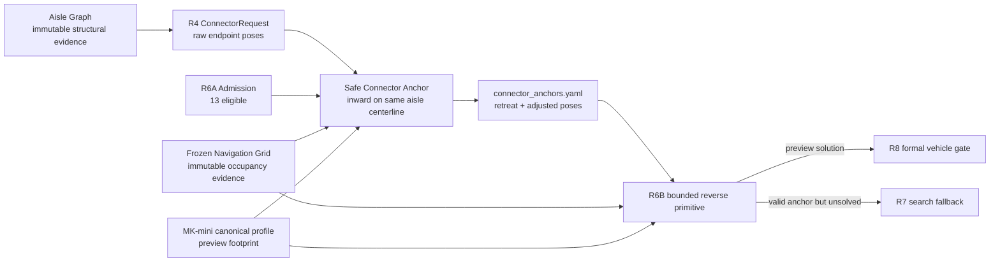

# Agricultural Route Safe Connector Anchors

Date: 2026-08-14

## Why this layer exists

The first real R6B greenhouse smoke exposed:

```text
13 R6A-admitted connectors
├─ 1  reverse primitive solved
├─ 11 R6B_START_FOOTPRINT_NOT_FREE
└─ 1  reverse primitive unsolved after search
```

R4 currently uses raw Agricultural Aisle Graph endpoints as ConnectorRequest
poses. The graph endpoint is structural centerline evidence and is not a
full-vehicle footprint guarantee

## Architecture



## Anchor semantics

```text
raw endpoint
↓
identify corresponding end of the existing aisle centerline
↓
walk inward along that same polyline
↓
find nearest pose whose MK-mini preview footprint is FREE
↓
also require a short stable FREE inward span
↓
freeze retreat distance and adjusted connector pose
```

The layer does not invent a new road and does not laterally move the aisle
centerline

## Immutable boundaries

```text
Aisle Graph          not modified
Navigation occupancy not modified
R6A admission        not broadened
Vehicle Profile      not duplicated
```

The output is only a derived route-production asset

## Route assembly requirement

If a connector start is retreated inward by `d_start`, the preceding straight
aisle traversal must terminate at that selected anchor

If a connector goal is retreated inward by `d_goal`, the following straight
aisle traversal must begin at that selected anchor

The final route must not include the unsafe raw endpoint tail between an anchor
and the original structural endpoint

## Failure policy

```text
READY_FOR_LOCAL_CONNECTOR
→ adjusted request may enter R6B

HOLD_ANCHOR_REVIEW
→ no stable FREE anchor inside bounded retreat
→ do not relax occupancy
→ do not send the raw endpoint unchanged to R7
```

R7 is only for kinematic/search failure after a valid vehicle-safe connector
anchor exists

## Readiness boundary

Anchor evidence uses the current MK-mini offline preview footprint assumption
and remains `PREVIEW_ONLY_NOT_R8_VEHICLE_READY`

The real `base_footprint` reference and final mounted envelope still need
physical measurement before formal Route READY promotion
