# Agricultural Route Production Architecture

本文定义 V25-12C 地图工作台输出如何进入 V25-12E Offline Route Preview 与既有 Route Asset 合同

它是 `system_architecture.md`、`route_asset_contract.md` 与 `bag_to_route_asset.md` 的农业结构化场景补充，不创建第二套 Route/Vehicle/Map 真值系统

## 1. 当前实现边界

真实温室 PCD 当前已经具备

```text
Cleaned / processed PCD
        ↓
Ground-relative Navigation Map
        ↓
Ground Confidence + Robust Slope
        ↓
Hybrid Row Skeleton
        ↓
Row Structural Band + Vegetation Envelope
        ↓
Interior Aisle + Explicit Boundary Aisle
        ↓
Aisle Centerline
        ↓
Vehicle Corridor Review
        ↓
2D / 3D operator audit
```

这些仍是 Offline Map/Structure evidence，不等同于 READY Route Asset

V25-12E 已开始把这些 evidence 升级成 Aisle Graph、Turn Zone、vehicle-aware coverage order 和 kinematic connector evidence

## 2. 场景与执行底盘绑定

平台 identity 不再用场景名替代

```text
Greenhouse / 温室大棚
    → canonical platform: mk_mini
    → profiles/platforms/mk_mini.yaml
    → Ackermann
    → V25-12E aisle / coverage / connector route production

GAAS open field / 农科院开阔场地
    → canonical platform: bunker
    → profiles/platforms/bunker.yaml
    → tracked differential
    → future GNSS / RTK truth benchmark + outdoor global navigation
```

`profiles/platforms/greenhouse_ackermann.yaml` 仅保留为历史兼容 profile，新 V25-12E 温室 Route Asset 不再绑定这个场景命名的通用 profile

底盘差异进入 canonical Vehicle Profile，不进入 Mission / BT 业务语义

## 3. 目标生产链

```mermaid
flowchart LR
  PCD["Processed PCD"]
  NAV["Navigation Map\nPGM/YAML + evidence"]
  ROW["Hybrid Row / Structural Band"]
  AISLE["Interior + Boundary Aisles"]
  GRAPH["Agricultural Aisle Graph\naisle_graph.yaml"]
  TURN["Turn Zones\nturn_zones.yaml"]
  PROFILE["Canonical Vehicle Profile\nprofiles/platforms/<platform>.yaml"]
  POLICY["Route Policy\npolicy.yaml"]
  ORDER["Coverage Ordering\nvehicle filter + Boustrophedon"]
  REQUEST["Connector Requests\nLOW_U / HIGH_U"]
  FWD["Forward-first\nAnalytic Dubins → Dubins-CC"]
  FIT["Turn-Zone Fit Diagnostic\noutward / inward / lateral deficit"]
  REV["Reverse fallback\nReeds-Shepp / RS-CC"]
  SMAC["Search fallback\nSmac Hybrid / State Lattice"]
  SWEEP["Full-footprint + kinematic\nswept validation"]
  ROUTE["Existing READY Route Asset\nroute.yaml + route.csv"]
  PREVIEW["2D / 3D Route Preview"]
  NAV2["Runtime ROUTE Capability / Nav2"]

  PCD --> NAV
  NAV --> ROW
  ROW --> AISLE
  AISLE --> GRAPH
  GRAPH --> ORDER
  TURN --> ORDER
  PROFILE --> ORDER
  POLICY --> ORDER
  ORDER --> REQUEST
  REQUEST --> FWD
  FWD -->|Turn Zone reject| FIT
  FIT -->|modest expansion physically available| TURN
  FIT -->|headland insufficient| REV
  FWD -->|centerline accepted| SWEEP
  REV -->|infeasible| SMAC
  REV --> SWEEP
  SMAC --> SWEEP
  NAV --> SWEEP
  PROFILE --> SWEEP
  TURN --> SWEEP
  SWEEP --> ROUTE
  ROUTE --> PREVIEW
  ROUTE --> NAV2
```



核心语义

```text
Aisle Graph          决定“有哪些结构化道路”
Coverage Ordering    决定“这台车能走哪些道路、以什么顺序访问”
Connector Request    决定“下一对道路需要在哪一侧连接”
Connector Planner    决定“怎样满足运动学连接”
Zone-Fit Diagnostic  决定“forward 失败是 envelope 太小还是 headland 真不足”
Navigation Map       决定“几何上是否安全”
Vehicle Profile      决定“这台车是否真的能通过/转过去”
Route Asset          冻结最终可执行离线路线
```

## 4. Navigation Map 与 Aisle Graph 分工

Navigation Map

```text
navigation_map.pgm
navigation_map.yaml
```

负责 Occupied / Free / Unknown、footprint collision、clearance、Nav2 static/global costmap 和 connector fallback search 的安全约束

Aisle Graph

```text
aisle_graph.yaml
```

负责 Interior / Boundary aisle identity、centerline XYZ、start/end pose、宽度、相邻垄/墙和诊断 evidence

PGM 不再承担“第几条行道先走”的任务语义

## 5. Turn Zone contract

```text
turn_zones.yaml
schema: agt_turn_zones/v1
```

Turn Zone 是 connector search envelope，不是 FREE-space truth

它可以约束允许调头、方向切换、倒车的位置，但任何 connector 仍必须重新经过 Navigation Map 与 full-footprint feasibility

首版自动派生 `turn_low_u` / `turn_high_u`，后续允许 Workbench operator 修订

自动 Turn Zone 参数不是车辆事实，也不是固定场景真值；R5 zone-fit diagnostic 可以证明某个 envelope 过小，但扩大 Turn Zone 前仍必须和 Navigation Map / 真实 headland 空间核对

## 6. Vehicle Profile 是唯一车辆几何真值

正式来源只有

```text
profiles/platforms/<platform>.yaml
```

Route production 至少读取

```text
navigation footprint
physical width / length
wheelbase / track when available
minimum turning radius
steering interface limit when available
reverse capability / policy
operational speed limits
```

Workbench 临时车宽只属于 Preview 参数

### MK-mini greenhouse baseline

厂家手册已经冻结

```text
overall envelope          0.840 x 0.600 x 0.310 m
wheelbase                 0.600 m
track                     0.517 m
wheel diameter            0.240 m
ground clearance          0.111 m
minimum turning radius    1.500 m
VCU steering soft limit   +/-34 deg
```

`minimum turning radius=1.5 m` 是 route connector 的 canonical vehicle-level curvature constraint

VCU `+/-34 deg` 不直接反推 bicycle-model turning radius，因为厂家手册没有证明二者采用相同 steering-angle reference

厂家 overall envelope 已可用于 offline planning preview，但实际 `base_footprint` 在外包络中的参考位置和最终搭载后的 navigation envelope 仍需上车测量，所以正式 Route READY promotion 继续 fail-closed

### BUNKER open-field baseline

BUNKER 不参与当前温室 Aisle Route 的车辆过滤

它保留给农科院开阔场地，并在后续阶段绑定 GNSS / RTK 作为 global truth / accuracy benchmark，同时继续评估 FAST-LIVO2 / odometry / global correction 的误差

## 7. Coverage Ordering contract

首版 schema

```text
agt_agricultural_coverage_order/v1
```

R4 输入

```text
Aisle Graph
+ Canonical Vehicle Profile
+ route-policy side clearance
```

首先进行车辆宽度过滤

```text
required_width = max(
  aisle.minimum_required_width,
  vehicle.navigation_width + 2 * policy_side_clearance
)
```

然后按照 row-normal lateral coordinate 做 deterministic sort，并执行 Boustrophedon / snake

重要语义

```text
WITH_ROW_DIRECTION
AGAINST_ROW_DIRECTION
```

只描述 aisle polyline 的遍历方向

两者默认都是

```text
motion_direction = FORWARD
```

不能把 `AGAINST_ROW_DIRECTION` 错写成倒车

真正的 `motion_direction=REVERSE` 只允许后续 reverse-aware connector fallback 产生

R4 不伪造连接曲线，只生成

```text
connector_001
from aisle_x
→ turn_high_u / turn_low_u
→ aisle_y
```

供 R5/R6/R7 求解

Fields2Cover / OR-tools 可以以后替换 ordering backend，但资产合同不绑定 backend 名称

## 8. Connector planning policy

冻结的 backend 优先级语义

```text
Dubins / Dubins-CC forward first
        ↓ fail
Reeds-Shepp reverse fallback
        ↓ fail
Smac Hybrid-A* / State Lattice search fallback
        ↓
Full-footprint validation
```

当前 R5 已实现的是 classical analytic Dubins forward-only，Dubins-CC 仍是后续可替换 forward backend candidate

对于 MK-mini，首个 forward connector 必须尊重 `Rmin=1.5 m`

R5 schema

```text
agt_forward_connector_plan/v1
```

R5 首版枚举标准 Dubins 六类

```text
LSL / RSR / LSR / RSL / RLR / LRL
```

按路径长度排序，并选择整条采样 centerline 都处于请求 Turn Zone 的最短 forward-only candidate

R5 只验证

```text
forward-only curvature
+ canonical minimum turning radius
+ Turn Zone centerline containment
```

R5 明确不验证

```text
full footprint swept collision
Navigation Map occupancy / UNKNOWN
vegetation semantic collision
formal Route READY
```

因此 `ACCEPTED_CENTERLINE` 只代表可以进入 R8 等后续 gate，不代表车辆最终可执行

### 8.1 Forward Turn-Zone fit diagnostic

真实温室首轮 R5 出现 17/17 `NO_FORWARD_DUBINS_IN_TURN_ZONE`，但每个 connector 都存在 4~5 个 analytic Dubins candidate，且最佳 inside fraction 约在 0.519~0.907

这不能直接解释成“必须倒车”

新增独立 schema

```text
agt_forward_connector_zone_fit_diagnostic/v1
```

它不改变 R5 plan 的冻结语义，而是在 Agricultural Aisle Graph row frame 中选择“需要最少 Turn Zone 扩张”的 forward Dubins candidate，并输出

```text
required_outward_extension_m
required_inward_extension_m
required_lateral_low_extension_m
required_lateral_high_extension_m
max_required_extension_m
```

对于当前矩形 `AUTO_ENDPOINT_ENVELOPE` Turn Zone，这些是精确的 row-frame bounding-envelope deficit

对于未来任意/凹多边形，它们只是 bounding-envelope diagnostic，不能替代 polygon containment

决策规则

```text
如果所需扩张很小
+ Navigation Map / 真实棚头确有对应 FREE 空间
→ 修订 Turn Zone
→ 重跑 R5

如果所需扩张很大
或扩张区域实际是墙 / 垄 / UNKNOWN / 不可用空间
→ forward-only 物理不可接受
→ 将该 connector 送入 R6 reverse fallback
```

是否允许 reverse 由 Route Policy 联合 canonical Vehicle Profile 决定

解析曲线满足曲率仍不足以 READY，必须经过完整 footprint swept collision / unknown / semantic / turn-zone gate

## 9. Route Asset 保持既有合同

最终正式产品仍使用

```text
runtime/maps/<map_id>/versions/<map_version_id>/routes/<route_id>/<revision>/
  route.yaml
  route.csv
  policy.yaml
  feasibility_report.json
  preview.geojson
```

本架构只增加上游农业 aisle/turn/order/connector evidence，不创建第二个 Route truth owner

## 10. 2D / 3D review

正式 Route Preview 复用 V25-12C 已验证的 2D/3D substrate

至少叠加

```text
PCD
Ground Surface
Row Structural Band
Aisle Graph
Turn Zones
ordered aisle traversal
connector candidates
Forward / Reverse motion
vehicle swept footprint
conflict / invalid poses
```

## 11. 实现顺序

```text
R1  Aisle Graph deterministic export
R2  Turn Zone derivation / authoring / export
R3  Canonical Vehicle Profile adapter
R4  Vehicle-aware deterministic boustrophedon ordering
R5  Forward connector backend + Turn-Zone fit diagnostic
R6  Reverse fallback backend
R7  Smac search fallback adapter
R8  Swept-footprint / kinematic feasibility
R9  route.yaml + route.csv + preview export
R10 Workbench 2D/3D Route Preview acceptance
```

## 12. 当前状态

```text
V25-12C Ground / Row / Aisle / 3D Review
  REAL-DATA OPERATOR REVIEW POSITIVE

R1 Aisle Graph
  IMPLEMENTED; GREENHOUSE REAL-DATA ACCEPTED; AUTOMATED GATE TO CONFIRM AFTER DOC FIX

R2 Turn Zones
  IMPLEMENTED CORE
  REAL ASSET GENERATED
  envelope geometry under R5 diagnostic

R3 Canonical Vehicle Profile
  IMPLEMENTED CORE
  MK-mini MANUFACTURER SPEC FROZEN
  greenhouse canonical platform corrected to mk_mini
  operator adapter output confirmed

R4 Coverage Ordering
  IMPLEMENTED CORE
  GREENHOUSE REAL-DATA SMOKE PASS
  19 input → 18 accepted / 1 width-rejected → 17 connector requests

R5 Forward Connector
  IMPLEMENTED CORE
  real greenhouse: 0/17 fit current Turn Zones
  17/17 have analytic Dubins candidates
  Turn-Zone fit diagnostic IMPLEMENTED / LOCAL GATE PENDING

R6+ reverse/search/swept feasibility/final Route Asset
  NOT YET CLAIMED IMPLEMENTED
```
