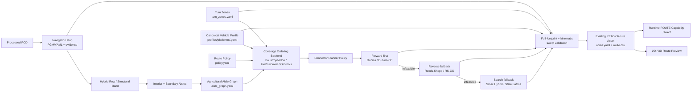

# Agricultural Route Production Architecture

本文定义 V25-12C 地图工作台输出如何进入 V25-12E Offline Route Preview 与既有 Route Asset 合同

它是 `system_architecture.md`、`route_asset_contract.md` 与 `bag_to_route_asset.md` 的农业结构化场景补充，不创建第二套 Route/Vehicle/Map 真值系统

## 1. 当前实现边界

截至当前 V25-12C 分支，真实温室 PCD 已经具备以下 Offline evidence

```text
Cleaned / processed PCD
        ↓
Ground-relative Navigation Map
        ↓
Ground Confidence + Robust Slope
        ↓
Hybrid Row Skeleton
        ↓
Row Structural Band + Vegetation Envelope
        ↓
Interior Aisle + Explicit Boundary Aisle
        ↓
Aisle Centerline
        ↓
Vehicle Corridor Review
        ↓
2D / 3D operator audit
```

上述证据仍属于 Offline Map/Structure production，不等同于 READY Route Asset

当前没有因为中心线已经可视化就宣称 Coverage Ordering、Dubins/Reeds-Shepp connector 或 Runtime Route execution 已完成

## 2. 目标生产链



核心语义

```text
Aisle Graph 决定“有哪些结构化道路”
Coverage Ordering 决定“以什么顺序访问”
Connector Planner 决定“相邻道路之间怎样满足运动学连接”
Navigation Map 决定“几何上是否安全”
Vehicle Profile 决定“这台车是否真的能通过”
Route Asset 冻结最终可执行离线路线
```

## 3. Navigation Map 与 Aisle Graph 分工

Navigation Map 继续导出

```text
navigation_map.pgm
navigation_map.yaml
```

职责

- Occupied / Free / Unknown 静态几何约束
- footprint collision / clearance validation
- Nav2 static/global costmap 输入
- connector search 与 fallback planner 的安全约束

Aisle Graph 新增导出

```text
aisle_graph.yaml
```

职责

- Interior aisle / Boundary aisle identity
- centerline XYZ polyline
- start/end pose
- aisle width / minimum safe width
- adjacent crop-row or boundary references
- Ground / Slope / obstacle evidence summary
- forward/reverse permission metadata
- topology edges / legal connection endpoints

因此不再要求 PGM 本身表达“第几条行道先走”

## 4. Aisle Graph contract

首版 schema

```text
agt_agricultural_aisle_graph/v1
```

建议结构

```yaml
schema: agt_agricultural_aisle_graph/v1
frame_id: map
source:
  navigation_map_content_sha256: sha256:...
  corridor_evidence_sha256: sha256:...
row_direction_xy: [0.99, 0.10]
nominal_row_spacing_m: 1.80
aisles:
  - aisle_id: aisle_001
    kind: interior
    pair_kind: ROW_ROW
    centerline_xyz:
      - [1.0, 2.0, -1.2]
      - [1.1, 2.0, -1.2]
    start_pose: {x: 1.0, y: 2.0, z: -1.2, yaw: 0.10}
    end_pose: {x: 25.0, y: 4.4, z: -1.0, yaw: 0.10}
    geometric_width_m: 0.96
    minimum_required_width_m: 0.45
    length_m: 25.08
    adjacent_structure:
      left: row_01
      right: row_02
```

Boundary aisle 使用同一结构，但 `kind=boundary`，一侧引用 `wall/boundary`

Aisle Graph 是 DRAFT/derived asset，不取代既有 Semantic Map 或 READY Route Asset

## 5. Turn Zone contract

连接器不能在任意位置掉头或倒车

```text
turn_zones.yaml
```

最低语义

```yaml
schema: agt_turn_zones/v1
frame_id: map
zones:
  - zone_id: headland_north
    polygon_xy: [[...], [...]]
    allowed_motions:
      forward_turn: true
      reverse: true
      direction_change: true
    minimum_clearance_m: 0.15
```

Turn Zone 可以来自

- Semantic Map 已标注 `headland_zone`
- Workbench operator polygon authoring
- 后续自动从 aisle endpoint 与 free-space geometry 派生的候选

自动候选必须经过 operator review 后才能成为 READY Route 的正式约束

## 6. Vehicle Profile 是唯一车辆几何真值

不新增第二份 `vehicle_profile.yaml` 复制已有平台参数

正式来源继续是

```text
profiles/platforms/<platform>.yaml
```

Route production 读取至少

```text
navigation footprint
physical width / length
wheelbase
minimum turning radius
reverse capability / policy
speed / steering limits when available
```

Workbench 中临时输入的车宽/安全余量只属于 Preview 参数，不成为 READY Route 的 canonical vehicle truth

## 7. Coverage ordering

第一条基线保持确定性 Boustrophedon / snake ordering

```text
aisle_01 forward
aisle_02 reverse_orientation
aisle_03 forward
...
```

Fields2Cover 作为可替换 ordering/path backend，而不是资产合同 owner

Fields2Cover 可消费由真实点云恢复出的 aisle/swath geometry；系统不要求它重新从理想 field polygon 生成一套与现场结构不同的 swath

未来 OR-tools / task-aware ordering 可以替换顺序算法，但输出仍进入相同 Route Asset lineage

## 8. Connector planning policy

连接器采用 forward-first fallback chain

```text
Connector request
    ↓
Dubins / Dubins Continuous Curvature
    ↓ infeasible or collision
Reeds-Shepp / reverse-aware connector
    ↓ infeasible or collision
Smac Hybrid-A* / State Lattice search fallback
    ↓
Full-footprint validation
```

是否允许 reverse 由 Route Policy + canonical Vehicle Profile 联合决定

单纯解析曲线满足最小转弯半径仍不足以 READY；必须通过完整 footprint swept collision / unknown / semantic / turn-zone gate

## 9. Route Asset 保持既有合同

最终正式产品仍使用

```text
runtime/maps/<map_id>/versions/<map_version_id>/routes/<route_id>/<revision>/
  route.yaml
  route.csv
  policy.yaml
  feasibility_report.json
  preview.geojson
```

本架构只新增上游结构化 aisle/turn evidence，不重新定义 Route Asset schema

Route CSV 继续冻结

```text
seq
segment_id
x
y
yaw
direction F/R
v_ref
curvature
clearance
semantic_ref
event_ref
```

可额外在生成器内部保留 `segment_type=aisle/connector`，如需进入正式 CSV 必须单独版本化 route contract

## 10. 2D / 3D review

正式 Route Preview 应复用 V25-12C 已验证的 2D/3D review substrate

至少可叠加

```text
PCD
Ground Surface
Row Structural Band
Aisle Graph
Turn Zones
Route centerline
Forward / Reverse segments
Vehicle swept footprint
Conflict envelope
Invalid poses
```

3D review 是审查客户端，不拥有 Route truth

READY Route preview 是冻结证据；修改路线必须产生新 revision 并重新 feasibility

## 11. 实现顺序

```text
R1  Aisle Graph deterministic export
R2  Turn Zone authoring / export
R3  Canonical Vehicle Profile adapter
R4  Deterministic boustrophedon ordering
R5  Forward connector backend
R6  Reverse fallback backend
R7  Smac search fallback adapter
R8  Swept-footprint / kinematic feasibility
R9  route.yaml + route.csv + preview export
R10 Workbench 2D/3D Route Preview acceptance
```

每个增量必须有独立 unit/contract test，且更新本文件与阶段文档状态

## 12. 当前状态标记

```text
Ground-relative / Hybrid Row / Aisle / Vehicle Corridor / 3D Review
  IMPLEMENTED, REAL-DATA OPERATOR REVIEW POSITIVE

Aisle Graph export
  NEXT IMPLEMENTATION INCREMENT

Turn Zone / Coverage Ordering / Connector / Route export
  TARGET, NOT YET CLAIMED IMPLEMENTED
```
