# Agricultural Route Production Architecture

本文定义 V25-12C 地图工作台输出如何进入 V25-12E Offline Route Preview 与既有 Route Asset 合同

它是 `system_architecture.md`、`route_asset_contract.md` 与 `bag_to_route_asset.md` 的农业结构化场景补充，不创建第二套 Route/Vehicle/Map 真值系统

## 1. 当前实现边界

真实温室 PCD 当前已经具备

```text
Cleaned / processed PCD
        ↓
Ground-relative Navigation Map
        ↓
Ground Confidence + Robust Slope
        ↓
Hybrid Row Skeleton
        ↓
Row Structural Band + Vegetation Envelope
        ↓
Interior Aisle + Explicit Boundary Aisle
        ↓
Aisle Centerline
        ↓
Vehicle Corridor Review
        ↓
2D / 3D operator audit
```

这些仍是 Offline Map/Structure evidence，不等同于 READY Route Asset

V25-12E 已开始把这些 evidence 升级成 Aisle Graph、Turn Zone、vehicle-aware coverage order 和 kinematic connector evidence

## 2. 场景与执行底盘绑定

平台 identity 不再用场景名替代

```text
Greenhouse / 温室大棚
    → canonical platform: mk_mini
    → profiles/platforms/mk_mini.yaml
    → Ackermann
    → V25-12E aisle / coverage / connector route production

GAAS open field / 农科院开阔场地
    → canonical platform: bunker
    → profiles/platforms/bunker.yaml
    → tracked differential
    → future GNSS / RTK truth benchmark + outdoor global navigation
```

`profiles/platforms/greenhouse_ackermann.yaml` 仅保留为历史兼容 profile，新 V25-12E 温室 Route Asset 不再绑定这个场景命名的通用 profile

底盘差异进入 canonical Vehicle Profile，不进入 Mission / BT 业务语义

## 3. 目标生产链

```mermaid
flowchart LR
  PCD["Processed PCD"]
  NAV["Navigation Map\nPGM/YAML + evidence"]
  ROW["Hybrid Row / Structural Band"]
  AISLE["Interior + Boundary Aisles"]
  GRAPH["Agricultural Aisle Graph\naisle_graph.yaml"]
  TURN["Turn Zones\nturn_zones.yaml"]
  PROFILE["Canonical Vehicle Profile\nprofiles/platforms/<platform>.yaml"]
  POLICY["Route Policy\npolicy.yaml"]
  ORDER["Coverage Ordering\nvehicle filter + Boustrophedon"]
  REQUEST["Connector Requests\nLOW_U / HIGH_U"]
  FWD["Forward-first\nAnalytic Dubins → Dubins-CC"]
  FIT["Turn-Zone Fit Diagnostic\noutward / inward / lateral deficit"]
  NAVGATE["Connector Navigation Preview Gate\ncenterline + preview swept footprint"]
  REFINE["Turn-Zone Refinement Proposal\nreview evidence only"]
  REV["Reverse fallback\nReeds-Shepp / RS-CC"]
  SMAC["Search fallback\nSmac Hybrid / State Lattice"]
  SWEEP["Formal full-footprint + kinematic\nswept validation"]
  ROUTE["Existing READY Route Asset\nroute.yaml + route.csv"]
  PREVIEW["2D / 3D Route Preview"]
  NAV2["Runtime ROUTE Capability / Nav2"]

  PCD --> NAV
  NAV --> ROW
  ROW --> AISLE
  AISLE --> GRAPH
  GRAPH --> ORDER
  TURN --> ORDER
  PROFILE --> ORDER
  POLICY --> ORDER
  ORDER --> REQUEST
  REQUEST --> FWD
  FWD -->|Turn Zone reject| FIT
  FIT --> NAVGATE
  NAV --> NAVGATE
  PROFILE --> NAVGATE
  FIT --> REFINE
  NAV --> REFINE
  NAVGATE -->|preview footprint free| TURN
  NAVGATE -->|occupied / unknown / out of grid| REV
  REFINE -->|operator geometry review| TURN
  FWD -->|accepted under revised envelope| SWEEP
  REV -->|infeasible| SMAC
  REV --> SWEEP
  SMAC --> SWEEP
  NAV --> SWEEP
  PROFILE --> SWEEP
  TURN --> SWEEP
  SWEEP --> ROUTE
  ROUTE --> PREVIEW
  ROUTE --> NAV2
```



核心语义

```text
Aisle Graph             决定“有哪些结构化道路”
Coverage Ordering       决定“这台车能走哪些道路、以什么顺序访问”
Connector Request       决定“下一对道路需要在哪一侧连接”
Connector Planner       决定“怎样满足运动学连接”
Zone-Fit Diagnostic     决定“当前 envelope 还缺多少几何空间”
Navigation Preview Gate 决定“某一条 forward candidate 本身是否穿过静态 OCCUPIED/UNKNOWN”
Turn-Zone Refinement    只提供共享 envelope 的几何/审查提案，不再代理 path feasibility
Navigation Map          决定“静态几何证据上是否存在 FREE/OCCUPIED/UNKNOWN”
Vehicle Profile         决定“这台车是否真的能通过/转过去”
Route Asset             冻结最终可执行离线路线
```

## 4. Navigation Map 与 Aisle Graph 分工

Navigation Map

```text
navigation_map.pgm
navigation_map.yaml
```

负责 Occupied / Free / Unknown、footprint collision、clearance、Nav2 static/global costmap 和 connector fallback search 的安全约束

V25-12E 允许通过轻量 `NavigationGridEvidence` 重新读取冻结 PGM/YAML，在不重跑 PCD 的前提下检查 connector 候选路径和 preview swept footprint

这仍然只是静态 preview evidence，不替代最终 formal full-footprint swept validation

Aisle Graph

```text
aisle_graph.yaml
```

负责 Interior / Boundary aisle identity、centerline XYZ、start/end pose、宽度、相邻垄/墙和诊断 evidence

PGM 不再承担“第几条行道先走”的任务语义

## 5. Turn Zone contract

```text
turn_zones.yaml
schema: agt_turn_zones/v1
```

Turn Zone 是 connector search envelope，不是 FREE-space truth

它可以约束允许调头、方向切换、倒车的位置，但任何 connector 仍必须重新经过 Navigation Map 与 full-footprint feasibility

首版自动派生 `turn_low_u` / `turn_high_u`，后续允许 Workbench operator 修订

自动 Turn Zone 参数不是车辆事实，也不是固定场景真值；R5 zone-fit diagnostic 可以证明某个 envelope 过小，但扩大 Turn Zone 前仍必须和 connector-specific Navigation Grid evidence / 真实 headland 空间核对

Turn Zone 修订使用独立 DRAFT proposal

```text
turn_zone_refinement_proposal.yaml
schema: agt_turn_zone_refinement_proposal/v1
```

它聚合共享 LOW_U/HIGH_U zone 中每个 connector 的最小 outward / inward / lateral deficit，并记录是哪一个 connector 驱动该方向的最大扩张

共享矩形扩张可能天然覆盖大量 crop-row ends，因此 whole-zone FREE ratio 不能作为 one-connector drivable-path gate

proposal 不是 drive permission，也不会原地覆盖 `turn_zones.yaml`

## 6. Vehicle Profile 是唯一车辆几何真值

正式来源只有

```text
profiles/platforms/<platform>.yaml
```

Route production 至少读取

```text
navigation footprint
physical width / length
wheelbase / track when available
minimum turning radius
steering interface limit when available
reverse capability / policy
operational speed limits
```

Workbench 临时车宽只属于 Preview 参数

### MK-mini greenhouse baseline

厂家手册已经冻结

```text
overall envelope          0.840 x 0.600 x 0.310 m
wheelbase                 0.600 m
track                     0.517 m
wheel diameter            0.240 m
ground clearance          0.111 m
minimum turning radius    1.500 m
VCU steering soft limit   +/-34 deg
```

`minimum turning radius=1.5 m` 是 route connector 的 canonical vehicle-level curvature constraint

VCU `+/-34 deg` 不直接反推 bicycle-model turning radius，因为厂家手册没有证明二者采用相同 steering-angle reference

厂家 overall envelope 已可用于 offline planning preview，但实际 `base_footprint` 在外包络中的参考位置和最终搭载后的 navigation envelope 仍需上车测量，所以正式 Route READY promotion 继续 fail-closed

### BUNKER open-field baseline

BUNKER 不参与当前温室 Aisle Route 的车辆过滤

它保留给农科院开阔场地，并在后续阶段绑定 GNSS / RTK 作为 global truth / accuracy benchmark，同时继续评估 FAST-LIVO2 / odometry / global correction 的误差

## 7. Coverage Ordering contract

首版 schema

```text
agt_agricultural_coverage_order/v1
```

R4 输入

```text
Aisle Graph
+ Canonical Vehicle Profile
+ route-policy side clearance
```

首先进行车辆宽度过滤

```text
required_width = max(
  aisle.minimum_required_width,
  vehicle.navigation_width + 2 * policy_side_clearance
)
```

然后按照 row-normal lateral coordinate 做 deterministic sort，并执行 Boustrophedon / snake

重要语义

```text
WITH_ROW_DIRECTION
AGAINST_ROW_DIRECTION
```

只描述 aisle polyline 的遍历方向

两者默认都是

```text
motion_direction = FORWARD
```

不能把 `AGAINST_ROW_DIRECTION` 错写成倒车

真正的 `motion_direction=REVERSE` 只允许后续 reverse-aware connector fallback 产生

R4 不伪造连接曲线，只生成

```text
connector_001
from aisle_x
→ turn_high_u / turn_low_u
→ aisle_y
```

供 R5/R6/R7 求解

Fields2Cover / OR-tools 可以以后替换 ordering backend，但资产合同不绑定 backend 名称

## 8. Connector planning policy

冻结的 backend 优先级语义

```text
Dubins / Dubins-CC forward first
        ↓ fail
Reeds-Shepp reverse fallback
        ↓ fail
Smac Hybrid-A* / State Lattice search fallback
        ↓
Full-footprint validation
```

当前 R5 已实现的是 classical analytic Dubins forward-only，Dubins-CC 仍是后续可替换 forward backend candidate

对于 MK-mini，首个 forward connector 必须尊重 `Rmin=1.5 m`

R5 schema

```text
agt_forward_connector_plan/v1
```

R5 首版枚举标准 Dubins 六类

```text
LSL / RSR / LSR / RSL / RLR / LRL
```

按路径长度排序，并选择整条采样 centerline 都处于请求 Turn Zone 的最短 forward-only candidate

R5 只验证

```text
forward-only curvature
+ canonical minimum turning radius
+ Turn Zone centerline containment
```

因此 `ACCEPTED_CENTERLINE` 只代表可以进入后续 gate，不代表车辆最终可执行

### 8.1 Forward Turn-Zone fit diagnostic

真实温室首轮 R5 出现 17/17 `NO_FORWARD_DUBINS_IN_TURN_ZONE`，但每个 connector 都存在 4~5 个 analytic Dubins candidate

后续真实 zone-fit 诊断表明 17/17 都需要扩张；绝大多数由 outward 缺口主导，整体最大单轴缺口中位数约 `0.470 m`，90th percentile 约 `0.686 m`

关键异常

```text
connector_001  HIGH_U  outward 0.677 m + lateral-low 0.277 m
connector_016  LOW_U   outward 0.361 m + inward 0.846 m
```

完整实测记录见

```text
docs/experiments/v25_12e_r5_turn_zone_fit_20260814.md
```

新增独立 schema

```text
agt_forward_connector_zone_fit_diagnostic/v1
```

它不改变 R5 plan 的冻结语义，而是在 Agricultural Aisle Graph row frame 中选择“需要最少 Turn Zone 扩张”的 forward Dubins candidate，并输出 outward / inward / lateral deficit

### 8.2 Shared Turn-Zone refinement is not path feasibility

真实 Navigation Grid refinement smoke 得到

```text
turn_low_u  added FREE 0.164 / OCCUPIED 0.832 / UNKNOWN 0.004
turn_high_u added FREE 0.344 / OCCUPIED 0.649 / UNKNOWN 0.007
```

这不证明 forward Dubins path 碰撞

原因是共享 Turn Zone rectangle 覆盖整排 aisle endpoints，扩大整个矩形自然把大量 crop-row ends 纳入 OCCUPIED

因此 shared-zone refinement 只保留为 envelope proposal / operator review evidence

### 8.3 Connector-specific Navigation Preview Gate

新增

```text
agt_forward_connector_navigation_gate/v1
```

流程

```text
ConnectorRequest
+ frozen NavigationGridEvidence
+ canonical MK-mini navigation footprint
+ analytic Dubins families
        ↓
per-candidate sampled centerline
        ↓
preview swept navigation-footprint mask
        ↓
FREE / OCCUPIED / UNKNOWN / out-of-grid
        ↓
PREVIEW_FOOTPRINT_FREE
or NO_FORWARD_PREVIEW_FREE_CANDIDATE
```

候选选择优先级是 navigation evidence first，再比较所需 Turn Zone 扩张和 path length

默认 preview footprint 在 canonical navigation-footprint bounding rectangle 外再加 `0.05 m` padding

因为实际 `base_footprint` 参考点仍待实车测量，此 gate 明确是 `PREVIEW_ONLY_NOT_R8_VEHICLE_READY`

如果 forward candidate 的 preview swept footprint 通过，则只需为所选安全 candidate 修订最小 Turn Zone envelope

如果所有 forward candidate 都在静态 grid 上撞 OCCUPIED / UNKNOWN / out-of-grid，该 connector 才进入 R6 reverse fallback

是否允许 reverse 由 Route Policy 联合 canonical Vehicle Profile 决定

解析曲线满足曲率仍不足以 READY，必须经过 R8 formal footprint swept collision / unknown / semantic / kinematic gate

## 9. Route Asset 保持既有合同

最终正式产品仍使用

```text
runtime/maps/<map_id>/versions/<map_version_id>/routes/<route_id>/<revision>/
  route.yaml
  route.csv
  policy.yaml
  feasibility_report.json
  preview.geojson
```

本架构只增加上游农业 aisle/turn/order/connector evidence，不创建第二个 Route truth owner

## 10. 2D / 3D review

正式 Route Preview 复用 V25-12C 已验证的 2D/3D substrate

至少叠加

```text
PCD
Ground Surface
Row Structural Band
Aisle Graph
Turn Zones
ordered aisle traversal
connector candidates
Forward / Reverse motion
preview vehicle swept footprint
formal conflict / invalid poses
```

## 11. 实现顺序

```text
R1  Aisle Graph deterministic export
R2  Turn Zone derivation / authoring / export
R3  Canonical Vehicle Profile adapter
R4  Vehicle-aware deterministic boustrophedon ordering
R5  Forward connector + zone-fit + connector-specific Navigation preview gate
R6  Reverse fallback backend
R7  Smac search fallback adapter
R8  Formal swept-footprint / kinematic feasibility
R9  route.yaml + route.csv + preview export
R10 Workbench 2D/3D Route Preview acceptance
```

## 12. 当前状态

```text
V25-12C Ground / Row / Aisle / 3D Review
  REAL-DATA OPERATOR REVIEW POSITIVE

R1 Aisle Graph
  IMPLEMENTED; GREENHOUSE REAL-DATA ACCEPTED; AUTOMATED GATE TO CONFIRM

R2 Turn Zones
  IMPLEMENTED CORE
  REAL ASSET GENERATED
  shared-zone FREE ratio is review evidence only

R3 Canonical Vehicle Profile
  IMPLEMENTED CORE
  MK-mini MANUFACTURER SPEC FROZEN
  greenhouse canonical platform corrected to mk_mini
  operator adapter output confirmed

R4 Coverage Ordering
  IMPLEMENTED CORE
  GREENHOUSE REAL-DATA SMOKE PASS
  19 input → 18 accepted / 1 width-rejected → 17 connector requests

R5 Forward Connector
  IMPLEMENTED CORE
  real greenhouse: 0/17 fit original Turn Zones
  17/17 have analytic Dubins candidates
  real zone-fit diagnostic RECORDED
  shared-zone Navigation result RECORDED / not used as path gate
  connector-specific Navigation preview gate IMPLEMENTED / LOCAL ACCEPTANCE PENDING

R6+ reverse/search/formal swept feasibility/final Route Asset
  NOT YET CLAIMED IMPLEMENTED
```
