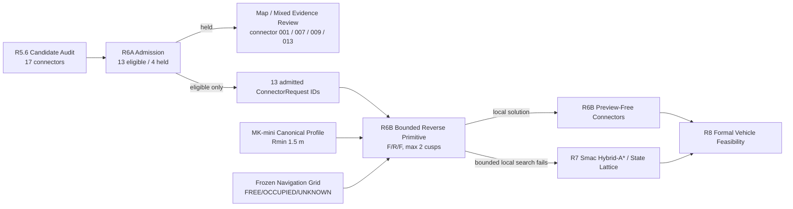

# Agricultural Route R6 Reverse Fallback Architecture

Date: 2026-08-14

This document is the focused R6 architecture checkpoint. It supplements
`agricultural_route_production.md` and records the actual implemented backend
rather than silently calling a primitive search analytic Reeds-Shepp.

## 1. Real greenhouse handoff

```text
R5.6 Forward Candidate Audit

17 connector requests
├─ 13 LOCAL_FORWARD_OCCUPANCY_BLOCKED
├─  1 LOCAL_FORWARD_MAP_EVIDENCE_INSUFFICIENT
└─  3 LOCAL_FORWARD_MIXED_EVIDENCE
```

R6A real-data acceptance:

```text
13 → ELIGIBLE_REVERSE_FALLBACK
 1 → HOLD_MAP_REVIEW
 3 → HOLD_MIXED_EVIDENCE
 0 → KEEP_FORWARD
```

The four held connectors are not inputs to R6B unless later evidence or explicit
operator approval changes their R6A admission state.

## 2. R6 pipeline



## 3. Current R6B backend identity

```text
BOUNDED_REVERSE_PRIMITIVE_SEARCH_NOT_ANALYTIC_REEDS_SHEPP
```

This wording is intentional

Current R6B is not a complete analytic Reeds-Shepp family implementation

Current R6B is also not the general Hybrid-A* fallback

It is a bounded local connector solver for an already-known aisle pair

## 4. Motion model

Canonical vehicle:

```text
platform                 mk_mini
kinematics               Ackermann
minimum turning radius   1.5 m
```

Primitive set:

```text
curvature = -1/R, 0, +1/R
motion    = FORWARD or REVERSE
```

Direction change is an explicit zero-distance cusp action

Default maximum cusps:

```text
2
```

Therefore the primary intended maneuver is:

```text
FORWARD
↓ cusp
REVERSE
↓ cusp
FORWARD
```

The planner may stop earlier if a bounded preview-free connector is found, but
normal aisle traversal itself remains FORWARD-only outside connector segments

## 5. Search boundary

R6B does not search the whole greenhouse

For each admitted connector:

```text
longitudinal search bound
= requested LOW_U/HIGH_U Turn Zone row-frame extent
+ explicit local padding

lateral search bound
= current from-aisle / to-aisle lateral span
+ explicit local padding
```

Search is additionally bounded by:

```text
max cusp count
max path length
max node expansions
state XY/Yaw discretization
```

If these local bounds cannot solve the connector, the result is not permission
to keep increasing them until R6B becomes a global planner

The connector moves to R7

## 6. Navigation evidence gate

Every R6B primitive sample checks the canonical MK-mini preview navigation
footprint against the frozen Navigation Grid

Fail closed:

```text
OCCUPIED
UNKNOWN
out-of-grid
```

Default preview footprint also carries an explicit 0.05 m padding

This is still:

```text
PREVIEW_ONLY_NOT_R8_VEHICLE_READY
```

because the exact physical `base_footprint` reference and final mounted vehicle
envelope have not yet been measured on the real greenhouse vehicle

## 7. R6B output contract

Schema:

```text
agt_reverse_primitive_connector_plan/v1
```

Each path sample records:

```text
x
y
z
yaw
motion_direction
curvature_per_m
segment_index
is_cusp
```

`z` is only start/end linear interpolation for planar preview at this stage

Result metrics include:

```text
path length
forward distance
reverse distance
cusp count
search expansions
goal pose error
centerline Navigation Grid evidence
preview footprint Navigation Grid evidence
```

## 8. R6 / R7 / R8 boundary

```text
R6B
= bounded local reverse-aware connector generation

R7
= general search fallback using Smac Hybrid-A* / State Lattice class methods

R8
= formal vehicle footprint / kinematic feasibility and Route READY gate
```

R6B success is not Route READY

R7 success is not Route READY

Only R8 may eventually participate in formal vehicle-feasible promotion
