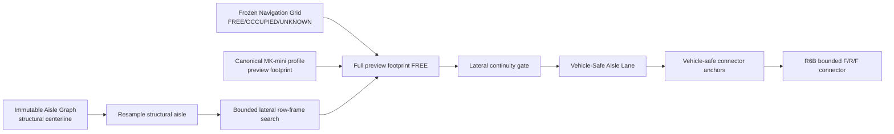

# Agricultural Route Vehicle-Safe Aisle Lane Architecture

Date: 2026-08-14

This document freezes the distinction between structural aisle evidence and a
vehicle-specific drivable lane

## 1. Why this layer exists

The real greenhouse R6B smoke exposed eleven connectors whose raw start
footprint was not FREE before reverse search started

The first inward-only Safe Connector Anchor attempt produced:

```text
13 admitted connectors
2  READY_FOR_LOCAL_CONNECTOR
11 HOLD_ANCHOR_REVIEW
```

The root cause is contractual rather than a search-budget problem

```text
structural aisle safe evidence
!= Navigation Map FREE configuration space
```

`navigation_corridor.safe_common` does not require the final occupancy value to
be FREE, while the Navigation Map additionally applies obstacle padding,
geometry-bad classification, and ground-support requirements

Therefore a structural centerline can remain geometrically meaningful without
being a valid full-vehicle trajectory

## 2. New layer



## 3. Asset contract

Schema:

```text
agt_vehicle_safe_aisle_lane/v1
```

Suggested asset filename:

```text
vehicle_safe_aisles.yaml
```

Each aisle records:

```text
aisle_id
status
structural_length_m
selected_span_m
coverage_fraction
low_u_retreat_m
high_u_retreat_m
allowed_lateral_shift_m
maximum_used_lateral_shift_m
safe_sample_count
total_sample_count
centerline_xyz
lateral_offsets_m
```

Statuses:

```text
VEHICLE_SAFE_LANE_READY
VEHICLE_SAFE_LANE_PARTIAL
NO_VEHICLE_SAFE_LANE
```

## 4. Search semantics

The structural centerline is resampled at a fixed longitudinal spacing

Candidate poses keep the canonical row heading and may shift only along the row
normal

The shift is bounded by:

```text
min(
  configured maximum lateral shift,
  0.5 * (aisle geometric width - preview vehicle lateral width)
)
```

Every selected pose must satisfy:

```text
full MK-mini preview footprint
inside frozen Navigation Grid
and every covered cell == FREE
```

A lateral change larger than the configured per-sample continuity limit breaks
the lane segment. The implementation must never teleport laterally from one
sample to the next

The longest contiguous safe segment is retained as route-production evidence

## 5. Immutability boundary

```text
Aisle Graph          not modified
Navigation occupancy not modified
Vehicle Profile      not copied into a second truth source
```

This layer derives route evidence only

It must never force OCCUPIED or UNKNOWN cells to FREE

## 6. Route semantics

If an aisle is `VEHICLE_SAFE_LANE_READY`, its low/high endpoint retreats define
where the executable aisle traversal may begin/end for this vehicle

Later route assembly must use the vehicle-safe lane instead of blindly following
the raw structural centerline to its extreme endpoint

If an aisle is `VEHICLE_SAFE_LANE_PARTIAL` or `NO_VEHICLE_SAFE_LANE`, connector
planning must not hide that failure by handing the raw endpoint to R6B or R7

## 7. R6 / R7 / R8 boundary

```text
Vehicle-Safe Aisle Lane
↓
Vehicle-safe Connector Anchor
↓
R6B bounded local reverse-aware connector
↓ fail after valid lane/anchor
R7 Smac Hybrid-A* / State Lattice
↓
R8 formal vehicle feasibility / Route READY
```

R6B and this lane layer remain:

```text
PREVIEW_ONLY_NOT_R8_VEHICLE_READY
```

until the physical MK-mini base_footprint reference and final mounted envelope
are measured
