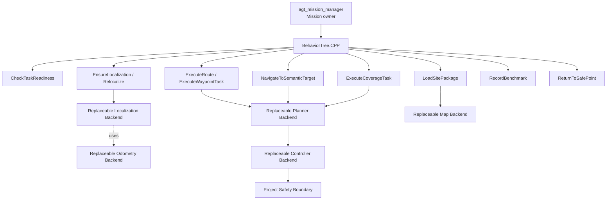

# Behavior-tree Execution Boundary

BehaviorTree.CPP is the Mission execution backend, not a second Mission manager and not a container for navigation algorithms

The authoritative business boundary is

```text
Operator / Qt / Web / Scheduler / Higher-level Robot Task
        ↓
/agt/missions/execute
        ↓
agt_mission_manager
Mission state / audit / cancellation owner
        ↓
BehaviorTree.CPP
controlled execution backend
        ↓
project BT Condition / Action nodes
        ↓
project capability Actions
        ↓
Navigation / Localization / Benchmark / future Arm capabilities
```

`agt_mission_manager` owns Mission identity, public state, audit records, cancellation policy and the public `ExecuteMission` Action

BT nodes own only temporary tree state and execution evidence

They do not publish `cmd_vel` or TF, inspect raw sensor streams to implement algorithms, modify READY maps, or directly control hardware

## Why Navigation must appear as Capability

The BT tree should express what the robot is trying to accomplish rather than which algorithm package is currently installed

Correct Mission-level semantics

```text
EnsureLocalization
ExecuteRoute
NavigateToSemanticTarget
ExecuteCoverageTask
RecordBenchmark
ReturnToSafePoint
```

Incorrect Mission-level semantics

```text
CallFastLivo2Node
RunNDTWithTheseParameters
CallNavfn
CallMPPI
PublishCmdVel
```

The second form couples business behavior to implementation details and makes later algorithm replacement require rewriting Mission trees

## Target capability stack



BT does not know whether the odometry backend is FAST-LIO2 or FAST-LIVO2, whether the planner is NavFn/Smac/Hybrid-A*/farmland planning, or whether the controller is MPPI/RPP/DWB/custom

Those selections belong to runtime profile, policy or adapter configuration

## Project-owned capability contract

Every BT Action node should wrap a project capability rather than an algorithm-native endpoint

A project capability must define

- semantic goal
- stable project request schema
- feedback
- terminal SUCCESS / FAILURE / CANCELED semantics
- structured project error/blocker code
- bounded cancellation behavior
- ownership of child backend lifecycle

Backend-native error details may be attached as technical evidence but must not become the Mission contract

## BT Conditions

Conditions should consume project-level state such as

```text
TaskReadiness
SystemHealth
LocalizationStatus
SitePackage identity / readiness
NavigationSession status
Safety state
Benchmark recorder state
```

Conditions shall not subscribe to raw LiDAR/IMU and recreate estimator logic inside the tree

## Example navigation mission

```text
Sequence
├── LoadSitePackage(site_id, version)
├── CheckTaskReadiness
├── EnsureLocalization
├── RecordBenchmark(start)
├── ExecuteRoute(route_id)
├── RecordBenchmark(stop)
└── Return SUCCESS
```

A recovery tree can remain explicit

```text
Fallback
├── ExecuteRoute(route_id)
└── Sequence
    ├── EnsureLocalization
    ├── ExecuteRoute(route_id)
    └── ReturnToSafePoint   # only if bounded retry still fails
```

Retries must be finite and auditable

## Backend replacement rule

Changing one backend must not require editing the business-level BT tree when the semantic capability is unchanged

Examples

### Odometry

```text
FAST-LIO2
FAST-LIVO2
future estimator
        ↓
project adapter
        ↓
canonical odometry + registered cloud + health
```

### Localization

```text
NDT / ICP
place recognition
weighted localization prior
GNSS/global fusion
        ↓
correction evidence
        ↓
Localization Authority
```

### Planning

```text
NavFn / Smac / Hybrid-A* / farmland planner
        ↓
project route/path capability
```

### Control

```text
MPPI / RPP / DWB / custom tracker
        ↓
/agt/navigation/cmd_vel
        ↓
agt_safety
```

The BT tree continues to call `ExecuteRoute` or equivalent project capability

## Safety and cancellation

BT child nodes must cancel their active project Action during `halt()` and fail closed on rejected, unavailable, timed-out, aborted or unconfirmed-cancelled operations

Parent Mission cancellation propagates through

```text
ExecuteMission cancel
→ mission_manager
→ haltTree()
→ BT Action halt()
→ project capability cancel
→ backend cancel
```

This cancellation path improves response and state consistency but does not replace Safety

Final physical stop remains the responsibility of the appropriate Safety domain

## Current implementation status

V25-05/V25-06 established the first production-style BT path behind `agt_mission_manager`

The first tree accepts a finite waypoint mission, uses project Action wrappers and preserves cancellation/audit ownership

Status remains `SYSTEM-INTEGRATED` for software integration

V25-11 subsequently validated the navigation/Safety/fault/observability runtime chain in SOFTWARE_ONLY Gazebo

V25-12 now freezes the target that navigation, site loading, localization, route execution and benchmark recording should evolve into reusable BT-composable project capabilities

## Groot2 boundary

Groot2 is for

- tree editing
- runtime tree visualization
- debugging
- operator/developer inspection

Groot2 is not

- Mission state owner
- map database
- localization authority
- Safety controller
- vehicle command source

## Development rule

Before adding a new BT node ask

1. Is this a stable semantic capability or only an implementation detail
2. Does a project Action/Service contract already exist
3. Can the underlying algorithm be changed without editing the tree
4. Does cancellation propagate to the real child operation
5. Is the result observable and auditable

If the answer to 1 or 3 is no, the functionality probably belongs below the BT capability boundary rather than inside the tree
