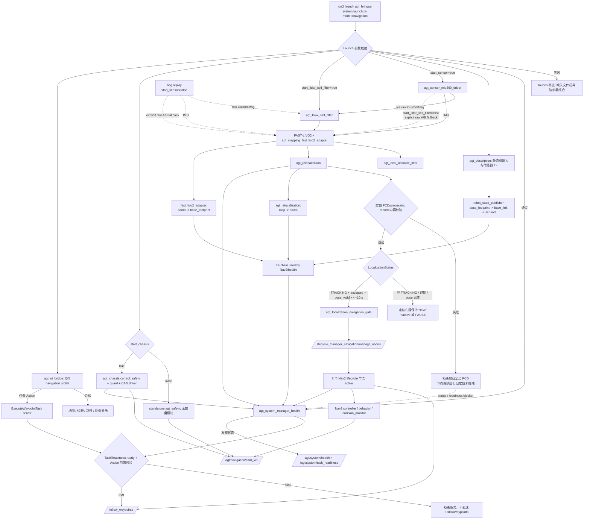
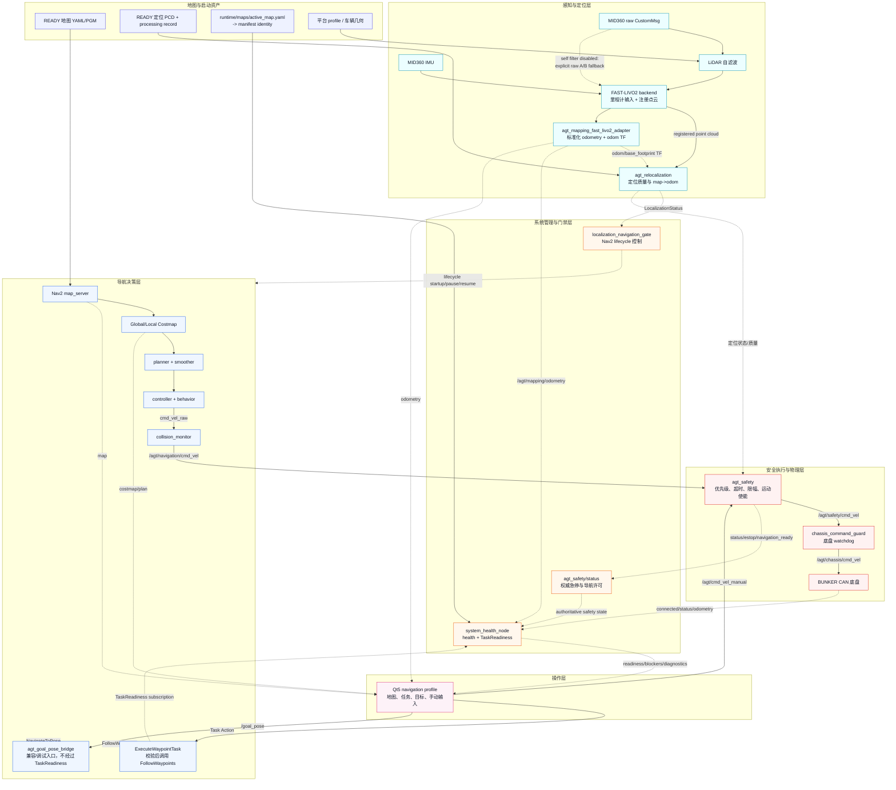

# 当前导航启动、数据流与门禁

本文描述 `agt_bringup system.launch.py mode:=navigation` 的当前实现，重点说明
Qt5、Nav2、`agt_safety`、定位和 BUNKER 底盘之间的边界。它是运行说明，不替代各
接口的消息定义和安全操作规程。

## 当前默认值

| 项目 | 当前默认值 | 含义 |
| --- | --- | --- |
| 系统模式 | `navigation`（通过 `mode` 显式选择） | 进入导航启动链，而不是 mapping 链 |
| `start_sensor` | `true` | 是否启动真实 MID360 驱动；只控制传感器驱动进程 |
| `start_lidar_self_filter` | `true` | 是否启动 Livox 自体点云前置过滤；由 `fast_livo2_mapping.launch.py` 单独控制 |
| `autostart` | `false` | Nav2 节点进程会启动，但保持 lifecycle 非 active |
| 定位门控 | `enable_localization_gate=true` | 仅由定位状态驱动 Nav2 lifecycle 启动、暂停和恢复 |
| 定位状态新鲜度 | `10 s` | 定位验证周期为 `5 s`，运行时门限必须覆盖该周期 |
| `start_gui` | `true` | 启动 navigation profile 的 Qt5 前端 |
| `start_chassis` | `false` | 默认不接管底盘；实车导航必须显式设为 `true` |
| `start_chassis_monitor` | `false` | monitor 模式只读 CAN，不是导航控制链 |
| `start_semantic_map_server` | `false` | 语义地图/Keepout 默认关闭 |
| `start_coverage_planning` | `false` | 覆盖规划默认关闭 |
| 安全运动状态 | `startup_motion_enabled=false` | 启动后必须经过现场检查再调用使能服务 |

`start_chassis:=false` 时仍会启动独立的 `agt_safety`，但不会有底盘连接状态和命令
guard，因此 `TaskReadiness` 不会变为 ready。要运行真实导航，需要使用 control 模式
启动 `agt_chassis`，而不是 `monitor` 模式。

`start_sensor` 与自滤波相互独立。历史 bag 回放可以设置
`start_sensor:=false start_lidar_self_filter:=true`：此时不启动 MID360 驱动，但仍启动
`agt_livox_self_filter`；如果再设置 `start_lidar_self_filter:=false`，FAST-LIVO2 才会回退
消费 raw `/agt/sensors/lidar/custom`。

## 启动流程



要点：

1. Qt5 启动不等于导航 ready。Qt5 可以先显示地图和诊断，但任务 Action 会继续检查
   定位、安全、底盘、Nav2 和地图身份。
2. 定位门控只负责 Nav2 lifecycle 的启动/暂停/恢复，不负责打开安全运动使能。
3. `TaskReadiness` 是任务执行门禁；它要求安全状态允许导航、底盘 connected 新鲜、8 个
   Nav2 节点 active、所需 TF 可查询、地图身份匹配，并且 `motion_enabled=true`。

## 系统框图

下面是面向操作人员的高层框图。实线表示会影响导航或运动的主数据链，虚线表示状态、
诊断或门禁信息；Qt5 位于操作层，不直接连接底盘。



### 读图顺序

1. **左上到中部**：地图/PCD/profile 是启动资产；MID360 和 IMU 经自滤波进入 FAST-LIVO2。
   注册点云进入定位节点，`agt_mapping_fast_livo2_adapter` 另行发布 `odom -> base_footprint`，
   定位节点通过 TF lookup 使用它并发布 `LocalizationStatus` 与 `map -> odom`。
2. **中部到右侧**：定位门控只负责 Nav2 lifecycle；地图进入 costmap，规划和控制产生
   `cmd_vel_raw`，再经过 `collision_monitor`。
3. **右下向底盘**：所有导航速度和 Qt 手动速度都必须进入 `agt_safety`，再经 command
   guard 才能到 BUNKER CAN；Qt5 没有到底盘的直连箭头。
4. **虚线回路**：底盘、安全、定位和 Nav2 的状态汇总到 `system_health_node`，形成
   `/agt/system/task_readiness`；门禁不满足时，任务 Action 被拒绝或执行中的 child Action
   被取消。

## 当前实现边界

### 两级地图校验

地图检查分成两层，失败行为不同：

| 层级 | 当前检查 | 失败行为 |
| --- | --- | --- |
| 顶层 launch 参数校验 | `map`、`global_map_pcd`、`global_map_processing_record` 非空且文件存在；semantic/coverage 参数组合合法 | 抛出 launch 错误，整个启动终止 |
| `agt_relocalization` 内容校验 | processing record `schema_version=1`、`state=ready`、`map_file` 与 PCD 路径匹配；若提供 map ID 或记录/期望 hash 则必须匹配 PCD/active map | 输出警告或节流错误，拒绝加载全局 PCD；节点和其他 launch 进程继续运行，定位状态及 TaskReadiness 保持阻塞；记录缺少 PCD hash 时仅标为未验证警告 |

顶层 launch 不解析 processing record 内容，也不校验其中的 hash。因此“文件存在”只表示
可以尝试启动，不表示定位地图 ready。

### 地图身份的两个输入面

导航 launch 参数中的 `map`、`map_id`、`map_version_id`、`global_map_pcd` 和
`global_map_processing_record` 会配置 map server、定位节点和 waypoint task server，
但顶层当前没有把 `map_id`/`map_version_id` 直接传给 `system_health_node`。健康节点每次
从以下位置刷新共享门禁身份：

```text
runtime/maps/active_map.yaml
    -> manifest.yaml
    -> map_id / map_version_id / map_hash / assets / READY state
```

也可以用 launch 参数 `active_map_pointer` 指定另一个 pointer。导航启动参数选择的地图版本
必须与该 pointer 指向的版本一致；否则即使 YAML、PCD 路径本身正确，TaskReadiness 仍会
产生 `MAP_ID_MISSING`、`MAP_NOT_READY` 或 `LOCALIZATION_MAP_MISMATCH`。这是当前的双重
输入面，后续应收敛为单一地图选择真源。

### SystemHealth 与 TaskReadiness

这两个输出有交集，但不是同一条件集合：

| 项目 | `SystemHealth` | `TaskReadiness` 当前实现 |
| --- | --- | --- |
| 底盘 | 检查 `/agt/chassis/connected`、`/agt/chassis/odometry`、`/agt/chassis/status` 的类型、频率/新鲜度 | 只直接检查新鲜的 `/agt/chassis/connected=true` |
| TF | 检查合同要求的 TF edge 是否可查询 | 用同一组已查询到的 edge 形成门禁 |
| Nav2 | 组件健康和 8 个 lifecycle 状态 | 直接要求 8 个 lifecycle 状态为 `active` |
| 安全 | 检查 `/agt/safety/status` 频率、新鲜度和合同条件 | 直接使用新鲜安全诊断中的 motion/estop/navigation-ready 结果 |

因此当前可能出现 `TaskReadiness.ready=true`，但 `SystemHealth` 中 chassis odometry 或 status
组件异常。两者都应显示：前者控制共享任务派发，后者用于判断系统整体健康度。

健康节点当前使用 `lookup_transform(..., Time())` 判断 TF edge 是否可查询，没有比较
transform header 时间戳与当前时间。文档中的“TF 可查询”仅描述当前实现；虽然现有 blocker
代码仍叫 `TF_NOT_FRESH`，在增加 TF age 校验前不能把它解释为严格的“TF 新鲜”。

### 单点与多点入口不等价

```text
正式多点任务:
Qt5 -> ExecuteWaypointTask -> TaskReadiness + 地图/任务校验 -> FollowWaypoints

兼容/调试单点:
Qt5 /goal_pose -> agt_goal_pose_bridge -> NavigateToPose
                 (不订阅 TaskReadiness、安全状态或 active map identity)
```

`/goal_pose` 仍受 Nav2 lifecycle 定位门控和下游 `agt_safety` 速度输出限制，不能绕过
`motion_enabled` 或急停；但它确实绕过 chassis-connected 共享门禁、active map identity、
任务版本绑定和 TaskReadiness。当前不应把它作为正式实车任务入口。后续需要项目
`ExecutePoseTask`，或为 goal bridge 增加与多点任务等价的门禁。

## Qt5、Nav2 与安全数据流

```mermaid
flowchart LR
    subgraph Frontend[Qt5 navigation profile]
        G[单点目标 /goal_pose]
        T[Task Library / ExecuteWaypointTask]
        M[手动速度 /agt/cmd_vel_manual]
        D[地图、位姿、诊断、路径显示]
    end

    G --> GP[agt_goal_pose_bridge]
    GP --> NP[/navigate_to_pose/]
    T --> TS[agt_waypoint_task_server]
    TS --> WP[/follow_waypoints/]
    M --> SAF[agt_safety tracked_controller]

    subgraph Nav2[Nav2]
        NP --> BT[bt_navigator]
        WP --> WF[waypoint_follower]
        BT --> PL[planner / smoother / controller]
        WF --> PL
        PL --> RAW[/agt/navigation/cmd_vel_raw/]
        RAW --> CM[collision_monitor]
        CM --> NC[/agt/navigation/cmd_vel/]
    end

    NC --> SAF
    SAF --> OUT[/agt/safety/cmd_vel/]
    OUT --> CG[agt_chassis_command_guard]
    CG --> CC[/agt/chassis/cmd_vel/]
    CC --> CAN[BUNKER CAN driver]
    CAN --> ODOM[/agt/chassis/odometry + status + connected/]
    ODOM --> H[system_health_node]
    H --> HEALTHMSG[/agt/system/health/]
    H --> READYMSG[/agt/system/task_readiness/]
    READYMSG --> TS

    LIDAR[MID360 raw CustomMsg] --> SELF[agt_livox_self_filter]
    SELF --> LIO[FAST-LIVO2 backend]
    LIDAR -. explicit raw A/B fallback .-> LIO
    IMU[MID360 IMU] --> LIO
    LIO --> ADAPTER[agt_mapping_fast_livo2_adapter]
    ADAPTER --> ODOM2[/agt/mapping/odometry/]
    ODOM2 --> H
    ADAPTER -. publishes .-> ODOMTF[odom -> base_footprint TF]
    LIO --> CLOUD[/agt/mapping/registered_points_lidar/]
    CLOUD --> LOC[agt_relocalization]
    ODOMTF -. TF lookup, not odometry subscription .-> LOC
    LOC --> LS[/agt/localization/status/]
    LOC --> TF[map -> odom]
    LS --> SAF
    LS --> GATE[localization_navigation_gate]
    GATE --> LM[/lifecycle_manager_navigation/manage_nodes/]
    LM --> Nav2
    TF --> D
    MAP[map_server] --> D
    COST[global/local costmap + plan] --> D
    LS --> D
    H --> D
```



速度链必须保持为：

```text
/agt/navigation/cmd_vel_raw
    -> collision_monitor
/agt/navigation/cmd_vel
    -> agt_safety
/agt/safety/cmd_vel
    -> agt_chassis_command_guard
/agt/chassis/cmd_vel
    -> BUNKER CAN driver
```

Qt5 不得发布 `/agt/chassis/cmd_vel`，也不直接调用底盘驱动。Qt5 手动输入只进入
`/agt/cmd_vel_manual`，由 `agt_safety` 做优先级、超时、限幅和运动使能判断。手动输入
具有优先级，所以在现场调试时即使导航定位无效，也必须保持 `motion_enabled=false`，直到
确认车辆周围安全。

## 启动的节点和进程

### 系统与传感器链

| 层 | 节点/进程 | 主要输入 | 主要输出 |
| --- | --- | --- | --- |
| 系统管理 | `agt_system_manager_health` | 全部健康 topic、TF、lifecycle 状态 | `/agt/system/health`、`/agt/system/task_readiness` |
| 机器人描述 | `robot_state_publisher`（`agt_description`） | URDF/参数 | `tf_static`，`base_footprint -> base_link -> lidar_link/imu_link` |
| 传感器 | `agt_sensor_mid360_driver` | MID360 网络 | `/agt/sensors/lidar/custom`、`/agt/sensors/imu/data` |
| 自滤波 | `agt_livox_self_filter` | raw CustomMsg、TF、平台 profile | `/agt/sensors/lidar/custom_filtered` |
| 里程计 | FAST-LIVO2 backend + `agt_mapping_fast_livo2_adapter` | filtered lidar、IMU | backend 注册点云；adapter 发布 `/agt/mapping/odometry` 和 `odom -> base_footprint` |
| 局部障碍 | `agt_local_obstacle_filter` | 注册点云 | 局部障碍观测/诊断 |
| 定位 | `agt_relocalization` | 注册点云、`/initialpose`、TF lookup（不是 odometry topic） | `/agt/localization/status`、`map -> odom`、重定位 Action |

TF 发布责任必须保持唯一：

| TF edge | 当前发布方 |
| --- | --- |
| `map -> odom` | `agt_relocalization` |
| `odom -> base_footprint` | `agt_mapping_fast_livo2_adapter` |
| `base_footprint -> base_link`、`base_link -> lidar_link/imu_link` | `robot_state_publisher` |

FAST-LIVO2 backend 的 `common.publish_tf` 在当前 launch 中关闭；BUNKER driver 的 odom TF
也默认关闭，避免重复发布。

### Nav2 与项目桥接

| 节点 | lifecycle | 作用 |
| --- | --- | --- |
| `map_server` | 是 | 发布 `/agt/map/global_occupancy` |
| `planner_server` | 是 | 全局路径规划 |
| `smoother_server` | 是 | 路径平滑 |
| `controller_server` | 是 | 跟踪路径，输出 remap 到 `/agt/navigation/cmd_vel_raw` |
| `behavior_server` | 是 | 行为动作，输出 remap 到 `/agt/navigation/cmd_vel_raw` |
| `bt_navigator` | 是 | 接受 Nav2 导航 Action |
| `waypoint_follower` | 是 | 接受 `/follow_waypoints` |
| `collision_monitor` | 是 | 过滤/限制 `/agt/navigation/cmd_vel_raw`，发布 `/agt/navigation/cmd_vel` |
| `lifecycle_manager_navigation` | 否 | 提供 lifecycle 管理服务，默认 `autostart=false` |
| `agt_localization_navigation_gate` | 否 | 按定位状态调用 lifecycle 管理服务 |
| `agt_goal_pose_bridge` | 否 | `/goal_pose` 兼容/调试入口转换为 `/navigate_to_pose`；当前不检查 TaskReadiness、底盘连接或 active map identity |
| `agt_waypoint_task_server` | 否 | 项目 `ExecuteWaypointTask`，校验后调用 `/follow_waypoints` |
| `agt_waypoint_preview_planner` | 否 | 只读 planner-only 预览，不产生执行速度 |

启用语义地图时，额外启动 semantic map server、`costmap_filter_info_server` 和其
lifecycle manager；语义和 coverage 在当前默认配置中关闭。

### 安全与底盘的两种模式

| 启动参数 | 启动内容 | 是否可满足导航控制链 |
| --- | --- | --- |
| `start_chassis:=false`、`start_chassis_monitor:=false` | 独立 `agt_safety` | 否；安全状态可见，但无底盘 connected/guard/driver |
| `start_chassis:=true` | `agt_safety`、`agt_chassis_command_guard`、`agt_bunker_status_bridge`、`agt_bunker_base` | 是；前提是 CAN、底盘状态和全部门禁正常 |
| `start_chassis_monitor:=true` | 状态桥和 CAN driver monitor，安全和 command guard 关闭 | 否；只能观测，不能用于导航执行 |

## 服务、Action 与关键 topic

### 服务和 Action

| 名称 | 类型/用途 | 调用方或条件 |
| --- | --- | --- |
| `/agt/system/get_health` | `agt_interfaces/srv/GetSystemHealth` | 查询结构化健康快照 |
| `/agt/system/evaluate_task_readiness` | `agt_interfaces/srv/EvaluateTaskReadiness` | 查询一次任务门禁 |
| `/lifecycle_manager_navigation/manage_nodes` | `nav2_msgs/srv/ManageLifecycleNodes` | 仅由定位门控控制 Nav2 lifecycle |
| `/<nav2_node>/get_state` | `lifecycle_msgs/srv/GetState` | 检查 8 个 Nav2 节点是否 active |
| `/agt/safety/set_motion_enabled` | `std_srvs/srv/SetBool` | 现场确认安全后显式使能/关闭运动 |
| `/agt/safety/reset_emergency_stop` | `std_srvs/srv/Trigger` | 仅硬件急停已清除后复位锁存 |
| `/agt/localization/relocalize` | `agt_interfaces/action/Relocalize` | 有界重定位请求 |
| `/agt/navigation/execute_waypoint_task` | `agt_interfaces/action/ExecuteWaypointTask` | Qt5/其他前端唯一的多点执行入口 |
| `/navigate_to_pose` | `nav2_msgs/action/NavigateToPose` | 单点兼容入口或 Nav2 客户端 |
| `/navigate_through_poses` | `nav2_msgs/action/NavigateThroughPoses` | Nav2 原生接口 |
| `/follow_waypoints` | `nav2_msgs/action/FollowWaypoints` | 仅由项目 waypoint task server 调用 |

### 状态与控制 topic

| 数据方向 | topic | 说明 |
| --- | --- | --- |
| 传感器输入 | `/agt/sensors/lidar/custom`、`/agt/sensors/lidar/custom_filtered`、`/agt/sensors/imu/data` | raw MID360、滤波后点云、IMU |
| 建图/定位 | `/agt/mapping/odometry`、`/agt/mapping/registered_points_lidar` | adapter 输出里程计；backend 注册点云直接供定位使用 |
| 定位状态 | `/agt/localization/status` | 结构化 `TRACKING/DEGRADED/RECOVERING/LOST`，含 `pose_valid`、`localization_accepted`、错误码和新鲜度 |
| Nav2 速度 | `/agt/navigation/cmd_vel_raw`、`/agt/navigation/cmd_vel` | controller/behavior 输出，经过 collision monitor 后进入安全层 |
| Qt 手动速度 | `/agt/cmd_vel_manual` | 安全层输入，手动优先，不能绕过安全层 |
| 安全输出 | `/agt/safety/cmd_vel`、`/agt/safety/status` | 最终安全速度和权威安全诊断 |
| 底盘 | `/agt/chassis/cmd_vel`、`/agt/chassis/connected`、`/agt/chassis/status`、`/agt/chassis/odometry` | command guard 后的 CAN 命令和底盘反馈 |
| 地图/规划 | `/agt/map/global_occupancy`、`/global_costmap/costmap`、`/plan`、`/local_plan` | Qt 显示和 Nav2 规划数据 |
| 系统门禁 | `/agt/system/health`、`/agt/system/task_readiness` | 健康快照和共享任务门禁 |

`/agt/safety/status` 中名称为 `agt_safety/tracked_controller` 的诊断是急停、安全和
导航许可的权威来源，至少包含：`motion_enabled`、`estop_latched`、`emergency_stop`、
`navigation_ready`、`localization_valid`、`linear_output`、`angular_output`。缺失的
`/agt/safety/emergency_stop` 发布者不会再被健康节点自动解释为有效急停；也不能通过手工
发布 `emergency_stop=false` 绕过安全链。

当前 `navigation_ready` 的定义是：`motion_enabled`、无 physical/latched estop、定位有效。
它不包含 `/agt/navigation/cmd_vel` 的 `0.5 s` 输入超时。命令超时会让安全输出立即归零，
但 `navigation_ready` 仍可能为 true；这属于执行中控制监视，不是任务启动前置条件。

## 门禁矩阵

| 阶段 | 必须满足 | 不满足时的行为 |
| --- | --- | --- |
| launch 参数校验 | `map`、`global_map_pcd`、`global_map_processing_record` 存在且为文件；语义/coverage 参数成对 | launch 直接失败，不启动半套导航 |
| 定位地图内容校验 | `agt_relocalization` 检查 processing record `state: ready`、`map_file`；存在时检查 map ID 和 PCD hash | 节点警告并拒绝加载全局 PCD；launch 继续，定位和 TaskReadiness 阻塞 |
| 定位有效 | `/agt/localization/status` 新鲜（`<=10 s`）、`state=TRACKING`、`pose_valid=true`、`localization_accepted=true`、`error_code=ERROR_NONE`、`status_stale=false` | lifecycle gate 不启动或暂停 Nav2；不会靠手工 TF/假状态放行 |
| Nav2 lifecycle | `map_server`、`planner_server`、`smoother_server`、`controller_server`、`behavior_server`、`bt_navigator`、`waypoint_follower`、`collision_monitor` 全部 `active` | `TaskReadiness.ready=false`，任务 Action 拒绝 |
| 地图身份 | `system_health_node` 从 `active_map.yaml -> manifest` 读取 READY 的 `map_id`/`map_version_id`/`map_hash`，并与定位状态匹配 | `MAP_*` 或 `LOCALIZATION_MAP_MISMATCH` blocker |
| TF | `map -> odom -> base_footprint` 和传感器链当前可查询；尚未检查 TF header age | 现有 blocker 代码为 `TF_NOT_FRESH`，但当前语义是不可查询/缺失，任务拒绝 |
| SystemHealth 底盘组件 | `/agt/chassis/connected`、`/agt/chassis/odometry`、`/agt/chassis/status` 各自满足健康合同 | 对应 SystemHealth component 报错；不等价于 TaskReadiness blocker |
| TaskReadiness 底盘门禁 | 仅要求新鲜的 `/agt/chassis/connected=true` | `CHASSIS_DISCONNECTED`，任务拒绝 |
| 启动前安全 | `/agt/safety/status` 新鲜（`<=1 s`）；`motion_enabled=true`；`emergency_stop=false`；`estop_latched=false`；`navigation_ready=true` | 安全门禁阻塞；不接受手工发布的伪急停清除 |
| 执行中速度监视 | 导航输入超时（默认 `0.5 s`）时安全输出归零；这不是启动前 TaskReadiness 条件，且 `navigation_ready` 仍可能为 true | 仅因命令超时不会让共享门禁取消 child Action；controller 卡死/底盘无响应还需要独立的执行期监视合同 |
| 任务 | Task Library 任务绑定当前 map/version，点数、坐标、地图栅格校验通过，循环有限 | `agt_waypoint_task_server` 拒绝，不调用 `/follow_waypoints` |
| 执行中 | safety/readiness 持续新鲜，Nav2 child Action 成功且无 missed waypoint | 取消 child Action，父 Action 返回失败或取消 |
| 单点兼容入口 | `/goal_pose -> agt_goal_pose_bridge -> NavigateToPose`；不经过 TaskReadiness、任务版本绑定或底盘 connected 门禁 | 仅适合兼容/调试；正式任务应使用项目 Action |

注意：`TaskReadiness` 是任务执行门禁，不是“启动所有节点”的触发器。定位门控先管理
Nav2 lifecycle；健康节点独立发布整体 `SystemHealth` 和共享 `TaskReadiness`。项目
waypoint Action 在发送 Nav2 child Action 前再次 fail-closed 检查，而 `/goal_pose` 兼容
桥接当前不经过这条共享任务门禁。

## 推荐启动和检查顺序

下面的路径和 map ID 使用占位符，实际值必须来自当前 READY map version；不要把占位符
直接用于实车。特别是：启动参数选择的地图版本必须与
`runtime/maps/active_map.yaml`（或 `active_map_pointer` 指定的 pointer）指向的 manifest
一致，不能只检查命令行路径存在。

```bash
source /opt/ros/humble/setup.bash
source install/setup.bash

ros2 launch agt_bringup system.launch.py mode:=navigation \
  map:=/absolute/path/to/map.yaml \
  global_map_pcd:=/absolute/path/to/localization_map.pcd \
  global_map_processing_record:=/absolute/path/to/localization_map.processing.yaml \
  map_id:=<map_id> map_version_id:=<map_version_id> \
  start_chassis:=true
```

`global_map_processing_record` 的内容由 `agt_relocalization` 在节点启动/使用地图时校验；
内容错误不会让顶层 launch 进程立即退出，而是使定位保持未就绪。

先保持安全关闭并检查：

```bash
ros2 topic echo /agt/localization/status --once
ros2 topic echo /agt/safety/status --once
ros2 topic echo /agt/system/task_readiness --once
ros2 topic echo /agt/chassis/connected --once
```

现场确认急停已释放、车轮区域安全、CAN 状态正常后，才允许：

```bash
ros2 service call /agt/safety/reset_emergency_stop std_srvs/srv/Trigger '{}'
ros2 service call /agt/safety/set_motion_enabled std_srvs/srv/SetBool '{data: true}'
```

若需要立即停运动，调用：

```bash
ros2 service call /agt/safety/set_motion_enabled std_srvs/srv/SetBool '{data: false}'
```

不要用 `ros2 topic pub /agt/safety/emergency_stop ... false` 伪造安全状态。确认
`motion_enabled=false` 后，再用 `/agt/safety/status --once` 检查 `linear_output` 和
`angular_output` 都为零。

## 逐项查看命令

```bash
ros2 node list

for node in map_server planner_server smoother_server controller_server \
  behavior_server bt_navigator waypoint_follower collision_monitor; do
  ros2 lifecycle get /"$node"
done

ros2 service call /agt/system/evaluate_task_readiness \
  agt_interfaces/srv/EvaluateTaskReadiness '{}'
ros2 topic echo /agt/system/health --once
ros2 topic echo /agt/system/task_readiness --once
```

如果卡在某个 service call，先按 `Ctrl+C` 终止客户端；服务响应和底盘准备是两个不同
问题。随后先调用 `set_motion_enabled=false`，再诊断安全状态、定位门控和 lifecycle。
