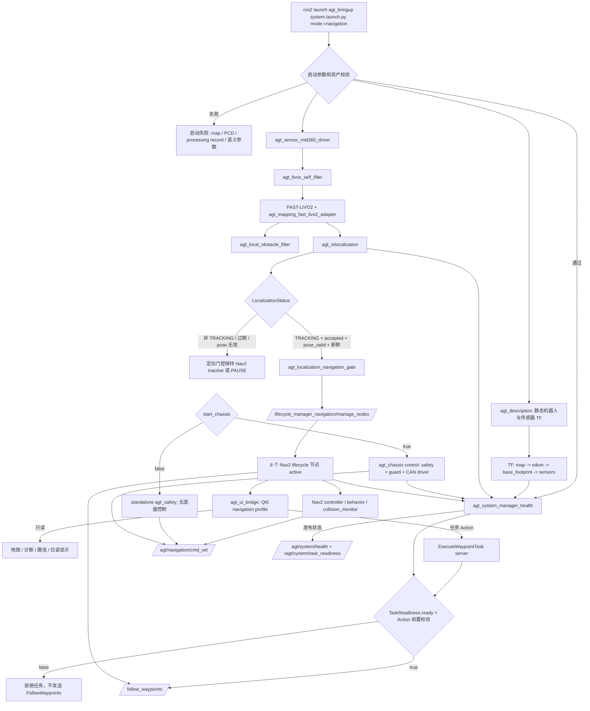
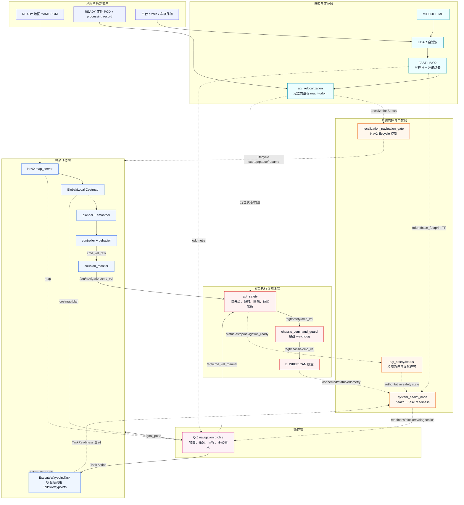
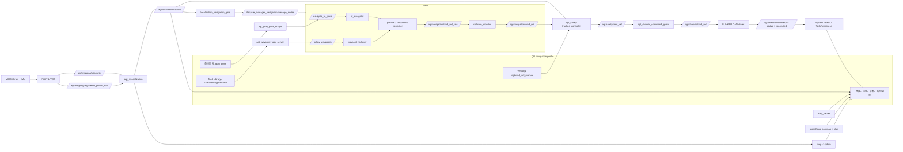

# 当前导航启动、数据流与门禁

本文描述 `agt_bringup system.launch.py mode:=navigation` 的当前实现，重点说明
Qt5、Nav2、`agt_safety`、定位和 BUNKER 底盘之间的边界。它是运行说明，不替代各
接口的消息定义和安全操作规程。

## 当前默认值

| 项目 | 当前默认值 | 含义 |
| --- | --- | --- |
| 系统模式 | `navigation`（通过 `mode` 显式选择） | 进入导航启动链，而不是 mapping 链 |
| `start_sensor` | `true` | 启动 MID360 驱动、IMU 和 lidar 自滤波 |
| `start_lidar_self_filter` | `true` | FAST-LIVO2 正常消费 `/agt/sensors/lidar/custom_filtered` |
| `autostart` | `false` | Nav2 节点进程会启动，但保持 lifecycle 非 active |
| 定位门控 | `enable_localization_gate=true` | 仅由定位状态驱动 Nav2 lifecycle 启动、暂停和恢复 |
| 定位状态新鲜度 | `10 s` | 定位验证周期为 `5 s`，运行时门限必须覆盖该周期 |
| `start_gui` | `true` | 启动 navigation profile 的 Qt5 前端 |
| `start_chassis` | `false` | 默认不接管底盘；实车导航必须显式设为 `true` |
| `start_chassis_monitor` | `false` | monitor 模式只读 CAN，不是导航控制链 |
| `start_semantic_map_server` | `false` | 语义地图/Keepout 默认关闭 |
| `start_coverage_planning` | `false` | 覆盖规划默认关闭 |
| 安全运动状态 | `startup_motion_enabled=false` | 启动后必须经过现场检查再调用使能服务 |

`start_chassis:=false` 时仍会启动独立的 `agt_safety`，但不会有底盘连接状态和命令
guard，因此 `TaskReadiness` 不会变为 ready。要运行真实导航，需要使用 control 模式
启动 `agt_chassis`，而不是 `monitor` 模式。

## 启动流程



要点：

1. Qt5 启动不等于导航 ready。Qt5 可以先显示地图和诊断，但任务 Action 会继续检查
   定位、安全、底盘、Nav2 和地图身份。
2. 定位门控只负责 Nav2 lifecycle 的启动/暂停/恢复，不负责打开安全运动使能。
3. `TaskReadiness` 是任务执行门禁；它要求安全状态允许导航、底盘已连接、8 个 Nav2
   节点 active、TF 新鲜、地图身份匹配，并且 `motion_enabled=true`。

## 系统框图

下面是面向操作人员的高层框图。实线表示会影响导航或运动的主数据链，虚线表示状态、
诊断或门禁信息；Qt5 位于操作层，不直接连接底盘。



### 读图顺序

1. **左上到中部**：地图/PCD/profile 是启动资产；MID360 和 IMU 经自滤波进入 FAST-LIVO2，
   再由定位节点产生 `LocalizationStatus` 与 `map -> odom`。
2. **中部到右侧**：定位门控只负责 Nav2 lifecycle；地图进入 costmap，规划和控制产生
   `cmd_vel_raw`，再经过 `collision_monitor`。
3. **右下向底盘**：所有导航速度和 Qt 手动速度都必须进入 `agt_safety`，再经 command
   guard 才能到 BUNKER CAN；Qt5 没有到底盘的直连箭头。
4. **虚线回路**：底盘、安全、定位和 Nav2 的状态汇总到 `system_health_node`，形成
   `/agt/system/task_readiness`；门禁不满足时，任务 Action 被拒绝或执行中的 child Action
   被取消。

## Qt5、Nav2 与安全数据流



速度链必须保持为：

```text
/agt/navigation/cmd_vel_raw
    -> collision_monitor
/agt/navigation/cmd_vel
    -> agt_safety
/agt/safety/cmd_vel
    -> agt_chassis_command_guard
/agt/chassis/cmd_vel
    -> BUNKER CAN driver
```

Qt5 不得发布 `/agt/chassis/cmd_vel`，也不直接调用底盘驱动。Qt5 手动输入只进入
`/agt/cmd_vel_manual`，由 `agt_safety` 做优先级、超时、限幅和运动使能判断。手动输入
具有优先级，所以在现场调试时即使导航定位无效，也必须保持 `motion_enabled=false`，直到
确认车辆周围安全。

## 启动的节点和进程

### 系统与传感器链

| 层 | 节点/进程 | 主要输入 | 主要输出 |
| --- | --- | --- | --- |
| 系统管理 | `agt_system_manager_health` | 全部健康 topic、TF、lifecycle 状态 | `/agt/system/health`、`/agt/system/task_readiness` |
| 机器人描述 | `robot_state_publisher`（`agt_description`） | URDF/参数 | `tf_static`，机器人/传感器静态 TF |
| 传感器 | `agt_sensor_mid360_driver` | MID360 网络 | `/agt/sensors/lidar/custom`、`/agt/sensors/imu/data` |
| 自滤波 | `agt_livox_self_filter` | raw CustomMsg、TF、平台 profile | `/agt/sensors/lidar/custom_filtered` |
| 里程计 | FAST-LIVO2 backend + `agt_mapping_fast_livo2_adapter` | filtered lidar、IMU | `/agt/mapping/odometry`、`/agt/mapping/registered_points_lidar`、`odom -> base_footprint` |
| 局部障碍 | `agt_local_obstacle_filter` | 注册点云 | 局部障碍观测/诊断 |
| 定位 | `agt_relocalization` | 注册点云、里程计、`/initialpose` | `/agt/localization/status`、`map -> odom`、重定位 Action |

### Nav2 与项目桥接

| 节点 | lifecycle | 作用 |
| --- | --- | --- |
| `map_server` | 是 | 发布 `/agt/map/global_occupancy` |
| `planner_server` | 是 | 全局路径规划 |
| `smoother_server` | 是 | 路径平滑 |
| `controller_server` | 是 | 跟踪路径，输出 remap 到 `/agt/navigation/cmd_vel_raw` |
| `behavior_server` | 是 | 行为动作，输出 remap 到 `/agt/navigation/cmd_vel_raw` |
| `bt_navigator` | 是 | 接受 Nav2 导航 Action |
| `waypoint_follower` | 是 | 接受 `/follow_waypoints` |
| `collision_monitor` | 是 | 过滤/限制 `/agt/navigation/cmd_vel_raw`，发布 `/agt/navigation/cmd_vel` |
| `lifecycle_manager_navigation` | 否 | 提供 lifecycle 管理服务，默认 `autostart=false` |
| `agt_localization_navigation_gate` | 否 | 按定位状态调用 lifecycle 管理服务 |
| `agt_goal_pose_bridge` | 否 | `/goal_pose` 兼容入口转换为 `/navigate_to_pose` |
| `agt_waypoint_task_server` | 否 | 项目 `ExecuteWaypointTask`，校验后调用 `/follow_waypoints` |
| `agt_waypoint_preview_planner` | 否 | 只读 planner-only 预览，不产生执行速度 |

启用语义地图时，额外启动 semantic map server、`costmap_filter_info_server` 和其
lifecycle manager；语义和 coverage 在当前默认配置中关闭。

### 安全与底盘的两种模式

| 启动参数 | 启动内容 | 是否可满足导航控制链 |
| --- | --- | --- |
| `start_chassis:=false`、`start_chassis_monitor:=false` | 独立 `agt_safety` | 否；安全状态可见，但无底盘 connected/guard/driver |
| `start_chassis:=true` | `agt_safety`、`agt_chassis_command_guard`、`agt_bunker_status_bridge`、`agt_bunker_base` | 是；前提是 CAN、底盘状态和全部门禁正常 |
| `start_chassis_monitor:=true` | 状态桥和 CAN driver monitor，安全和 command guard 关闭 | 否；只能观测，不能用于导航执行 |

## 服务、Action 与关键 topic

### 服务和 Action

| 名称 | 类型/用途 | 调用方或条件 |
| --- | --- | --- |
| `/agt/system/get_health` | `agt_interfaces/srv/GetSystemHealth` | 查询结构化健康快照 |
| `/agt/system/evaluate_task_readiness` | `agt_interfaces/srv/EvaluateTaskReadiness` | 查询一次任务门禁 |
| `/lifecycle_manager_navigation/manage_nodes` | `nav2_msgs/srv/ManageLifecycleNodes` | 仅由定位门控控制 Nav2 lifecycle |
| `/<nav2_node>/get_state` | `lifecycle_msgs/srv/GetState` | 检查 8 个 Nav2 节点是否 active |
| `/agt/safety/set_motion_enabled` | `std_srvs/srv/SetBool` | 现场确认安全后显式使能/关闭运动 |
| `/agt/safety/reset_emergency_stop` | `std_srvs/srv/Trigger` | 仅硬件急停已清除后复位锁存 |
| `/agt/localization/relocalize` | `agt_interfaces/action/Relocalize` | 有界重定位请求 |
| `/agt/navigation/execute_waypoint_task` | `agt_interfaces/action/ExecuteWaypointTask` | Qt5/其他前端唯一的多点执行入口 |
| `/navigate_to_pose` | `nav2_msgs/action/NavigateToPose` | 单点兼容入口或 Nav2 客户端 |
| `/navigate_through_poses` | `nav2_msgs/action/NavigateThroughPoses` | Nav2 原生接口 |
| `/follow_waypoints` | `nav2_msgs/action/FollowWaypoints` | 仅由项目 waypoint task server 调用 |

### 状态与控制 topic

| 数据方向 | topic | 说明 |
| --- | --- | --- |
| 传感器输入 | `/agt/sensors/lidar/custom`、`/agt/sensors/lidar/custom_filtered`、`/agt/sensors/imu/data` | raw MID360、滤波后点云、IMU |
| 建图/定位 | `/agt/mapping/odometry`、`/agt/mapping/registered_points_lidar` | FAST-LIVO2 里程计和定位注册点云 |
| 定位状态 | `/agt/localization/status` | 结构化 `TRACKING/DEGRADED/RECOVERING/LOST`，含 `pose_valid`、`localization_accepted`、错误码和新鲜度 |
| Nav2 速度 | `/agt/navigation/cmd_vel_raw`、`/agt/navigation/cmd_vel` | controller/behavior 输出，经过 collision monitor 后进入安全层 |
| Qt 手动速度 | `/agt/cmd_vel_manual` | 安全层输入，手动优先，不能绕过安全层 |
| 安全输出 | `/agt/safety/cmd_vel`、`/agt/safety/status` | 最终安全速度和权威安全诊断 |
| 底盘 | `/agt/chassis/cmd_vel`、`/agt/chassis/connected`、`/agt/chassis/status`、`/agt/chassis/odometry` | command guard 后的 CAN 命令和底盘反馈 |
| 地图/规划 | `/agt/map/global_occupancy`、`/global_costmap/costmap`、`/plan`、`/local_plan` | Qt 显示和 Nav2 规划数据 |
| 系统门禁 | `/agt/system/health`、`/agt/system/task_readiness` | 健康快照和共享任务门禁 |

`/agt/safety/status` 中名称为 `agt_safety/tracked_controller` 的诊断是急停、安全和
导航许可的权威来源，至少包含：`motion_enabled`、`estop_latched`、`emergency_stop`、
`navigation_ready`、`localization_valid`、`linear_output`、`angular_output`。缺失的
`/agt/safety/emergency_stop` 发布者不会再被健康节点自动解释为有效急停；也不能通过手工
发布 `emergency_stop=false` 绕过安全链。

## 门禁矩阵

| 阶段 | 必须满足 | 不满足时的行为 |
| --- | --- | --- |
| launch 前置校验 | `map`、`global_map_pcd`、`global_map_processing_record` 存在且为文件；PCD processing record 为 `state: ready`；语义/coverage 参数成对 | launch 直接失败，不启动半套导航 |
| 定位有效 | `/agt/localization/status` 新鲜（`<=10 s`）、`state=TRACKING`、`pose_valid=true`、`localization_accepted=true`、`error_code=ERROR_NONE`、`status_stale=false` | lifecycle gate 不启动或暂停 Nav2；不会靠手工 TF/假状态放行 |
| Nav2 lifecycle | `map_server`、`planner_server`、`smoother_server`、`controller_server`、`behavior_server`、`bt_navigator`、`waypoint_follower`、`collision_monitor` 全部 `active` | `TaskReadiness.ready=false`，任务 Action 拒绝 |
| 地图身份 | active `map_id`/`map_version_id` 存在，导航 YAML/PGM 和定位 PCD hash 有效且匹配 | `MAP_*` 或 `LOCALIZATION_MAP_MISMATCH` blocker |
| TF | `map -> odom -> base_footprint`，以及传感器链存在且新鲜 | `TF_NOT_FRESH`，任务拒绝 |
| 底盘 | control 模式、`/agt/chassis/connected=true`，底盘 status/odometry 新鲜 | `CHASSIS_DISCONNECTED`，任务拒绝 |
| 安全 | `/agt/safety/status` 新鲜（`<=1 s`）；`motion_enabled=true`；`emergency_stop=false`；`estop_latched=false`；`navigation_ready=true`；导航输出未超时 | 安全输出归零，任务取消/失败；不接受手工发布的伪急停清除 |
| 任务 | Task Library 任务绑定当前 map/version，点数、坐标、地图栅格校验通过，循环有限 | `agt_waypoint_task_server` 拒绝，不调用 `/follow_waypoints` |
| 执行中 | safety/readiness 持续新鲜，Nav2 child Action 成功且无 missed waypoint | 取消 child Action，父 Action 返回失败或取消 |

注意：`TaskReadiness` 是任务执行门禁，不是“启动所有节点”的触发器。定位门控先
管理 Nav2 lifecycle；随后健康节点汇总 Nav2、定位、TF、底盘和安全状态，最后由项目
Action server 在发送 Nav2 child Action 前再次 fail-closed 检查。

## 推荐启动和检查顺序

下面的路径和 map ID 使用占位符，实际值必须来自当前 READY map version；不要把占位符
直接用于实车。

```bash
source /opt/ros/humble/setup.bash
source install/setup.bash

ros2 launch agt_bringup system.launch.py mode:=navigation \
  map:=/absolute/path/to/map.yaml \
  global_map_pcd:=/absolute/path/to/localization_map.pcd \
  global_map_processing_record:=/absolute/path/to/localization_map.processing.yaml \
  map_id:=<map_id> map_version_id:=<map_version_id> \
  start_chassis:=true
```

先保持安全关闭并检查：

```bash
ros2 topic echo /agt/localization/status --once
ros2 topic echo /agt/safety/status --once
ros2 topic echo /agt/system/task_readiness --once
ros2 topic echo /agt/chassis/connected --once
```

现场确认急停已释放、车轮区域安全、CAN 状态正常后，才允许：

```bash
ros2 service call /agt/safety/reset_emergency_stop std_srvs/srv/Trigger '{}'
ros2 service call /agt/safety/set_motion_enabled std_srvs/srv/SetBool '{data: true}'
```

若需要立即停运动，调用：

```bash
ros2 service call /agt/safety/set_motion_enabled std_srvs/srv/SetBool '{data: false}'
```

不要用 `ros2 topic pub /agt/safety/emergency_stop ... false` 伪造安全状态。确认
`motion_enabled=false` 后，再用 `/agt/safety/status --once` 检查 `linear_output` 和
`angular_output` 都为零。

## 逐项查看命令

```bash
ros2 node list

for node in map_server planner_server smoother_server controller_server \
  behavior_server bt_navigator waypoint_follower collision_monitor; do
  ros2 lifecycle get /"$node"
done

ros2 service call /agt/system/evaluate_task_readiness \
  agt_interfaces/srv/EvaluateTaskReadiness '{}'
ros2 topic echo /agt/system/health --once
ros2 topic echo /agt/system/task_readiness --once
```

如果卡在某个 service call，先按 `Ctrl+C` 终止客户端；服务响应和底盘准备是两个不同
问题。随后先调用 `set_motion_enabled=false`，再诊断安全状态、定位门控和 lifecycle。
