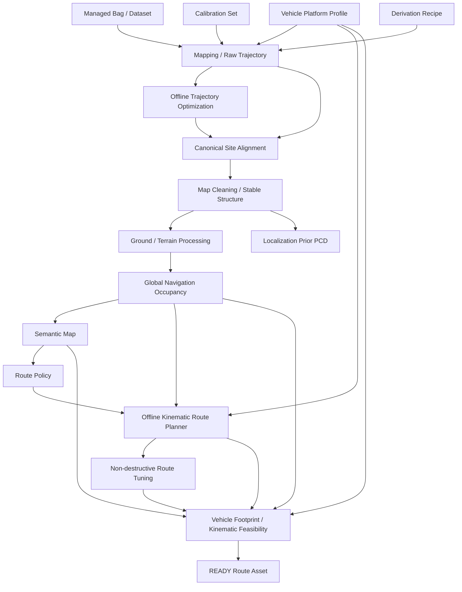

# Offline Asset & Evaluation Plane

本平面位于 V2.5 Runtime/Mission 平面之前，负责把不可变数据集转换成可版本化、可复现、可验证的地图与路线资产。它不发布底盘速度，不拥有运行时 TF，也不替代 Mission/Navigation Capability。



## 核心 lineage

```text
Bag/Experiment
+ Calibration
+ Platform Profile
+ Recipe
    ↓
Map Version
    ↓
Semantic Map
    ↓
Route Policy
    ↓
Route Revision
    ↓
Feasibility Report
```

每个箭头都必须通过 ID + SHA256 可追溯。任何正式下游资产不能仅通过“当前目录下最新文件”隐式选择上游。

## 场景复用

- 不同场景：复用 recipe/schema/tooling，但使用不同 `site_id` 与 site frame
- 同一场景不同时期：保持 `site_id`，使用不同 `epoch_id`/dataset/map version，并对齐到同一 site frame
- 老地图不能原地覆盖；多时期地图通过 parent/reference binding 和 alignment report 形成 lineage

## 与 Runtime Plane 的边界

Runtime 只消费已经验证的资产：

```text
Localization Prior -> initial/global localization
Global Occupancy -> MAP planning / offline route validation
Semantic Map -> task/route knowledge
READY Route Asset -> ROUTE backend
Vehicle Profile -> tracker/controller adaptation
```

Runtime 不负责现场“修地图”来让任务继续。地图、路线或 profile 发生修改时应生成新 version/revision 后重新验证。
