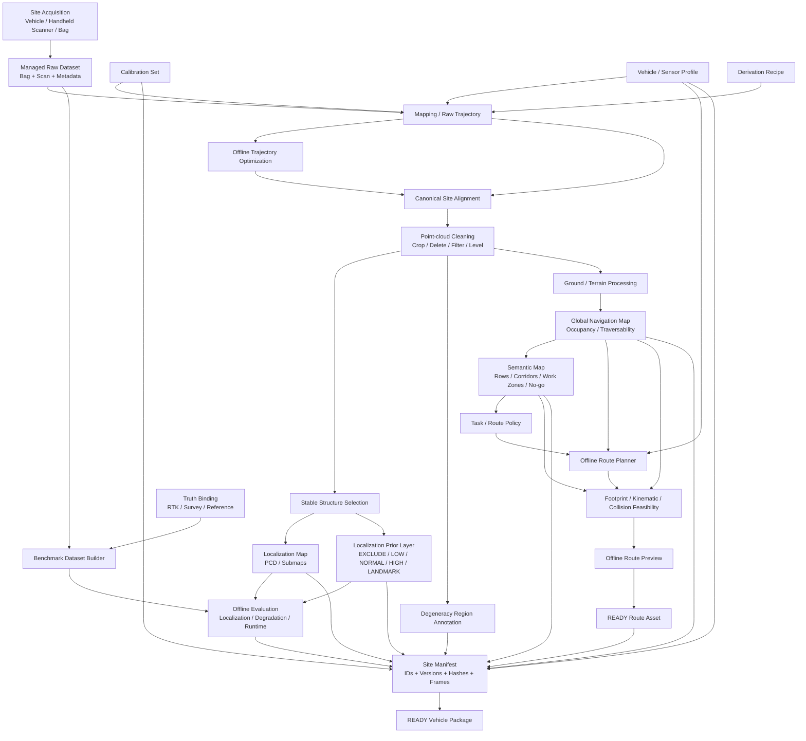

# Offline Site Asset & Evaluation Plane

本平面位于 V2.5 Runtime/Mission 平面之前，负责把一次场景采集转换成可版本化、可复现、可验证、可部署的 Site Package

它不发布底盘速度，不拥有运行时 TF，不替代 Mission/Navigation Capability，也不允许运行时为了让任务继续而原地修改 READY 地图

V25-12 的正式需求基线见 [`V25_12_SITE_WORKFLOW_REQUIREMENTS.md`](../v2.5/V25_12_SITE_WORKFLOW_REQUIREMENTS.md)

## 目标工作流



## 核心 lineage

```text
Bag/Experiment / Raw Dataset
+ Calibration
+ Vehicle/Sensor Profile
+ Derivation Recipe
    ↓
Map Version
    ├── Localization Map
    ├── Localization Prior
    ├── Degeneracy Annotation
    └── Navigation Map
            ↓
       Semantic Map
            ↓
       Route Policy
            ↓
       Route Revision
            ↓
       Feasibility Report
            ↓
       Benchmark / Evaluation
            ↓
       READY Site Package
```

这里的 `Bag/Experiment` 保留 V25-09A 已冻结的 provenance 术语；V25-12 将其统一视为 Site Acquisition 产生并受 Dataset Binding 管理的原始实验/采集证据，而不是引入第二套数据身份

每个正式箭头必须通过 ID + version + hash 可追溯

任何正式下游资产不能仅通过“当前目录下最新文件”隐式选择上游

## Site Package

推荐布局

```text
sites/<site_id>/
├── manifest.yaml
├── calibration/
├── raw/
├── maps/
│   ├── cleaned_map.pcd
│   ├── localization_map.pcd
│   ├── navigation_map.pgm
│   └── navigation_map.yaml
├── localization/
│   ├── prior.yaml
│   ├── stable_regions.yaml
│   └── degeneracy_regions.yaml
├── semantic/
│   └── semantic_map.yaml
├── routes/
│   └── *.yaml
├── benchmark/
│   ├── metadata.yaml
│   ├── truth.*
│   └── reports/
└── vehicle_package/
```

同一场景不同季节或不同采集轮次保持 `site_id`，通过 `epoch_id` / dataset version / map version 区分

老地图不能原地覆盖；新地图通过 parent/reference binding 与 alignment report 形成 lineage

## 地图产品边界

### Localization Map

用于 global localization / relocalization / map matching

重点保存长期稳定、具有几何辨识度的三维结构

### Localization Prior

不是第二张点云地图，而是对空间 region/voxel 的先验可靠性描述

第一版仅允许粗粒度等级

```text
EXCLUDE
LOW
NORMAL
HIGH
LANDMARK
```

最终 estimator 是否使用该权重由 backend adapter 明确声明

仅修改 PCD intensity 不等于完成权重融合

### Navigation Map

用于 traversability、global planning、footprint feasibility 等

不要求保留定位地图中的全部三维结构

### Semantic Map

用于农业场景长期领域知识和任务意图

现有 `semantic_map_server`、semantic schema、Task/Coverage 组件应逐步迁移为消费 Site Package 中版本化语义资产，而不是单独维护另一套地图目录

### Route Asset

Route 是经过地图、语义、车辆 profile 和规划策略验证后的导航意图

它不是 Mission，也不是 controller 的临时 runtime path

## AGT Map Workbench

Workbench 是 V25-12C 目标，不阻塞 V25-12A/B CLI-first 数据链

MVP 只包含六类能力

1. 3D select / crop / delete
2. deterministic filtering / downsample / ground processing
3. localization-prior region authoring
4. semantic annotation
5. offline route preview + footprint / kinematic feasibility
6. immutable revision export

Workbench 的任何保存操作必须生成新 revision 或明确的 draft，不允许静默覆盖 READY 资产

## Benchmark Plane

Benchmark 是 Site Package 的正式组成部分，而不是实验结束后临时保存的 bag

建议绑定

- LiDAR / IMU / Camera
- chassis / wheel state
- canonical odometry
- canonical localization status
- TF / TF static
- SensorHealth / Safety / Mission / Navigation state
- GNSS/RTK 或独立 truth
- CPU / RSS / processing latency / topic-rate diagnostics

离线报告至少分为

### Trajectory / Localization

- ATE / RPE 或等价误差
- drift per distance/time
- relocalization success / latency
- correction / jump / false-relocalization evidence

### Degeneration

- estimator exposed observability / covariance / innovation / information diagnostics
- match/correspondence quality
- explicit degraded intervals

如果某个 estimator 暂时没有这些诊断量，应记录为 unavailable，不允许伪造通用置信度

### Runtime Stability

- CPU
- RSS memory
- map/submap memory
- search / registration latency
- processing latency
- dropped frames / topic rate

## Long-duration Experiment

每个正式实现场景应建立固定 Figure-8 或等价闭环 benchmark route

相同 route/truth 用于比较不同 estimator/fusion 配置

```text
FAST-LIVO2
FAST-LIVO2 + localization prior
FAST-LIVO2 + wheel
FAST-LIVO2 + GNSS/global correction
future combinations
```

实验从多圈短测逐步扩展到 30 min / 1 h / 2 h 等长期运行，并持续记录内存与搜索延迟

## Large-map Evolution

第一版允许单地图实现，但接口必须允许未来替换为

```text
Global Site Map
    ↓
Spatial Tile / Submap Index
    ↓
Candidate Place Retrieval
    ↓
Load Nearby Active Submaps
    ↓
Fine Registration / Planning
```

运行时不得把“整张超大 PCD 永久全量驻留并全局暴力搜索”固化为项目接口

## 与 Runtime Plane 的边界

Runtime 只消费已经验证的资产

```text
Localization Map / Prior -> localization capability
Navigation Map -> global planning
Semantic Map -> semantic task resolution
READY Route -> route execution capability
Vehicle Profile -> planner/controller adaptation
Benchmark Contract -> runtime recording / acceptance
```

Runtime 发生地图、路线、prior 或 profile 修改时，应回到 Offline Plane 生成新的 version/revision 后重新验证
