# V2.5 → V25-12 System Architecture

本文冻结 V25-12 目标架构

当前 V25-11 已完成 SOFTWARE_ONLY Gazebo 导航、故障、安全、可观测性和响应 Gate 闭环；V25-12 不再继续把功能堆进仿真验证脚本，而是开始把系统整理为可复制的 Site Workflow 与可替换 backend 的 Navigation Capability 平台

正式 V25-12 需求基线见 [`V25_12_SITE_WORKFLOW_REQUIREMENTS.md`](../v2.5/V25_12_SITE_WORKFLOW_REQUIREMENTS.md)

运行时接口名称、类型、frame 和 owner 仍以 [`topic_contract.md`](../interfaces/topic_contract.md) 为准

未来能力出现在图中不代表已经实现

## 总体原则

系统分成三个平面

```text
Offline Site Production Plane
        ↓ READY Site Package
Runtime Navigation Capability Plane
        ↓ project capability result
Mission / Behavior Tree Plane
```

关键原则

- Offline Plane 生产不可变、可追溯、可验证的 Site Package
- Runtime Plane 只消费版本化资产，不现场修改 READY 地图
- Mission/BT Plane 只编排项目级 Capability，不直接实现 SLAM、规划、控制或 Safety
- Localization / Planner / Controller / Map backend 可以替换，但项目能力接口与 Mission 语义保持稳定
- `odom -> base_footprint` 与 `map -> odom` 的唯一 owner 规则保持不变
- 所有运动输出必须经过项目 Safety boundary

## 三平面总体架构图

```mermaid
flowchart TD

%% ============================================================
%% OFFLINE SITE PRODUCTION
%% ============================================================
subgraph OFFLINE["Offline Site Production & Evaluation Plane"]
  ACQ["Site Acquisition\nVehicle / Handheld Scanner / Bag"]
  RAW["Raw Dataset + Metadata"]
  CAL["Calibration Set"]
  VPROF["Vehicle / Sensor Profile"]
  RECIPE["Derivation Recipe"]

  MAPBUILD["Mapping / Offline Optimization"]
  EDIT["AGT Map Workbench / CLI\nCrop / Delete / Filter / Level"]
  STABLE["Stable Structure Selection"]
  LOCPRIOR["Localization Prior\nEXCLUDE / LOW / NORMAL / HIGH / LANDMARK"]
  DEGEN["Degeneracy Annotation"]

  LOCMAP["Localization Map\nPCD / future tiled submaps"]
  NAVMAP["Navigation Map\nOccupancy / Traversability"]
  SEMMAP["Semantic Map\nRows / Zones / Anchors / Tasks"]
  OFFPLAN["Offline Route Planner"]
  FEAS["Footprint / Kinematic / Collision Check"]
  ROUTEASSET["READY Route Asset"]

  BENCH["Benchmark Dataset Builder"]
  TRUTH["Independent Truth Binding\nRTK / Survey / Reference"]
  OFFEVAL["Offline Evaluation\nTrajectory / Degradation / Runtime"]

  MANIFEST["Site Manifest\nIDs + Versions + Hashes + Frames"]
  SITEPKG["READY Site Package"]

  ACQ --> RAW
  RAW --> MAPBUILD
  CAL --> MAPBUILD
  VPROF --> MAPBUILD
  RECIPE --> MAPBUILD
  MAPBUILD --> EDIT
  EDIT --> STABLE
  STABLE --> LOCMAP
  STABLE --> LOCPRIOR
  EDIT --> DEGEN
  EDIT --> NAVMAP
  NAVMAP --> SEMMAP
  SEMMAP --> OFFPLAN
  NAVMAP --> OFFPLAN
  VPROF --> OFFPLAN
  OFFPLAN --> FEAS
  FEAS --> ROUTEASSET

  RAW --> BENCH
  TRUTH --> BENCH
  LOCMAP --> OFFEVAL
  LOCPRIOR --> OFFEVAL
  BENCH --> OFFEVAL

  LOCMAP --> MANIFEST
  LOCPRIOR --> MANIFEST
  DEGEN --> MANIFEST
  NAVMAP --> MANIFEST
  SEMMAP --> MANIFEST
  ROUTEASSET --> MANIFEST
  CAL --> MANIFEST
  VPROF --> MANIFEST
  OFFEVAL --> MANIFEST
  MANIFEST --> SITEPKG
end

%% ============================================================
%% RUNTIME SENSOR / ODOMETRY
%% ============================================================
subgraph FRONTEND["Runtime Sensor & Continuous Odometry"]
  LIDAR["LiDAR Adapter\nMID360 / future scanner"]
  IMU["IMU Adapter"]
  CAMERA["Camera Adapter"]
  WHEEL["Wheel / Chassis Odometry Adapter"]
  GNSS["RTK GNSS Adapter"]
  SELF["URDF Self Filter"]
  SENSORHEALTH["Sensor Sync / Health"]

  ODOMBACKEND["Replaceable Odometry Backend\nFAST-LIO2 / FAST-LIVO2 / future"]
  ODOMADAPTER["Project Odometry Adapter"]
  ODOM["Canonical Odometry\n/agt/mapping/odometry\nodom → base_footprint"]
  CLOUD["Canonical Registered Cloud\n/agt/mapping/registered_points"]
  ESTHEALTH["Estimator Health / Diagnostics"]

  LIDAR --> SELF
  SELF --> ODOMBACKEND
  IMU --> ODOMBACKEND
  CAMERA -. optional .-> ODOMBACKEND
  WHEEL -. optional constraint .-> ODOMBACKEND
  ODOMBACKEND --> ODOMADAPTER
  ODOMADAPTER --> ODOM
  ODOMADAPTER --> CLOUD
  ODOMADAPTER --> ESTHEALTH

  LIDAR --> SENSORHEALTH
  IMU --> SENSORHEALTH
  CAMERA -.-> SENSORHEALTH
  GNSS -.-> SENSORHEALTH
end

%% ============================================================
%% GLOBAL LOCALIZATION AUTHORITY
%% ============================================================
subgraph GLOBALLOC["Global Localization / Correction Plane"]
  LOCMAPRT["Site Localization Map"]
  PRIORRT["Localization Prior Layer"]
  RELOCBACKEND["Replaceable Relocalization Backend\nNDT / ICP / place recognition / future weighted matcher"]
  GNSSCORR["GNSS Correction Producer"]
  LOOPCORR["Loop / Place Recognition Producer"]
  FUSION["Optional Global Fusion Backend\nGTSAM / iSAM2 / future"]
  AUTH["Localization Authority\nSingle state / correction owner"]
  MAPODOM["Authoritative map → odom"]
  LOCSTATUS["Canonical Localization Status"]

  CLOUD --> RELOCBACKEND
  LOCMAPRT --> RELOCBACKEND
  PRIORRT -. consumed when backend supports it .-> RELOCBACKEND
  RELOCBACKEND --> AUTH
  GNSS --> GNSSCORR
  GNSSCORR --> FUSION
  LOOPCORR --> FUSION
  FUSION -. correction evidence .-> AUTH
  AUTH --> MAPODOM
  AUTH --> LOCSTATUS
end

%% ============================================================
%% MAP / SEMANTIC / ROUTE RUNTIME
%% ============================================================
subgraph ASSETRUNTIME["Versioned Runtime Site Assets"]
  SITERT["Loaded Site Package\nmanifest + hash binding"]
  NAVMAPRT["Global Navigation Map"]
  SEMRT["Semantic Map"]
  ROUTERT["READY Route Assets"]
  PROFILE["Vehicle Profile"]

  SITERT --> LOCMAPRT
  SITERT --> PRIORRT
  SITERT --> NAVMAPRT
  SITERT --> SEMRT
  SITERT --> ROUTERT
  SITERT --> PROFILE
end

%% ============================================================
%% NAVIGATION CAPABILITIES
%% ============================================================
subgraph NAVCAP["Project Navigation Capability Plane"]
  READINESS["EvaluateTaskReadiness"]
  ENSURELOC["EnsureLocalization / Relocalize"]
  LOADSITE["LoadSitePackage"]
  EXECROUTE["ExecuteRoute / ExecuteWaypointTask"]
  NAVSEM["NavigateToSemanticTarget"]
  COVERAGE["ExecuteCoverageTask"]
  BENCHREC["RecordBenchmark"]

  POLICY["Navigation Mode / Backend Policy"]
  GLOBALPLANADAPTER["Project Global Planner Adapter"]
  GLOBALPLANNER["Replaceable Global Planner\nNavFn / Smac / Hybrid-A* / farmland planner"]
  PATH["Canonical Runtime Path"]

  LOCALMAP["Local Environment Map / Nav2 Costmap"]
  CONTROLADAPTER["Project Controller Adapter"]
  CONTROLLER["Replaceable Local Controller\nMPPI / RPP / DWB / custom tracker"]
  NAVCMD["/agt/navigation/cmd_vel"]

  NAVMAPRT --> GLOBALPLANNER
  SEMRT --> POLICY
  ROUTERT --> POLICY
  PROFILE --> POLICY
  MAPODOM --> GLOBALPLANNER

  EXECROUTE --> POLICY
  NAVSEM --> POLICY
  COVERAGE --> POLICY
  POLICY --> GLOBALPLANADAPTER
  GLOBALPLANADAPTER --> GLOBALPLANNER
  GLOBALPLANNER --> PATH

  CLOUD --> LOCALMAP
  ODOM --> LOCALMAP
  PATH --> CONTROLADAPTER
  LOCALMAP --> CONTROLADAPTER
  CONTROLADAPTER --> CONTROLLER
  CONTROLLER --> NAVCMD
end

%% ============================================================
%% SAFETY / CHASSIS
%% ============================================================
subgraph SAFETYDOMAIN["Safety & Chassis Ownership"]
  SAFETY["agt_safety / collision / watchdog"]
  SAFECMD["/agt/safety/cmd_vel"]
  CHASSIS["BUNKER / future chassis adapter"]

  NAVCMD --> SAFETY
  SENSORHEALTH --> SAFETY
  LOCSTATUS --> SAFETY
  SAFETY --> SAFECMD
  SAFECMD --> CHASSIS
end

%% ============================================================
%% SYSTEM HEALTH
%% ============================================================
subgraph HEALTH["System Health / Readiness"]
  SYSTEMHEALTH["agt_system_manager\nSystemHealth / TaskReadiness"]
  SENSORHEALTH --> SYSTEMHEALTH
  ESTHEALTH --> SYSTEMHEALTH
  LOCSTATUS --> SYSTEMHEALTH
  CHASSIS --> SYSTEMHEALTH
  SITERT --> SYSTEMHEALTH
end

%% ============================================================
%% MISSION / BT
%% ============================================================
subgraph MISSION["Mission / BehaviorTree Capability Orchestration"]
  OPERATOR["Operator / Qt / Web / Scheduler / Higher-level Robot Task"]
  MM["agt_mission_manager\nMission state / audit / cancel owner"]
  BT["BehaviorTree.CPP\nExecution backend"]

  BTCHECK["BT Conditions\nread project state only"]
  BTACTION["Project Capability BT Nodes"]

  OPERATOR --> MM
  MM --> BT
  BT --> BTCHECK
  BT --> BTACTION

  SYSTEMHEALTH --> BTCHECK
  READINESS --> BTACTION
  ENSURELOC --> BTACTION
  LOADSITE --> BTACTION
  EXECROUTE --> BTACTION
  NAVSEM --> BTACTION
  COVERAGE --> BTACTION
  BENCHREC --> BTACTION
end

%% ============================================================
%% OFFLINE → RUNTIME BOUNDARY
%% ============================================================
SITEPKG ==> SITERT
```



## 架构图最重要的变化

旧架构主要围绕 ROS runtime 模块展开

V25-12 之后，系统的正式交付单位变成 `Site Package + Project Capability`

```text
场景差异
→ 通过 Site Package 表达

算法差异
→ 通过 backend adapter / policy 表达

业务任务差异
→ 通过 Mission / BT 表达
```

因此换场景、换算法、换任务不应该继续通过修改同一层代码解决

## 关键边界

### 1. Continuous odometry 与 global localization 分离

连续估计器唯一拥有 `odom -> base_footprint`

项目 adapter 将不同 estimator 的原生输出转换成 canonical odometry、registered cloud 与 health evidence

Localization Authority 唯一拥有 authoritative `map -> odom`

NDT/ICP、GNSS、loop/place recognition、GTSAM 等只能作为 correction producer / factor / candidate，不得并列竞争 TF

### 2. Site Package 内的地图产品不是同一个地图

```text
Localization Map
Localization Prior
Navigation Map
Semantic Map
Route Asset
Benchmark / Truth
```

它们共享同一个 site/frame/version lineage，但用途不同

### 3. Localization Prior 是显式先验，不是 PCD intensity 技巧

Prior 必须有独立 schema 与版本

只有 backend 明确消费该 prior 时，权重才进入 estimator/relocalization 的计算

未来有效置信度应组合

```text
static site prior
× current geometric observability
× current match quality
```

### 4. Task、Route、Runtime Path、Mission 保持分层

```text
Semantic Task Intent
        !=
Route Asset
        !=
Runtime Path
        !=
Mission
```

Mission/BT 描述业务流程

Route 描述经过策略解析后的导航意图

Runtime Path 是当前 planner/controller 消费的几何轨迹

### 5. BT 是 Capability orchestrator，不是算法容器

BT 节点不得

- 发布速度
- 发布 TF
- 读取 raw LiDAR/IMU 后自己实现定位逻辑
- 直接修改 READY map
- 绕过项目 Action 调用任意 native backend 接口

BT 只组合项目级 Capability，并消费结构化 SUCCESS / FAILURE / CANCELED / blocker evidence

### 6. Backend replacement 不得破坏 Mission semantics

至少以下 backend 必须可替换

```text
Continuous Odometry Backend
Global Relocalization / Fusion Backend
Global Planner Backend
Local Controller Backend
Map Storage Backend
Chassis Adapter
```

例如从 FAST-LIVO2 换到其他 odometry backend 时，BT 仍然调用 `EnsureLocalization` / `ExecuteRoute`

例如从 MPPI 换成 RPP/DWB 时，Mission tree 不需要知道 controller 名字

### 7. Safety 是最终运动边界

Mission/BT cancellation 会向下传播并主动 cancel child Action

但最终 fail-closed 停车仍由 Safety domain 保证

任何 planner/controller backend 都必须进入相同的

```text
/agt/navigation/cmd_vel
→ agt_safety
→ /agt/safety/cmd_vel
→ chassis
```

边界

### 8. Offline 与 Runtime 严格分离

Offline tools 可以生成、编辑和验证新资产

Runtime 只能加载 READY 版本

运行中如果发现地图错误，应记录 failure evidence 并回到 Offline Plane 生成新 revision，而不是现场偷偷改图

## 当前已验证的软件基础

V25-11 SOFTWARE_ONLY Gazebo 已验证

- canonical localization + map identity
- static map + Route + Nav2 planner/controller
- Safety command chain + Gazebo physical motion
- `localization_lost`
- `lidar_dropout`
- `imu_dropout`
- fault comparison metrics
- observability timeline / summary
- fail-fast route abort
- self-terminating validation harness

因此 V25-12 可以把重点转向 Site Pipeline、real-data benchmark 与 runtime backend replacement，而不是继续证明基本导航链能否运行

## V25-12 之后的交付路线

```text
V25-12A  Site Manifest & Asset Lineage
V25-12B  Point Cloud Processing CLI
V25-12C  AGT Map Workbench MVP
V25-12D  Localization Prior Contract
V25-12E  Semantic + Offline Route Preview
V25-12F  Benchmark Dataset & Offline Evaluator
V25-12G  Vehicle Package Export

V25-13   Real BUNKER + MID360 + FAST-LIVO2
V25-14   Long-duration Figure-eight Benchmark
V25-15   GNSS / RTK Global Navigation
V25-16   Large-map / tiled-submap / long-term runtime
```

## Runtime ownership summary

- continuous odometry backend/project adapter uniquely owns `odom -> base_footprint`
- Localization Authority uniquely owns authoritative `map -> odom`
- `robot_state_publisher` owns static robot/sensor transform chain
- `agt_mission_manager` remains the only Mission Action/state/audit owner
- BehaviorTree.CPP remains an execution backend under Mission Manager
- BT nodes only invoke project capabilities or inspect project-level condition evidence
- planner/controller backend output must pass the same Safety boundary
- `/agt/mapping/registered_points` remains the canonical registered-cloud topic
- Site Package manifest is the runtime map/semantic/route identity root
