# v2.5 系统架构与交付路线

本文是当前架构边界和 V25-08 语义基线。运行时接口的名称、类型、frame 和 owner 以
[`topic_contract.md`](../interfaces/topic_contract.md) 为准；导航概念与未来模式语义以
[`navigation_semantics.md`](navigation_semantics.md) 为准。未来能力不因出现在架构图中而成为已实现能力。

颜色只表达实现/研究状态：

- 绿色：DONE / 已有稳定基础或软件系统集成完成
- 橙色：CURRENT / 已实现但仍有专项 bag、UI 或实车验收项
- 黄色：P1 / 下一阶段鲁棒性增强
- 蓝色：P2 / 长期研究
- 灰色：OPTIONAL / 可选派生能力

## 四层架构总图

```mermaid
flowchart TD

%% ============================================================
%% LEGEND
%% ============================================================
LEG_DONE["DONE<br/>已有稳定基础 / 软件集成完成"]
LEG_CUR["CURRENT<br/>已实现，仍有专项验收"]
LEG_P1["P1<br/>下一阶段鲁棒性增强"]
LEG_P2["P2<br/>长期研究"]
LEG_OPT["OPTIONAL<br/>可选能力"]

%% ============================================================
%% SENSOR / ODOMETRY FRONTEND
%% ============================================================
subgraph SENSOR["Sensor & Odometry Frontend"]
LIDAR["MID360<br/>LiDAR"]
IMU["IMU"]
CAM["Camera"]
GNSS["RTK GNSS"]
WHEEL["Wheel Odometry"]
SELF["URDF Self Filter"]
HEALTH_SENSOR["Sensor Sync / Health"]
FRONT["FAST-LIO2 / FAST-LIVO2<br/>Robust Continuous Odometry"]
ODOM["Odometry<br/>/agt/mapping/odometry<br/>odom → base_footprint"]
CLOUD["Registered Cloud<br/>/agt/mapping/registered_points<br/>frame=odom"]

LIDAR --> SELF
SELF --> FRONT
IMU --> FRONT
CAM -. optional LIVO .-> FRONT
LIDAR -. health .-> HEALTH_SENSOR
IMU -. health .-> HEALTH_SENSOR
CAM -. health .-> HEALTH_SENSOR
GNSS -. quality .-> HEALTH_SENSOR
FRONT --> ODOM
FRONT --> CLOUD
end

%% ============================================================
%% PERSISTENT MAP / KNOWLEDGE
%% ============================================================
subgraph KNOWLEDGE["Persistent Map & Knowledge"]
GLOBALMAP["Global Navigation Map<br/>2D OccupancyGrid<br/>长期几何记忆"]
LOCPRIOR["Localization Prior<br/>localization_map.pcd<br/>当前全局定位先验"]
SEMMAP["Semantic Map<br/>GeoJSON<br/>长期领域知识"]
WAYPOINT["Semantic Waypoint Library<br/>Named Anchors"]
TASK["Waypoint Task / TaskGroup<br/>Ordered Task Intent"]
ANCHOR["Localization Anchors<br/>Stable Semantic / Geometric Anchors"]

SEMMAP --> WAYPOINT
WAYPOINT --> TASK
SEMMAP -. future anchor semantics .-> ANCHOR
end

%% ============================================================
%% GLOBAL STATE ESTIMATION
%% ============================================================
subgraph GLOBALSTATE["Global State Estimation / Localization Authority"]
RELOC["NDT / ICP<br/>Relocalization"]
SPARSE["Sparse Global Correction<br/>Anchor Recovery"]
GTSAM["GTSAM / iSAM2<br/>Global Backend"]
GNSSF["GNSS Factor"]
WHEELF["Wheel / Nonholonomic Factor"]
GROUNDFACTOR["Ground Factor"]
LOOP["STD / Scan Context<br/>Loop / Place Recognition"]
AUTH["Localization Authority<br/>localization subsystem<br/>single selected TF publisher"]
MAPODOM["Authoritative TF<br/>map → odom"]

CLOUD --> RELOC
LOCPRIOR --> RELOC
RELOC --> AUTH
SPARSE --> AUTH
GNSS --> GNSSF
WHEEL --> WHEELF
GNSSF --> GTSAM
WHEELF --> GTSAM
GROUNDFACTOR --> GTSAM
LOOP --> GTSAM
GTSAM --> AUTH
AUTH --> MAPODOM
end

%% ============================================================
%% LOCAL PERCEPTION: CURRENT + FUTURE LOCAL MAP PRODUCT
%% ============================================================
subgraph LOCALENV["Local Environment Perception"]
OBSFILTER["Existing Local Obstacle Filter<br/>height / range / robot-body filtering"]
OBSCLOUD["/agt/perception/obstacle_cloud<br/>PointCloud2<br/>base_footprint"]
GROUND["Ground / Terrain Separation<br/>future improved classification"]
ROLLING["Rolling Local Map Window<br/>odom frame"]
RAYCAST["Raycast + Log-Odds<br/>Observation Timeout / Decay"]
LOCALOCC["/agt/map/local_occupancy<br/>OccupancyGrid<br/>odom / transient / rolling"]
ESDF["Optional ESDF"]

CLOUD --> OBSFILTER
OBSFILTER --> OBSCLOUD
CLOUD --> GROUND
GROUND -. future improved obstacle evidence .-> OBSCLOUD
ODOM --> ROLLING
OBSCLOUD --> RAYCAST
ROLLING --> RAYCAST
RAYCAST --> LOCALOCC
LOCALOCC --> ESDF
end

%% ============================================================
%% MISSION PLANE
%% ============================================================
subgraph MISSIONPLANE["Mission Plane"]
MISSION["agt_mission_manager<br/>Mission State Owner"]
BT["BehaviorTree.CPP<br/>Execution Backend"]
PROJECTACTION["Project Navigation Capability<br/>ExecuteWaypointTask"]
MISSION --> BT
BT --> PROJECTACTION
end

%% ============================================================
%% NAVIGATION CAPABILITY PLANE
%% ============================================================
subgraph NAVCAP["Navigation Capability Plane"]
MODE["Navigation Mode Policy"]
MAPNAV["MAP Navigation"]
ROUTENAV["ROUTE Navigation"]
LOCALNAV["LOCAL Navigation"]
PROJECTACTION --> MODE
MODE --> MAPNAV
MODE --> ROUTENAV
MODE --> LOCALNAV
end

%% ============================================================
%% MAP MODE
%% ============================================================
subgraph MAPMODE["MAP Mode — current baseline"]
GLOBALPLANNER["Global Planner<br/>Nav2 / Smac / A*"]
GLOBALPATH["Global Runtime Path<br/>map frame"]
GLOBALMAP --> GLOBALPLANNER
MAPODOM --> GLOBALPLANNER
GLOBALPLANNER --> GLOBALPATH
end
MAPNAV --> GLOBALPLANNER

%% ============================================================
%% ROUTE MODE
%% ============================================================
subgraph ROUTEMODE["ROUTE Mode — V25-09+"]
ROUTERESOLVER["Route Resolver"]
ROUTE["Prior Route<br/>map frame"]
SEGMENT["Active Route Segment"]
ODOMPATH["Runtime Path<br/>odom frame"]
ROUTECONF["Odometry / Route Confidence"]

TASK --> ROUTERESOLVER
SEMMAP --> ROUTERESOLVER
ROUTERESOLVER --> ROUTE
ROUTE --> SEGMENT
MAPODOM --> SEGMENT
SEGMENT --> ODOMPATH
ODOM --> ROUTECONF
ROUTECONF -. degraded .-> SPARSE
ANCHOR -. anchor event .-> SPARSE
end
ROUTENAV --> ROUTERESOLVER

%% ============================================================
%% LOCAL MODE
%% ============================================================
subgraph LOCALMODE["LOCAL Mode — reserved"]
LOCALGOAL["Relative / Local Goal"]
LOCALPATH["Local Runtime Path<br/>odom/local frame"]
LOCALGOAL --> LOCALPATH
end
LOCALNAV --> LOCALGOAL

%% ============================================================
%% CONTROL / SAFETY
%% ============================================================
subgraph CONTROL["Local Planning / Control / Safety"]
PATHMUX["Runtime Path / Backend Policy"]
NAV2LOCAL["Existing Nav2 Local Costmap<br/>odom rolling<br/>Voxel + Inflation"]
CONTROLLER["Local Controller<br/>current: Nav2 MPPI<br/>future backend may vary"]
SAFETY["Collision Monitor + agt_safety"]
CHASSIS["BUNKER Chassis"]

OBSCLOUD --> NAV2LOCAL
LOCALOCC -. future canonical local-map source .-> NAV2LOCAL
ESDF -. optional advanced cost .-> PATHMUX
GLOBALPATH --> CONTROLLER
ODOMPATH --> PATHMUX
LOCALPATH --> PATHMUX
PATHMUX --> CONTROLLER
NAV2LOCAL --> CONTROLLER
CONTROLLER --> SAFETY
SAFETY --> CHASSIS
end

%% ============================================================
%% HEALTH / READINESS
%% ============================================================
SYSTEMHEALTH["agt_system_manager<br/>SystemHealth / TaskReadiness"]
HEALTH_SENSOR --> SYSTEMHEALTH
ODOM --> SYSTEMHEALTH
MAPODOM --> SYSTEMHEALTH
CHASSIS --> SYSTEMHEALTH
LOCALOCC -. future mode-aware readiness .-> SYSTEMHEALTH
SYSTEMHEALTH --> BT

%% ============================================================
%% LONG-TERM AGRICULTURAL RESEARCH
%% ============================================================
subgraph LONGTERM["Long-term Agricultural Map"]
STRUCT["Stable Structural Layer"]
SEASON["Seasonal / Growth Layer"]
DYNAMIC["Dynamic Change Layer"]
PLACEDB["Descriptor / Place DB"]
STRUCT --> LOCPRIOR
PLACEDB --> LOOP
end

%% ============================================================
%% STYLES
%% ============================================================
classDef done fill:#d9f7be,stroke:#389e0d,stroke-width:2px,color:#000
classDef current fill:#ffd8bf,stroke:#d4380d,stroke-width:3px,color:#000
classDef p1 fill:#fff1b8,stroke:#d4b106,stroke-width:2px,color:#000
classDef p2 fill:#d6e4ff,stroke:#2f54eb,stroke-width:2px,color:#000
classDef optional fill:#f0f0f0,stroke:#8c8c8c,stroke-width:1px,color:#000

%% DONE
class LEG_DONE,LIDAR,IMU,FRONT,ODOM,CLOUD,GLOBALMAP,LOCPRIOR,SEMMAP,TASK,RELOC,AUTH,MAPODOM,OBSFILTER,OBSCLOUD,MISSION,BT,PROJECTACTION,MAPNAV,GLOBALPLANNER,GLOBALPATH,NAV2LOCAL,CONTROLLER,SAFETY,CHASSIS,SYSTEMHEALTH done

%% CURRENT / acceptance pending
class LEG_CUR,SELF,HEALTH_SENSOR,WAYPOINT current

%% P1
class LEG_P1,GNSS,WHEEL,SPARSE,GTSAM,GNSSF,WHEELF,GROUNDFACTOR,GROUND,ROLLING,RAYCAST,LOCALOCC,MODE,ROUTENAV,LOCALNAV,ROUTERESOLVER,ROUTE,SEGMENT,ODOMPATH,ROUTECONF,ANCHOR,LOCALGOAL,LOCALPATH,PATHMUX p1

%% P2
class LEG_P2,LOOP,STRUCT,SEASON,DYNAMIC,PLACEDB p2

%% OPTIONAL
class LEG_OPT,CAM,ESDF optional
```



## 关键边界

### 1. Continuous odometry 与 global localization 分离

`agt_mapping_fast_livo2_adapter` 是唯一 `odom -> base_footprint` publisher。authoritative
`map -> odom` 属于 localization subsystem，任一 runtime profile 只能选择一个 TF publisher。
当前 baseline 是 `agt_localization` package 内的 `agt_relocalization` node；未来若启用 fusion
owner，必须先关闭当前 publisher。NDT/ICP、GTSAM、GNSS、loop/place-recognition 都只能提供
correction evidence/factor/candidate，不得并列竞争 TF。

### 2. 四类地图/知识产品不是同一个“地图”

- Global Navigation Map：`map` frame 的持久二维导航几何
- Localization Prior：当前 `localization_map.pcd` 等全局定位先验；P2 才研究稳定结构层
- Semantic Map：持久领域知识与命名锚点
- Local Environment Map：未来 `odom` frame 的短期 rolling occupancy；不是 READY map version

Local Occupancy 到 ESDF 是可选派生关系，ESDF 不是 P1 默认主链。

### 3. 当前 local costmap 与未来 local occupancy 不能混为一谈

当前 MAP baseline 已经存在 Nav2 `odom` rolling local costmap，并通过 VoxelLayer/InflationLayer
消费 `/agt/perception/obstacle_cloud`。V25-11 的目标不是重新发明这个已有 costmap，而是提供一个
项目级、可审计、可衰减的 `/agt/map/local_occupancy` 产品：ground/terrain separation + raycast +
log-odds + timeout/decay。它未来可以成为 Nav2/local controller 的一个输入，也可以供其他 backend
或 UI/audit 使用。

### 4. Task、Route、Path 保持分层

```text
SemanticWaypoint != WaypointTask != Route != Runtime Path
```

WaypointTask/TaskGroup 是有序任务意图；Route 是 Navigation Policy 解析后的内部导航意图；Runtime
Path 才是 controller 消费的几何轨迹。V25-08 不新增 Route Action 或 Mission `navigation_mode` 字段。

## 当前与目标状态

| Capability / product | Status | 说明 |
| --- | --- | --- |
| MAP-oriented Nav2 navigation | SYSTEM-INTEGRATED | 当前稳定导航基线，通过 `ExecuteWaypointTask` 使用 |
| P0 BT Mission | SYSTEM-INTEGRATED | BT 是 Mission Manager backend，不是第二个 Mission owner |
| Existing obstacle cloud + Nav2 local costmap | SYSTEM-INTEGRATED | 当前 MAP baseline 已使用 `base_footprint` obstacle cloud 与 `odom` rolling costmap |
| V25-08 architecture semantics | IMPLEMENTED | 只冻结合同/语义，不增加 runtime ROS interface |
| ROUTE | RESERVED | V25-09 目标；当前没有 route runtime |
| LOCAL | RESERVED | 当前没有 local-target runtime |
| Sparse Global Correction | RESERVED | V25-10 目标；correction producer 不拥有 TF |
| Local Environment Mapping | RESERVED | V25-11 目标；canonical `/agt/map/local_occupancy` 当前无 publisher |
| ESDF | OPTIONAL | 仅在 Local Occupancy 之后按需派生 |

## 交付路线

```text
P0     First BT Mission                         PASS software integration; vehicle validation separate
V25-08 Architecture & Semantics Baseline       IMPLEMENTED
V25-09 Robust Route Navigation Core
V25-10 Sparse Global Correction / Anchor Recovery
V25-11 Local Environment Mapping
V25-12 Optional ESDF / Advanced Local Planning
```

GNSS、Wheel、Ground Factor、GTSAM 保持 P1 state-estimation track；STD、Scan Context 和
seasonal maps 保持 P2 research track。

## Runtime ownership summary

- `agt_mapping_fast_livo2_adapter` uniquely publishes `odom -> base_footprint`.
- localization subsystem uniquely owns authoritative `map -> odom`; current selected publisher is
  `agt_relocalization` with `publish_tf=true`.
- `robot_state_publisher` owns the robot/sensor description chain below `base_footprint`.
- `agt_mission_manager` remains the single project Mission Action/state owner.
- BT nodes do not publish velocity or TF and do not call Nav2 native Actions directly.
- Current MAP motion is `Nav2 controller -> project collision/safety chain -> agt_safety -> agt_chassis`;
  future ROUTE/LOCAL backends must enter the same safety/chassis ownership boundary.
- `/agt/mapping/registered_points` is the sole canonical registered-cloud topic; historical names remain
  forbidden in runtime configuration.
