# v2.5 系统架构与交付路线

本文是当前架构边界和 V25-08 语义基线。运行时接口的名称、类型和 owner 以
[`topic_contract.md`](../interfaces/topic_contract.md) 为准；未来能力不因出现在
架构图中而成为已实现能力。

## 四层架构总图

```mermaid
flowchart TD

%% ============================================================
%% LEGEND
%% ============================================================

LEG_DONE["DONE<br/>已有稳定基础 / 软件集成完成"]
LEG_CUR["CURRENT<br/>当前实现或验收中"]
LEG_P1["P1<br/>下一阶段鲁棒性增强"]
LEG_P2["P2<br/>长期研究"]
LEG_OPT["OPTIONAL<br/>可选能力"]

%% ============================================================
%% SENSOR / FRONTEND
%% ============================================================

subgraph SENSOR["Sensor & Odometry Frontend"]

LIDAR["MID360<br/>LiDAR"]
IMU["IMU"]
CAM["Camera"]
GNSS["RTK GNSS"]
WHEEL["Wheel Odometry"]

SELF["URDF Self Filter"]
HEALTH_SENSOR["Sensor Sync / Health"]

FRONT["FAST-LIO2 / FAST-LIVO2<br/>Robust Continuous Odometry"]

ODOM["Odometry<br/>odom → base_footprint"]
CLOUD["Registered Cloud<br/>/agt/mapping/registered_points"]

LIDAR --> SELF
SELF --> FRONT
IMU --> FRONT
CAM -. optional LIVO .-> FRONT

LIDAR -. health .-> HEALTH_SENSOR
IMU -. health .-> HEALTH_SENSOR
CAM -. health .-> HEALTH_SENSOR
GNSS -. quality .-> HEALTH_SENSOR

FRONT --> ODOM
FRONT --> CLOUD

end

%% ============================================================
%% KNOWLEDGE / MAP
%% ============================================================

subgraph KNOWLEDGE["Persistent Map & Knowledge"]

GLOBALMAP["Global Navigation Map<br/>2D OccupancyGrid<br/>长期几何记忆"]

LOCPRIOR["Localization Prior<br/>localization_map.pcd<br/>稳定结构先验"]

SEMMAP["Semantic Map<br/>GeoJSON<br/>长期领域知识"]

WAYPOINT["Semantic Waypoint Library<br/>Named Anchors"]

TASK["Waypoint Task / TaskGroup<br/>Ordered Task Intent"]

ANCHOR["Localization Anchors<br/>Stable Structural Anchors"]

SEMMAP --> WAYPOINT
WAYPOINT --> TASK
SEMMAP -. stable anchor semantics .-> ANCHOR

end

%% ============================================================
%% GLOBAL STATE ESTIMATION
%% ============================================================

subgraph GLOBALSTATE["Global State Estimation"]

RELOC["NDT / ICP<br/>Relocalization"]

SPARSE["Sparse Global Correction<br/>Anchor Recovery"]

GTSAM["GTSAM / iSAM2<br/>Global Backend"]

GNSSF["GNSS Factor"]
WHEELF["Wheel / Nonholonomic Factor"]
GROUNDFACTOR["Ground Factor"]

LOOP["STD / Scan Context<br/>Loop / Place Recognition"]

AUTH["Localization Authority<br/>agt_localization"]

MAPODOM["Authoritative TF<br/>map → odom"]

CLOUD --> RELOC
LOCPRIOR --> RELOC

RELOC --> AUTH
SPARSE --> AUTH

GNSS --> GNSSF
WHEEL --> WHEELF

GNSSF --> GTSAM
WHEELF --> GTSAM
GROUNDFACTOR --> GTSAM
LOOP --> GTSAM

GTSAM --> AUTH

AUTH --> MAPODOM

end

%% ============================================================
%% LOCAL ENVIRONMENT
%% ============================================================

subgraph LOCALENV["Local Environment Perception"]

GROUND["Ground / Terrain Separation"]

OBSTACLE["Obstacle Cloud"]

ROLLING["Rolling Local Occupancy"]

RAYCAST["Raycast + Log-Odds<br/>Observation Timeout / Decay"]

LOCALOCC["Local OccupancyGrid<br/>短期实时环境"]

ESDF["Optional ESDF"]

CLOUD --> GROUND
GROUND --> OBSTACLE
OBSTACLE --> RAYCAST

ODOM --> ROLLING
ROLLING --> RAYCAST

RAYCAST --> LOCALOCC
LOCALOCC --> ESDF

end

%% ============================================================
%% MISSION
%% ============================================================

subgraph MISSIONPLANE["Mission Plane"]

MISSION["agt_mission_manager<br/>Mission State Owner"]

BT["BehaviorTree.CPP<br/>Execution Backend"]

PROJECTACTION["Project Navigation Capability<br/>ExecuteWaypointTask"]

MISSION --> BT
BT --> PROJECTACTION

end

%% ============================================================
%% NAVIGATION CAPABILITY
%% ============================================================

subgraph NAVCAP["Navigation Capability Plane"]

MODE["Navigation Mode Policy"]

MAPNAV["MAP Navigation"]

ROUTENAV["ROUTE Navigation"]

LOCALNAV["LOCAL Navigation"]

PROJECTACTION --> MODE

MODE --> MAPNAV
MODE --> ROUTENAV
MODE --> LOCALNAV

end

%% ============================================================
%% MAP MODE
%% ============================================================

subgraph MAPMODE["MAP Mode"]

GLOBALPLANNER["Global Planner<br/>Nav2 / Smac / A*"]

GLOBALPATH["Global Runtime Path"]

GLOBALMAP --> GLOBALPLANNER
MAPODOM --> GLOBALPLANNER

GLOBALPLANNER --> GLOBALPATH

end

MAPNAV --> GLOBALPLANNER

%% ============================================================
%% ROUTE MODE
%% ============================================================

subgraph ROUTEMODE["ROUTE Mode"]

ROUTERESOLVER["Route Resolver"]

ROUTE["Prior Route<br/>map frame"]

SEGMENT["Active Route Segment"]

ODOMPATH["Runtime Path<br/>odom frame"]

ROUTECONF["Odometry / Route Confidence"]

TASK --> ROUTERESOLVER
SEMMAP --> ROUTERESOLVER

ROUTERESOLVER --> ROUTE

ROUTE --> SEGMENT
MAPODOM --> SEGMENT

SEGMENT --> ODOMPATH

ODOM --> ROUTECONF
ROUTECONF -. degraded .-> SPARSE
ANCHOR -. anchor event .-> SPARSE

end

ROUTENAV --> ROUTERESOLVER

%% ============================================================
%% LOCAL MODE
%% ============================================================

subgraph LOCALMODE["LOCAL Mode"]

LOCALGOAL["Relative / Local Goal"]

LOCALPATH["Local Runtime Path"]

LOCALGOAL --> LOCALPATH

end

LOCALNAV --> LOCALGOAL

%% ============================================================
%% CONTROL
%% ============================================================

subgraph CONTROL["Local Planning / Control / Safety"]

PATHMUX["Runtime Path / Command Policy"]

LOCALCOST["Local Cost / Obstacle Constraints"]

CONTROLLER["Local Controller<br/>Nav2 Controller / RPP / MPPI"]

SAFETY["Safety / Collision Monitor"]

CHASSIS["Chassis"]

GLOBALPATH --> PATHMUX
ODOMPATH --> PATHMUX
LOCALPATH --> PATHMUX

LOCALOCC --> LOCALCOST
ESDF -. optional advanced cost .-> LOCALCOST

PATHMUX --> CONTROLLER
LOCALCOST --> CONTROLLER

CONTROLLER --> SAFETY
SAFETY --> CHASSIS

end

%% ============================================================
%% HEALTH
%% ============================================================

SYSTEMHEALTH["agt_system_manager<br/>SystemHealth / TaskReadiness"]

HEALTH_SENSOR --> SYSTEMHEALTH
ODOM --> SYSTEMHEALTH
MAPODOM --> SYSTEMHEALTH
LOCALOCC -. future mode-aware readiness .-> SYSTEMHEALTH
CHASSIS --> SYSTEMHEALTH

SYSTEMHEALTH --> BT

%% ============================================================
%% LONG TERM MAP
%% ============================================================

subgraph LONGTERM["Long-term Agricultural Map"]

STRUCT["Stable Structural Layer"]
SEASON["Seasonal / Growth Layer"]
DYNAMIC["Dynamic Change Layer"]
PLACEDB["Descriptor / Place DB"]

STRUCT --> LOCPRIOR
PLACEDB --> LOOP

end

%% ============================================================
%% STYLES
%% ============================================================

classDef done fill:#d9f7be,stroke:#389e0d,stroke-width:2px,color:#000
classDef current fill:#ffd8bf,stroke:#d4380d,stroke-width:3px,color:#000
classDef p1 fill:#fff1b8,stroke:#d4b106,stroke-width:2px,color:#000
classDef p2 fill:#d6e4ff,stroke:#2f54eb,stroke-width:2px,color:#000
classDef optional fill:#f0f0f0,stroke:#8c8c8c,stroke-width:1px,color:#000

%% DONE
class LEG_DONE,LIDAR,IMU,FRONT,ODOM,CLOUD,GLOBALMAP,LOCPRIOR,SEMMAP,TASK,RELOC,AUTH,MAPODOM,MISSION,BT,PROJECTACTION,MAPNAV,GLOBALPLANNER,GLOBALPATH,CONTROLLER,SAFETY,CHASSIS,SYSTEMHEALTH done

%% CURRENT / P0 closure
class LEG_CUR,SELF,HEALTH_SENSOR,WAYPOINT current

%% P1
class LEG_P1,GNSS,WHEEL,SPARSE,GTSAM,GNSSF,WHEELF,GROUNDFACTOR,GROUND,OBSTACLE,ROLLING,RAYCAST,LOCALOCC,MODE,ROUTENAV,LOCALNAV,ROUTERESOLVER,ROUTE,SEGMENT,ODOMPATH,ROUTECONF,ANCHOR,LOCALGOAL,LOCALPATH,PATHMUX,LOCALCOST p1

%% P2
class LEG_P2,LOOP,STRUCT,SEASON,DYNAMIC,PLACEDB p2

%% OPTIONAL
class LEG_OPT,CAM,ESDF optional
```



架构中只有 `agt_localization` 可以发布 authoritative `map -> odom`，只有
FAST-LIVO2 adapter 可以发布 `odom -> base_footprint`。NDT/ICP relocalization、
GTSAM/iSAM2、GNSS backend、loop closure 和 place recognition 只能提供 evidence、
factor、candidate transform 或 pose constraint。

Global Navigation Map、Localization Prior 和 Semantic Map 是三个不同产品。
Local Occupancy 向 Optional ESDF 的关系是派生关系；ESDF 不是 P1 默认主链。

## 当前与目标状态

| Capability / product | Status | 说明 |
| --- | --- | --- |
| MAP-oriented Nav2 navigation | SYSTEM-INTEGRATED | 当前稳定导航基线，通过 `ExecuteWaypointTask` 使用 |
| P0 BT Mission | SYSTEM-INTEGRATED | BT 是 Mission Manager backend，不是第二个 Mission owner |
| ROUTE | RESERVED | V25-09 目标；当前没有 route runtime |
| LOCAL | RESERVED | 当前没有 local-target runtime |
| Local Environment Mapping | RESERVED | V25-11 目标；当前 local occupancy 不是已实现 runtime 产品 |
| Sparse Global Correction | RESERVED | V25-10 目标；当前 correction evidence 不拥有 TF |
| ESDF | OPTIONAL | 仅在 Local Occupancy 之后按需派生 |

## 交付路线

```text
P0   First BT Mission                         PASS software integration; vehicle validation separate
V25-08 Architecture & Semantics Baseline
V25-09 Robust Route Navigation Core
V25-10 Sparse Global Correction / Anchor Recovery
V25-11 Local Environment Mapping
V25-12 Optional ESDF / Advanced Local Planning
```

GNSS、Wheel、GTSAM 保持 P1 state-estimation track；STD、Scan Context 和 seasonal
maps 保持 P2 research track。

## Runtime ownership summary

- `agt_localization` uniquely owns authoritative `map -> odom` correction.
- `agt_mapping_fast_livo2_adapter` uniquely publishes `odom -> base_footprint`.
- `robot_state_publisher` owns the robot/sensor description chain below `base_footprint`.
- `agt_mission_manager` remains the single project Mission Action/state owner.
- BT nodes do not publish velocity or TF and do not call Nav2 native Actions directly.
- Motion remains `Nav2 -> collision/safety chain -> agt_safety -> agt_chassis`.
- `/agt/mapping/registered_points` is the sole canonical registered-cloud topic;
  historical names remain forbidden in runtime configuration.
