# v2.5 系统架构与交付路线

本文保存 v2.5 新架构总图，以及每个能力的交付状态。颜色和优先级含义如下：

| 标识 | 含义 |
| --- | --- |
| 绿色 | DONE：已有稳定基础 |
| 橙色 | P0：当前首个 BT Demo 必须完成 |
| 黄色 | P1：下一阶段鲁棒性增强 |
| 蓝色 | P2：长期研究 |
| 灰色 | OPTIONAL：可选能力 |

canonical cross-module topic 的唯一正式名称、类型和 owner 以
[`topic_contract.md`](../interfaces/topic_contract.md) 为准；package-local/debug topic 由对应模块文档维护。

## v2.5 新架构总图

```mermaid
flowchart TD

%% ============================================================
%% LEGEND
%% ============================================================
LEG1["DONE 已完成 / 已有稳定基础"]
LEG2["P0 当前首个 BT Demo 必须完成"]
LEG3["P1 下一阶段鲁棒性增强"]
LEG4["P2 长期研究"]
LEG5["OPTIONAL 可选"]

%% ============================================================
%% SENSOR
%% ============================================================

LIDAR["MID360<br/>/agt/sensors/lidar/custom<br/>CustomMsg"]
URDF["robot_description<br/>URDF Collision Geometry"]
SELF["P0 URDF Self Filter<br/>已实现，待 bag / 实车验收"]
LFILT["/agt/sensors/lidar/custom_filtered<br/>CustomMsg<br/>保留原始 LiDAR frame/逐点字段"]
IMU["IMU<br/>/agt/sensors/imu/data<br/>sensor_msgs/Imu"]
CAM["Camera<br/>Image + CameraInfo"]
GNSS["P1 RTK GNSS<br/>NavSatFix + RTCM/status"]
WHEEL["P1 Chassis Wheel Odom<br/>nav_msgs/Odometry"]
SYNC["P0 Time Sync + Sensor Health<br/>时间同步/传感器健康"]

LIDAR --> SELF
URDF --> SELF
SELF --> LFILT
LIDAR -. raw health .-> SYNC
IMU -. health/timestamp .-> SYNC
CAM -. health/timestamp .-> SYNC
GNSS -. quality .-> SYNC

%% ============================================================
%% FRONTEND
%% ============================================================

FRONT["FAST-LIO2 / FAST-LIVO2<br/>LIO 连续里程计前端"]
LFILT --> FRONT
IMU --> FRONT
CAM -. LIVO mode .-> FRONT
ODOM["/agt/mapping/odometry<br/>nav_msgs/Odometry<br/>TF odom → base_footprint"]
CLOUD["/agt/mapping/registered_points<br/>PointCloud2<br/>frame=odom"]
FRONT --> ODOM
FRONT --> CLOUD

%% ============================================================
%% LOCAL PERCEPTION
%% ============================================================

TERRAIN["P1 Terrain Classification<br/>Normal + Height Band<br/>/ Patchwork++"]
GPLANE["P1 Local Ground Plane<br/>局部地面平面"]
GMSG["P1 /agt/perception/ground_plane<br/>GroundPlane.msg"]
OBS["P1 /agt/perception/obstacle_cloud<br/>PointCloud2"]
LOCALMAP["P1 Rolling Local Map<br/>滚动局部地图"]
LOG["P1 Raycast + Log-Odds<br/>+ Timeout"]
OCC["P1 /agt/map/local_occupancy<br/>OccupancyGrid"]
ESDF["P1 2D ESDF<br/>EnvironmentInterface"]

CLOUD --> TERRAIN
CLOUD --> GPLANE
TERRAIN --> OBS
GPLANE --> GMSG
OBS --> LOG
ODOM --> LOCALMAP
LOCALMAP --> LOG
LOG --> OCC
OCC --> ESDF

%% ============================================================
%% BACKEND
%% ============================================================

KF["P1 Keyframe Manager"]
LIOF["P1 LIO Between Factor"]
GF["P1 Ground Factor<br/>Z / Roll / Pitch"]
RTKF["P1 RTK Factor"]
WF["P1 Wheel / Nonholonomic Factor"]
STD["P2 STD / Scan Context"]
LOOP["P2 Loop Candidate<br/>+ GICP Verification"]
LOOPF["P2 Loop Factor"]
BACKEND["P1 GTSAM / iSAM2<br/>Global Backend"]
MAPODOM["TF map → odom"]

ODOM --> KF
CLOUD --> KF
KF --> LIOF
GMSG --> GF
GNSS --> RTKF
WHEEL --> WF
KF --> STD
STD --> LOOP
LOOP --> LOOPF
LIOF --> BACKEND
GF --> BACKEND
RTKF --> BACKEND
WF --> BACKEND
LOOPF --> BACKEND
BACKEND --> MAPODOM

%% ============================================================
%% EXISTING RELOCALIZATION
%% ============================================================

PRIOR["Global Prior PCD"]
RELOC["Existing NDT / ICP<br/>Relocalization"]
CLOUD --> RELOC
PRIOR --> RELOC
RELOC --> MAPODOM

%% ============================================================
%% MAP / SEMANTIC
%% ============================================================

STATIC["Global Static Occupancy<br/>静态二维地图"]
SEM["Existing Semantic GeoJSON<br/>语义地图"]
KEEP["Existing Keepout Mask"]
WEDITOR["P0 Waypoint Edit Mode<br/>语义编辑器路点模式"]
WDB["P0 Semantic Waypoint Library<br/>命名路点库"]
TASK["Existing Waypoint Task<br/>有序任务序列"]

SEM --> KEEP
SEM --> WEDITOR
WEDITOR --> WDB
WDB --> TASK
STATIC --> GLOBALCOST["Nav2 Global Costmap"]
KEEP --> GLOBALCOST
OCC --> LOCALCOST["Nav2 Local Costmap"]

%% ============================================================
%% LONG TERM MAP
%% ============================================================

LTM["P2 Long-term Multi-layer Map<br/>长期多层地图"]
STRUCT["P2 Stable Structural Layer<br/>长期稳定结构"]
SEASON["P2 Seasonal / Growth Layer<br/>生长期变化层"]
DYNAMIC["P1 Short-term Dynamic Layer<br/>短期动态层"]
DESCRIPTOR["P2 Descriptor / Place DB<br/>地点识别数据库"]
CLOUD --> LTM
LTM --> STRUCT
LTM --> SEASON
LTM --> DESCRIPTOR
OCC --> DYNAMIC
STRUCT -. localization .-> RELOC
SEASON -. planning / change .-> GLOBALCOST
DESCRIPTOR -. loop/relocalization .-> STD

%% ============================================================
%% NAVIGATION
%% ============================================================

NAV["Existing Nav2<br/>Smac2D + MPPI"]
GLOBALCOST --> NAV
LOCALCOST --> NAV
MAPODOM --> NAV
NAV --> SAFETY["Existing Safety / Collision Monitor"]
SAFETY --> CHASSIS["Existing Chassis"]

%% ============================================================
%% SYSTEM MANAGER
%% ============================================================

HEALTH["Existing agt_system_manager<br/>SystemHealth + TaskReadiness"]
SYNC --> HEALTH
ODOM --> HEALTH
MAPODOM --> HEALTH
NAV --> HEALTH
CHASSIS --> HEALTH

%% ============================================================
%% MISSION / BT
%% ============================================================

MISSION["Existing agt_mission_manager<br/>ExecuteMission / Mission State Owner"]
BT["P0 BT Execution Engine<br/>BehaviorTree.CPP + Groot2"]
READY["P0 BT Conditions<br/>TaskReady / LocalizationReady<br/>SafetyReady"]
RELOC_BT["P0 Relocalize BT Action"]
NAV_BT["P0 ExecuteWaypointTask BT Action"]
MODE_BT["P0 ChangeSystemMode BT Action"]
MISSION --> BT
HEALTH --> READY
BT --> READY
BT --> RELOC_BT
BT --> NAV_BT
BT --> MODE_BT
RELOC_BT --> RELOC
NAV_BT --> TASK
TASK --> NAV

%% ============================================================
%% STYLES - STATUS / PRIORITY ONLY
%% ============================================================

classDef done fill:#d9f7be,stroke:#389e0d,stroke-width:2px,color:#000
classDef p0 fill:#ffd8bf,stroke:#d4380d,stroke-width:3px,color:#000
classDef p1 fill:#fff1b8,stroke:#d4b106,stroke-width:2px,color:#000
classDef p2 fill:#d6e4ff,stroke:#2f54eb,stroke-width:2px,color:#000
classDef optional fill:#f0f0f0,stroke:#8c8c8c,stroke-width:1px,color:#000
class LEG1,FRONT,ODOM,CLOUD,RELOC,STATIC,SEM,KEEP,TASK,NAV,SAFETY,CHASSIS,HEALTH,PRIOR,MISSION done
class LEG2,SELF,SYNC,WEDITOR,WDB,BT,READY,RELOC_BT,NAV_BT,MODE_BT p0
class LEG3,GNSS,WHEEL,TERRAIN,GPLANE,GMSG,OBS,LOCALMAP,LOG,OCC,ESDF,KF,LIOF,GF,RTKF,WF,BACKEND,LOCALCOST,DYNAMIC p1
class LEG4,STD,LOOP,LOOPF,LTM,STRUCT,SEASON,DESCRIPTOR p2
class LEG5 optional
```

## v2.5 待完成内容

### P0：首个 BT Demo 必须完成

- URDF 自体点云滤除：主体几何来自 `robot_description` 的 URDF collision；platform profile 仅保留
  enable/padding、显式临时 supplemental box 和 `geometry_source:=profile` A/B 回归路径。实现已加入
  V25-02，完成同 bag `raw/profile/urdf` 与实车误删/漏删验收后才能转 DONE。
- 时间同步与传感器健康检查，统一检查 timestamp、消息新鲜度和输入质量。
- Qt5 waypoint edit mode 与命名 Semantic Waypoint Library；不修改基础 PGM。
- 保留现有 `agt_mission_manager` 作为唯一 Mission Action/状态 owner，在其后端增加
  BehaviorTree.CPP + Groot2 执行引擎，不创建第二个并列 mission manager。
- BT 层提供 `Relocalize`、`ExecuteWaypointTask`、`ChangeSystemMode` project-Action wrapper，并连接
  `TaskReady`、`LocalizationReady`、`SafetyReady` 条件；BT 不直接调用 Nav2 native Action，不发布速度或 TF。

### P1：鲁棒性增强

- Patchwork++ terrain classification、local ground plane、障碍点云和滚动局部地图。
- Raycast + log-odds + timeout 的 `/agt/map/local_occupancy` 与 2D ESDF。
- Keyframe Manager、LIO/ground/RTK/wheel factors，以及 GTSAM/iSAM2 global backend。
- RTK GNSS、轮速/非完整约束和短期动态层。
- 以上能力须先完成离线 bag 回归、资源限制、stale-data 清理和安全 fail-closed 验证，
  才能接入导航运行链。

### P2：长期研究

- STD/Scan Context、回环候选与 GICP verification。
- 长期多层地图：稳定结构层、生长/季节层和地点描述数据库。
- 多层地图与 localization、planning/change detection 的受控集成。

### 已有稳定基础与边界

- MID360 → self-filter → FAST-LIVO2 → `/agt/mapping/registered_points` → NDT/ICP relocalization。
- 静态 OccupancyGrid、semantic GeoJSON、keepout mask、Nav2、TaskReadiness、安全和 Bunker chassis。
- `agt_mission_manager` 已提供业务级 Mission 接口/有限状态执行基础；BehaviorTree execution engine 仍属于 P0。
- 语义地图、coverage planning、动态语义感知和实时 traversability 在 v2.5 中不因架构图出现
  而自动变为执行能力；相关开关继续默认关闭。
- 不得恢复 `registered_cloud`、`/agt/mapping/registered_points_lidar` 或
  `/agt/mapping/registered_cloud` 作为运行时接口。详见 topic contract。

## Runtime ownership summary

- `agt_localization` uniquely owns authoritative `map → odom` correction.
- `agt_mapping_fast_livo2_adapter` uniquely publishes `odom → base_footprint`.
- `robot_state_publisher` uniquely publishes the robot and sensor description chain below `base_footprint`
  and supplies `robot_description` used by the URDF self-filter.
- `agt_mission_manager` remains the single project Mission Action/state owner; the future BT engine is an implementation layer behind that boundary.
- The public registered cloud is `/agt/mapping/registered_points`, a
  `sensor_msgs/msg/PointCloud2` in `odom`; historical names are archive/legacy references only.
