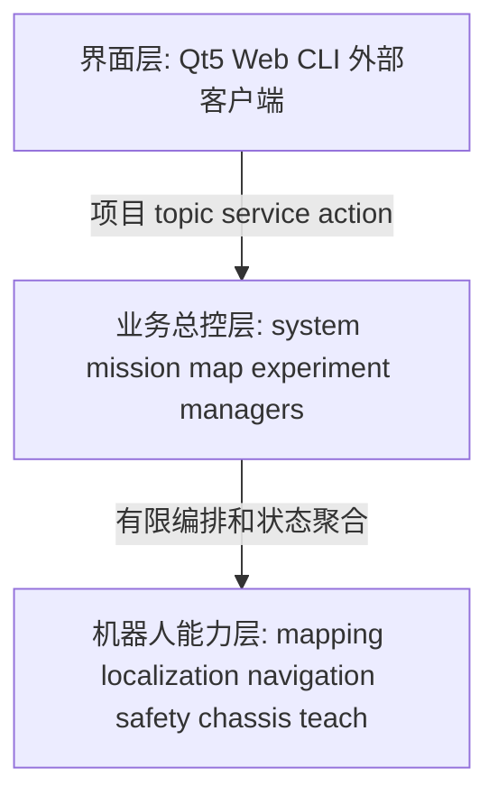

# 三层系统架构

本项目以 ROS 2 为唯一真实业务后端。Qt5、Web、CLI 和外部系统均为客户端，不保存
权威的模式、地图、任务、实验或安全状态。

## 责任边界

| 层 | 拥有 | 不拥有 |
| --- | --- | --- |
| 界面层 | 展示、表单、确认、客户端超时 | launch、活动地图资产、任务 FSM、速度与 TF |
| 业务总控层 | 模式、Mission、版本、实验、聚合读模型与审计 | 定位、规划、控制、地图算法与底盘命令 |
| 机器人能力层 | 传感、建图、定位、Nav2、安全和底盘适配 | 前端布局和跨业务资产所有权 |

业务总控层由职责明确的 manager 组成，不创建 `agt_control_center` God package。模式切换
仍由 `agt_system_manager` 的 allowlisted profile 完成，`agt_bringup` 只是内部 launch 组合。
所有导航速度保持 `Nav2 -> agt_safety -> chassis_command_guard -> driver`。

## 兼容期

`ChangeSystemMode`、`ManageMappingSession`、`ExecuteWaypointTask` 和 `Relocalize` 保持可用。
新的正式任务入口是 `ExecuteMission`；`/goal_pose` 仅保留为默认隐藏的高级调试入口。旧入口
只有在新 Qt/Web 工作流、离线回归和实车门禁分别验收后才可评审删除。
