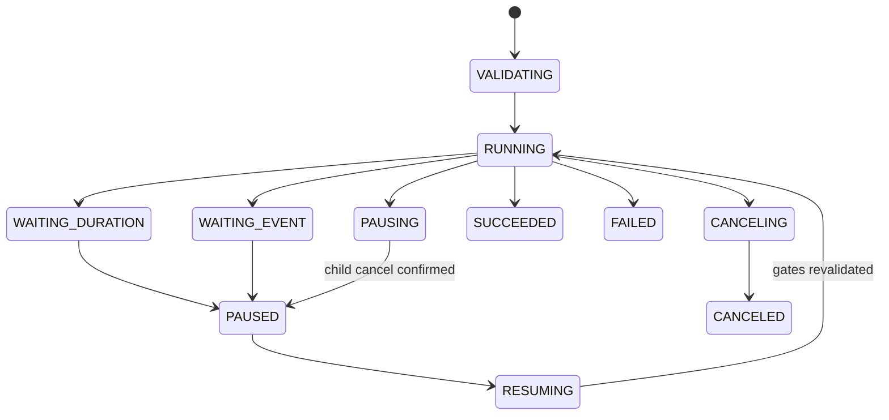

# Mission 执行工作流

提交前先用 `/agt/maps/active` 比较 map ID、version 和 manifest hash，再检查定位与
`TaskReadiness`。WAYPOINT_TASK 只调用 `/agt/navigation/execute_waypoint_task` 并以子 Action
结果、missed waypoints 和取消确认决定步骤结果。等待步骤使用单调时间保存剩余量，暂停时间
不计入等待。

父 Action cancel 会取消活动导航子目标并等待确认。safety/readiness 丢失由 waypoint server
取消 Nav2 child，Mission 将该子 Action 失败作为终态；Mission 本身不发布零速度。恢复导航
使用未完成 waypoint 子集形成有审计记录的新 child goal，并在发送前重新检查全部门禁。

每次校验、步骤开始/结束、暂停、恢复、取消和终态写入原子 JSONL 审计。进程启动发现之前的
活动状态时写入 `INTERRUPTED`，等待人工重新提交，不自动执行。
