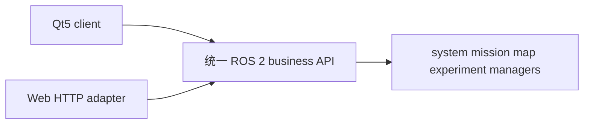

# Qt 与 Web 共享后端



Qt ROS channel 和 Web `RosConsoleBridge` 消费相同的 `RobotState`、`MissionStatus`、manager
service/action。Web 保留现有 REST URL，但每个真实请求只是 ROS API 的 HTTP adapter；不得
直接构造 `MapRegistry`、`ExperimentManager`，不得读写活动 manifest 或管理 rosbag 子进程。

Qt 的 theme、layout 与 capability 三者独立。`UiThemeId` 或 `UiLayoutId` 变化只能改变外观和
信息架构，不能打开 `EnableTaskExecution`、手动控制、READY 底图编辑或其他被 profile 禁止的
能力。`legacy` 和 `control-center-v1` 共享同一个 ROS channel 与 view-model。

当前 `control-center-v1` 已通过 `RobotStateViewModel`、`MissionViewModel`、
`SystemModeViewModel` 和 `BusinessOperationsViewModel` 接入统一后端。页面注册由 profile 的
`Show*Page` 与独立 capability 共同约束；建图、重定位、地图资产和 Bag/实验请求分别走项目
Action/service，均为异步请求并通过 queued Qt 信号回到 GUI 线程。旧 waypoint 执行和
`/goal_pose` 只作为默认关闭的兼容/调试入口。

offline Web/Qt 必须显式显示 simulation/不可执行；不能与 ROS backend 同时拥有同一 runtime，
不能产生 READY 实车资产，也不能启动 localization、controller、safety 或 chassis motion chain。

## 共享地图与 Bag 流程

- 两端用 `/agt/maps/list` 获取版本，用 `/agt/maps/manage` validate/activate/pin/archive/delete，
  用 `/agt/maps/active` 获取包含 PGM YAML、PCD、processing record 和 tasks 目录的权威上下文。
- 两端用 `/agt/data/bags/list` 与 `/agt/data/bags/manage` 查询或控制实验/Bag，不持有 `Popen`。
- 建图由 `/agt/mapping/manage_session` 自动创建实验并使用 `mapping` profile；Qt/Web 只显示同一
  `BagSessionSummary`，不会各自再启动一个 recorder。
- destructive 地图操作必须显式确认；实验引用、active、pinned、processing 和 parent dependency
  仍由后端拒绝。

## 离线验证

Qt fork 与 vendored 快照由 `third_party/ros_qt5_gui_app/.agt-fork-commit` 和
`third_party/README.md` 的同一完整 SHA 绑定。提交前运行：

```bash
./tools/build_ros_qt5_gui_app.sh
python3 -m pytest -q src/agt_ui_bridge/test/test_ros_qt5_gui_profiles.py
AGT_QT_FORK=/path/to/Ros_Qt5_Gui_App \
  python3 .agents/skills/qt5-app-ui-modernization/scripts/validate_ui_contract.py
```

这些检查覆盖编译、主题资源、profile 能力、READY 资产只读、离线/teach 禁执行、manager
endpoint、手动速度 topic 和双仓库 pin；它们不替代真实地图、DDS 多客户端或实车安全验收。
