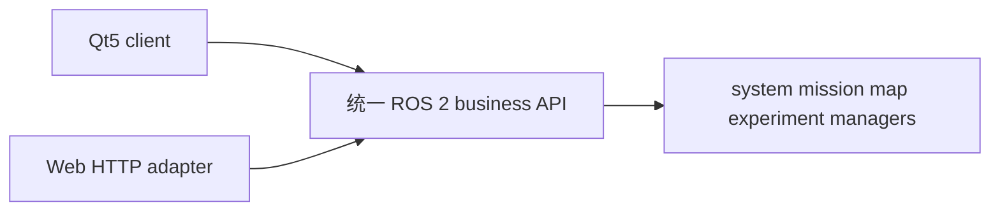

# Qt 与 Web 共享后端

Qt ROS channel 和 Web `RosConsoleBridge` 消费相同的 `RobotState`、`MissionStatus`、manager
service/action。Web 保留现有 REST URL，但每个真实请求只是 ROS API 的 HTTP adapter；不得
直接构造 `MapRegistry`、`ExperimentManager`，不得读写活动 manifest 或管理 rosbag 子进程。

Qt 的 theme、layout 与 capability 三者独立。`UiThemeId` 或 `UiLayoutId` 变化只能改变外观和
信息架构，不能打开 `EnableTaskExecution`、手动控制、READY 底图编辑或其他被 profile 禁止的
能力。`legacy` 和 `control-center-v1` 共享同一个 ROS channel 与 view-model。

offline Web/Qt 必须显式显示 simulation/不可执行；不能与 ROS backend 同时拥有同一 runtime，
不能产生 READY 实车资产，也不能启动 localization、controller、safety 或 chassis motion chain。
